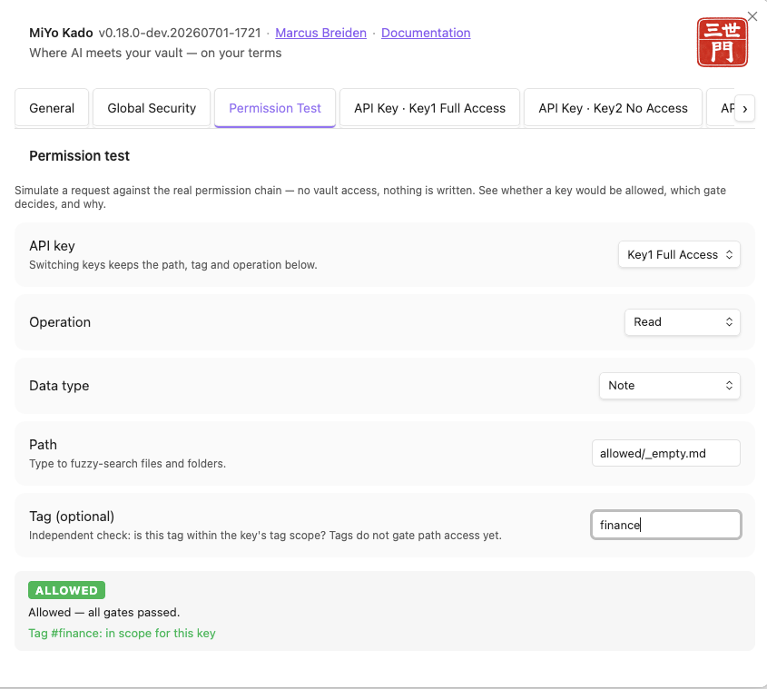
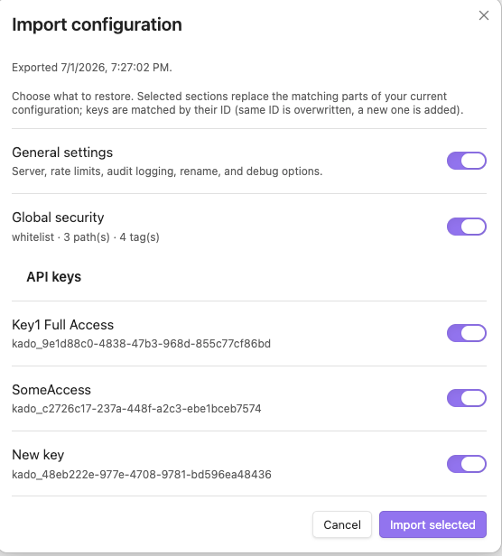

<p align="center">
  
</p>

# MiYo Kado -- Obsidian MCP Gateway

Security-first [Model Context Protocol](https://modelcontextprotocol.io/) server plugin for Obsidian. Gives AI assistants controlled, granular access to your vault through seven tools: `kado-read`, `kado-write`, `kado-delete`, `kado-rename`, `kado-search`, `kado-open-notes`, and `kado-graph`.

> Part of the **MiYo** family. The plugin is referred to as **MiYo Kado** in the Obsidian community-plugin index and in the settings UI; "Kado" alone is used as a short form throughout this README and the source.

<p align="center">
  
</p>

## Why MiYo Kado?

Letting an AI assistant talk to your vault sounds great until you realize most integrations give the assistant **everything** -- every note, every file, full read/write. Kado is built around the opposite default:

- **Nothing is exposed by default.** You opt every path and every data type in, explicitly.
- **Per-key scopes.** Different assistants get different keys with different permissions. Revoke any key independently.
- **Audit trail.** Every allowed and denied request is logged so you can see exactly what an assistant touched.
- **Local-first.** The MCP server runs inside Obsidian on `127.0.0.1` by default. No cloud, no telemetry, no third party.

If you've ever wanted to say "this assistant can read my project notes but not my journal, and can delete drafts but never touch archived material", Kado is for you. For a deeper look at why AI permissioning matters for PKM workflows -- and why guardrails are not the same as real permissions -- see [Permissioning your AI](docs/permissioning-for-pkm.md).

## Features

- **Default-deny security** -- nothing is accessible until explicitly whitelisted
- **Two-tier access control** -- global security scope defines what is eligible; per-key scope defines what is permitted
- **Five permission gates** -- authenticate, global-scope, key-scope, datatype-permission, path-access
- **Four data types** -- notes (markdown), frontmatter (YAML as JSON), files (binary as base64), Dataview inline fields
- **Partial note read/write** -- read a slice (`firstXChars`, `firstXWords` for a Unicode-aware word preview, `section` by heading, `range` by line/char) and write in place (`append`/`prepend`, `insertUnderHeading`, `replaceSection`/`replaceRange`) without round-tripping the whole body; omitting the mode is byte-for-byte backward compatible
- **Rename & move** -- `kado-rename` renames or moves notes and files with backlinks updated automatically; one folder ⇒ rename (needs `update`), across folders ⇒ move (needs `delete` on the source + `create` on the target). Works best with Obsidian's "Automatically update internal links" on (silent, links updated); with it off the tool is hidden unless you opt in, and then each rename prompts Obsidian's link-update dialog (the file still moves, but inbound links update only when you answer)
- **Seven search operations** -- byName, byTag, byContent, byFrontmatter, listDir, listTags, listNotes. `byContent` is full-text ranked: it matches notes containing any query term, scores them by term coverage and proximity, and returns relevance `snippets` (with line numbers), best-first
- **Link-graph navigation** -- `kado-graph` traverses the vault's link structure: `backlinks`, `outgoing`, `neighbors` (1-hop), `related` (2-hop, with the `via` neighbour), and `dangling` (unresolved link targets). Resolved nodes outside the key's scope are silently omitted, so a traversal can never disclose a path the key cannot read
- **Self-guiding responses** -- tool responses may carry an optional, additive `_hints` array suggesting the sensible next step (re-read after a `CONFLICT`, fetch the next page when a cursor is present, continue a truncated read). Purely advisory and safe to ignore
- **Optimistic concurrency** -- timestamp-based conflict detection on writes
- **Rate limiting** -- configurable per-IP throttle (default 20 requests per 5 s; tunable live, `0` disables)
- **Audit logging** -- NDJSON log with rotation (metadata only, no content)
- **Permission Test panel** -- a settings tab that dry-runs any key + operation + path against the real permission chain (in memory, no vault access) and shows ALLOWED/DENIED, the deciding gate, and why -- so you can verify a scope before an assistant connects
- **Backup & restore** -- export the whole config to a JSON file and import it back with per-section selection (general settings / global security / individual keys); for migrating between vaults or machines and recovering from mistakes
- **Status bar indicator** -- the 門 gate glyph shows server state at a glance (listening / off / bind error) and throbs on each tool call, colour-coded for reads vs. writes, with the acting key's name in the tooltip; a rejected call lingers red for a few seconds then self-clears. Click it to open Kado's settings

## Architecture & the MiYo ecosystem

MiYo Kado is one component of the **MiYo** multi-repo system. Kado is the Obsidian-side
MCP gateway: it owns the vault access-control model (two-layer path eligibility + per-key
CRUD scopes) and exposes the MCP tool surface that companion tools such as **MiYo Tomo**
consume. The authoritative record for cross-repo contracts, system-level architecture, and
governance decisions lives in **MiYo Kokoro**; this repo's local design docs (below, and
`docs/XDD/specs/`) defer to Kokoro for project-wide principles. Cross-component contract
changes (e.g. new MCP tools) are handed off to Kokoro via `_outbox/for-kokoro/`.

Internally Kado follows a four-layer clean architecture: MCP boundary (`src/mcp/`) →
permission gates + policy (`src/core/`) → Obsidian adapters (`src/obsidian/`) → canonical
types (`src/types/`). See [How It Works](docs/how-it-works.md) for the enforcement flow.

## Documentation

| Document | Audience | Content |
|----------|----------|---------|
| [Installation](docs/installation.md) | Everyone | Community Plugins, BRAT, manual install |
| [Configuration Guide](docs/configuration.md) | Vault owners | Settings UI, security setup, API key management |
| [Client Setup](docs/client-setup.md) | Vault owners | Claude Code, Claude Desktop, Cursor, Windsurf |
| [How It Works](docs/how-it-works.md) | Vault owners | Architecture, security model, enforcement logic, audit log |
| [Example Configurations](docs/example-configs.md) | Vault owners | Common setups with permission matrices |
| [API Reference](docs/api-reference.md) | MCP client developers | Tool schemas, parameters, examples, error codes |
| [Development Guide](docs/development.md) | Contributors | Build, test, lint, architecture, live testing |
| [Permissioning your AI](docs/permissioning-for-pkm.md) | PKM practitioners | Why AI permissioning matters, guardrails vs enforcement |

## Roadmap

Tracked as GitHub issues:

- **Tag permissions beyond read-only** ([#81](https://github.com/MMoMM-org/miyo-kado/issues/81)) -- deny permission so tags can *exclude* matching items from otherwise-allowed paths.
- **Granular whitelist / blacklist toggle** ([#82](https://github.com/MMoMM-org/miyo-kado/issues/82)) -- per-section toggle for mixed strategies.
Shipped: **Permission Test** dry-run panel ([#83](https://github.com/MMoMM-org/miyo-kado/issues/83)) and **Backup & restore** config export/import ([#84](https://github.com/MMoMM-org/miyo-kado/issues/84)); sub-path key scopes (narrower sub-paths inside an allowed parent) landed in v0.15.0.

## Known edge cases

### Editing a note the AI wants access to

- **Edit-while-reading gap.** If you're actively typing in a note and your AI assistant reads it via Kado at the same moment, the assistant may see the version from up to 2 seconds ago -- Obsidian saves your edits to disk on a ~2 second pause. Pause briefly (or press Cmd/Ctrl+S) before asking the AI about your most recent sentence.
- **Write while the same note is open and dirty.** If an AI tries to write to a note you are currently editing with unsaved keystrokes, Kado refuses the write with a `CONFLICT` error and shows a Notice ("Kado wanted to modify *\<note\>* ..."). Your typing always wins. The AI client sees the same conflict signal used for any concurrent change and is expected to re-read and retry, so once you pause typing (~2 s Obsidian autosave) and it retries, its write is applied on top of your latest edits.

## Quick Start

1. [Install the plugin](docs/installation.md)
2. Open **Settings > MiYo Kado**
3. Add paths to the global security whitelist (e.g. `notes/`, `projects/`, or `**` for full vault)
4. Create an API key and assign it paths and per-data-type permissions
5. Enable the server
6. [Connect your AI client](docs/client-setup.md)

```json
{
  "mcpServers": {
    "kado": {
      "type": "http",
      "url": "http://127.0.0.1:23026/mcp",
      "headers": {
        "Authorization": "Bearer YOUR_API_KEY"
      }
    }
  }
}
```

## Screenshots

**General tab** -- server status, port, audit logging, and backup & restore.

<p align="center">
  
</p>

**Global Security tab** -- whitelist of paths and tags that any key may reference. Permissions are set per data type (Notes, Frontmatter, Dataview, Files) for each path.

<p align="center">
  
</p>

**Permission Test tab** -- dry-run any key + operation + path against the real permission chain (in memory) and see ALLOWED/DENIED with the deciding gate.

<p align="center">
  
</p>

**API Key tab** -- per-key access. Each key has its own access mode, paths, tags, and permission matrix, all constrained by the global security scope.

<p align="center">
  
</p>

**Backup & restore** -- export the whole config to a JSON file, or import one and choose per-section (general / global security / each key) what to restore.

<p align="center">
  
</p>

## Security Model

Every request passes through five gates in order. The first denial stops the chain. For the full enforcement logic, see [How It Works](docs/how-it-works.md).

| # | Gate | Purpose |
|---|------|---------|
| 0 | authenticate | Bearer token must match an enabled API key |
| 1 | global-scope | Path must be inside the global whitelist (or outside the blacklist) |
| 2 | key-scope | Path must be inside the key's own scope |
| 3 | datatype-permission | Key must have the required CRUD flag for the data type |
| 4 | path-access | Final path-traversal and validation check |

## Architecture

```
MCP Client -> [MCP API Handler] -> [Kado Core] -> [Obsidian Interface] -> Vault
```

- **MCP API Handler** -- Express + Streamable HTTP transport, auth, rate limiting
- **Kado Core** -- Permission gates, routing, concurrency guard. No MCP or Obsidian imports.
- **Obsidian Interface** -- Vault adapters for notes, frontmatter, files, inline fields, search

## Part of MiYo

Kado is part of **MiYo**, a small family of Obsidian-adjacent tools focused on giving you control over what your assistants can see and do. MiYo Kado is the gateway component -- the piece that turns your vault into a properly-scoped MCP server. More tools are in the works.

### Open tracking

Live issues and upstream references live in [GitHub Issues](https://github.com/MMoMM-org/miyo-kado/issues) and `docs/ai/memory/troubleshooting.md`. No open issues at the time of this release.

## Support

If MiYo Kado is useful to you and you want to help me keep building, you can support development via:

- [Buy Me a Coffee](https://ko-fi.com/mmomm)
- [GitHub Sponsors](https://github.com/sponsors/MMoMM-org)

Issues and pull requests are also very welcome.

## Contributing

Contributions are welcome. The short version:

1. **Open an issue first** for anything non-trivial (bugs, features, refactors) so we can align on scope before you invest time.
2. **Fork & branch** from `master`. Use a descriptive branch name (e.g. `fix/search-tag-case`, `feat/granular-scopes`).
3. **Keep changes focused** -- one feature or one fix per PR. See [Development Guide](docs/development.md) for build, test, and lint commands.
4. **Tests & lint must pass** -- run `npm run build`, `npm test`, and `npm run lint` before pushing.
5. **Conventional commits** -- e.g. `feat:`, `fix:`, `docs:`, `refactor:`. Release notes are generated from commit history.
6. **Open a PR** against `master` and reference the issue. Small, reviewable diffs get merged fastest.

For security issues, please **do not** open a public issue -- email marcus@mmomm.org instead.

## License

[MIT](LICENSE)
