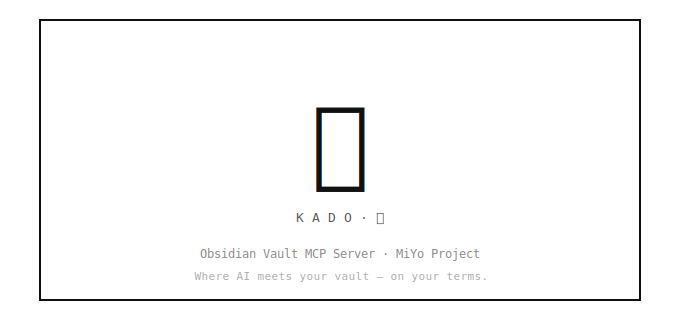
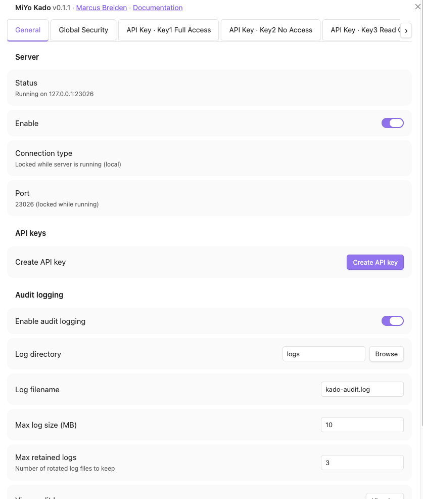
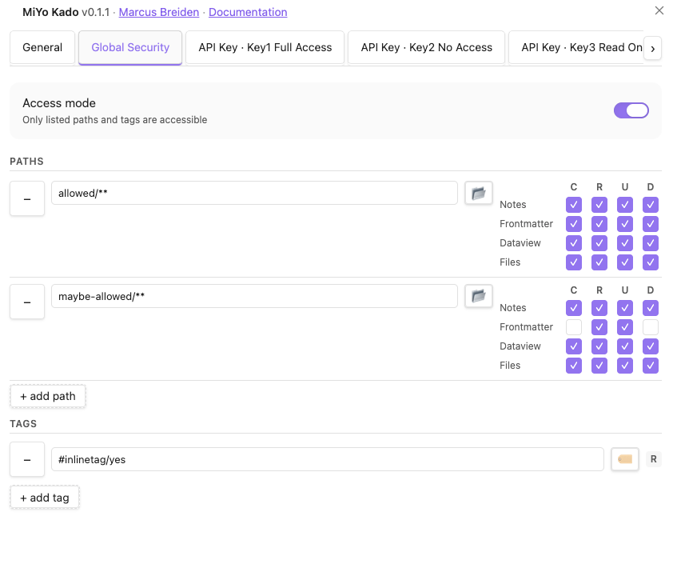
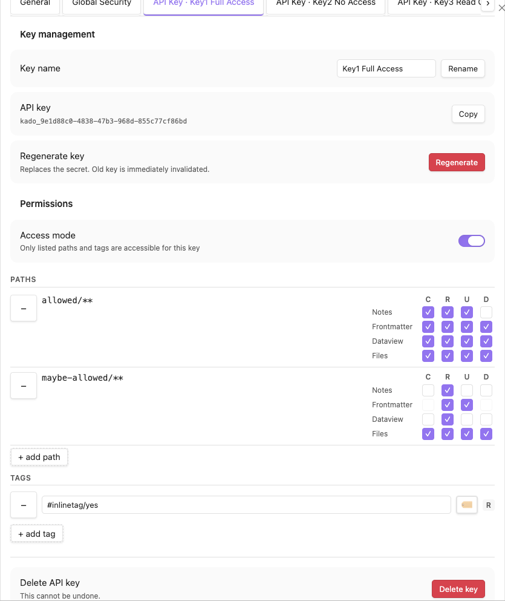

<p align="center">
  
</p>

# MiYo Kado -- Obsidian MCP Gateway

Security-first [Model Context Protocol](https://modelcontextprotocol.io/) server plugin for Obsidian. Gives AI assistants controlled, granular access to your vault through four tools: `kado-read`, `kado-write`, `kado-delete`, and `kado-search`.

> Part of the **MiYo** family. The plugin is referred to as **MiYo Kado** in the Obsidian community-plugin index and in the settings UI; "Kado" alone is used as a short form throughout this README and the source.

<p align="center">
  
</p>

## Why MiYo Kado?

Letting an AI assistant talk to your vault sounds great until you realize most integrations give the assistant **everything** -- every note, every file, full read/write. Kado is built around the opposite default:

- **Nothing is exposed by default.** You opt every path and every data type in, explicitly.
- **Per-key scopes.** Different assistants get different keys with different permissions. Revoke any key independently.
- **Audit trail.** Every allowed and denied request is logged so you can see exactly what an assistant touched.
- **Local-first.** The MCP server runs inside Obsidian on `127.0.0.1` by default. No cloud, no telemetry, no third party.

If you've ever wanted to say "this assistant can read my project notes but not my journal, and can delete drafts but never touch archived material", Kado is for you. Delete is a separate permission flag alongside create/read/update — you decide which keys are allowed to remove content, and all deletions go through the trash (respecting your Obsidian "Deleted files" setting).

## Features

- **Default-deny security** -- nothing is accessible until explicitly whitelisted
- **Two-tier access control** -- global security scope defines what is eligible; per-key scope defines what is permitted
- **Five permission gates** -- authenticate, global-scope, key-scope, datatype-permission, path-access
- **Four data types** -- notes (markdown), frontmatter (YAML as JSON), files (binary as base64), Dataview inline fields
- **Six search operations** -- byName, byTag, byContent, byFrontmatter, listDir, listTags
- **Optimistic concurrency** -- timestamp-based conflict detection on writes
- **Rate limiting** -- 200 requests/minute per IP
- **Audit logging** -- NDJSON log with rotation (metadata only, no content)

## Installation

### From the Obsidian Community Plugins

Once MiYo Kado is in the Community Plugins directory, search for "MiYo Kado" in **Settings -> Community plugins -> Browse**, install, and enable.

### Using BRAT (recommended while pending review)

1. Install the [BRAT](https://github.com/TfTHacker/obsidian42-brat) plugin
2. In BRAT settings, **Add Beta Plugin** -> paste `MMoMM-org/miyo-kado`
3. Enable **MiYo Kado** in **Settings -> Community plugins**

### Manual

1. Download `main.js`, `manifest.json`, and `styles.css` from the [latest release](https://github.com/MMoMM-org/miyo-kado/releases/latest)
2. Copy them into `<your-vault>/.obsidian/plugins/miyo-kado/` (create the folder if it doesn't exist)
3. Reload Obsidian and enable **MiYo Kado** in **Settings -> Community plugins**

## Quick Start

1. Open **Settings -> MiYo Kado**
2. Add paths to the global security whitelist (e.g. `notes/`, `projects/`, or `**` for full vault)
3. Create an API key and assign it paths and per-data-type permissions
4. Enable the server
5. Connect your MCP client using the key

```json
{
  "mcpServers": {
    "kado": {
      "type": "http",
      "url": "http://127.0.0.1:23026/mcp",
      "headers": {
        "Authorization": "Bearer YOUR_API_KEY_ID"
      }
    }
  }
}
```

## Screenshots

**General tab** -- server status, port, audit logging.

<p align="center">
  
</p>

**Global Security tab** -- whitelist of paths and tags that any key may reference. Permissions are set per data type (Notes, Frontmatter, Dataview, Files) for each path.

<p align="center">
  
</p>

**API Key tab** -- per-key access. Each key has its own access mode, paths, tags, and permission matrix, all constrained by the global security scope.

<p align="center">
  
</p>

## Documentation

| Document | Audience | Content |
|----------|----------|---------|
| [Configuration Guide](docs/configuration.md) | Vault owners | Installation, settings UI, security setup, API key management |
| [API Reference](docs/api-reference.md) | MCP client developers | Tool schemas, parameters, examples, error codes, auth |
| [Development Guide](docs/development.md) | Contributors | Build, test, lint, architecture, live testing |

## Security Model

Every request passes through five gates in order. The first denial stops the chain.

| # | Gate | Purpose |
|---|------|---------|
| 0 | authenticate | Bearer token must match an enabled API key |
| 1 | global-scope | Path must be inside the global whitelist (or outside the blacklist) |
| 2 | key-scope | Path must be inside the key's own scope |
| 3 | datatype-permission | Key must have the required CRUD flag for the data type |
| 4 | path-access | Final path-traversal and validation check |

Global security and each API key independently configure **whitelist** or **blacklist** mode. Both scopes can use **tags** for search operations.

## Architecture

```
MCP Client -> [MCP API Handler] -> [Kado Core] -> [Obsidian Interface] -> Vault
```

- **MCP API Handler** -- Express + Streamable HTTP transport, auth, rate limiting
- **Kado Core** -- Permission gates, routing, concurrency guard. No MCP or Obsidian imports.
- **Obsidian Interface** -- Vault adapters for notes, frontmatter, files, inline fields, search

## Part of MiYo

Kado is part of **MiYo**, a small family of Obsidian-adjacent tools focused on giving you control over what your assistants can see and do. MiYo Kado is the gateway component -- the piece that turns your vault into a properly-scoped MCP server. More tools are in the works.

## Roadmap

A few things I plan to address in upcoming releases. None of these are blockers for v0.1.x.

### Planned enhancements

- **Tag permissions beyond read-only.** Today tags are read-filters only. I want to add a Deny permission so you can use tags to *exclude* matching items even from otherwise-allowed paths.
- **Granular whitelist / blacklist toggle.** The mode flip currently applies to paths and tags together. A per-section toggle would allow mixed strategies.
- **Sub-path key scopes.** Right now an API key can only reference paths that the global scope already includes. I want to support narrower sub-paths inside an allowed parent (e.g. global allows `Atlas`, key only sees `Atlas/People`).
- **Real-time permission testing.** A "try this request" dry-run in the settings UI so you can verify permissions without wiring up an MCP client.
- **Settings import / export.** Backup/restore for the whole config (paths, keys, rules).

### Known issues

Tracked as GitHub Issues, linked in `docs/ai/memory/troubleshooting.md`:

- [#8](https://github.com/MMoMM-org/miyo-kado/issues/8) Blacklist permission-flag semantics inconsistent across CRUD actions
- [#9](https://github.com/MMoMM-org/miyo-kado/issues/9) Settings tab stale after plugin reload
- [#10](https://github.com/MMoMM-org/miyo-kado/issues/10) Transient file truncation after `vault.adapter.write()` (Obsidian-internal)
- [#11](https://github.com/MMoMM-org/miyo-kado/issues/11) MCP SDK does not handle 429 `Retry-After` (upstream SDK gap, Kado mitigated)

## Support

If MiYo Kado is useful to you and you want to help me keep building, you can support development via:

- [Buy Me a Coffee](https://ko-fi.com/mmomm)
- [GitHub Sponsors](https://github.com/sponsors/MMoMM-org)

Issues and pull requests are also very welcome.

## Contributing

Contributions are welcome. The short version:

1. **Open an issue first** for anything non-trivial (bugs, features, refactors) so we can align on scope before you invest time.
2. **Fork & branch** from `master`. Use a descriptive branch name (e.g. `fix/search-tag-case`, `feat/granular-scopes`).
3. **Keep changes focused** -- one feature or one fix per PR. See [Development Guide](docs/development.md) for build, test, and lint commands.
4. **Tests & lint must pass** -- run `npm run build`, `npm test`, and `npm run lint` before pushing.
5. **Conventional commits** -- e.g. `feat:`, `fix:`, `docs:`, `refactor:`. Release notes are generated from commit history.
6. **Open a PR** against `master` and reference the issue. Small, reviewable diffs get merged fastest.

For security issues, please **do not** open a public issue -- email marcus@mmomm.org instead.

## License

[MIT](LICENSE)
