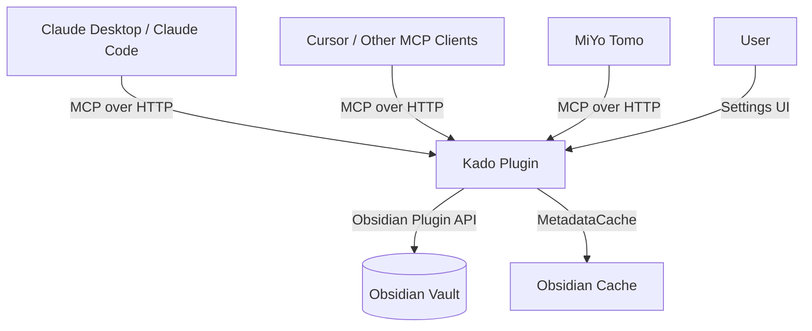
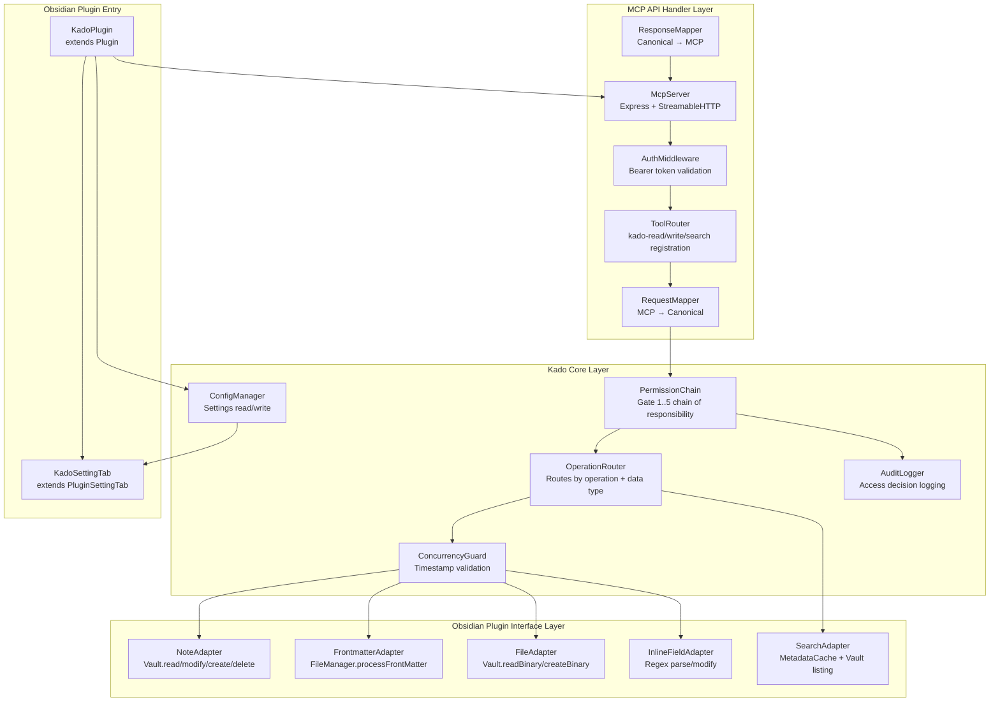
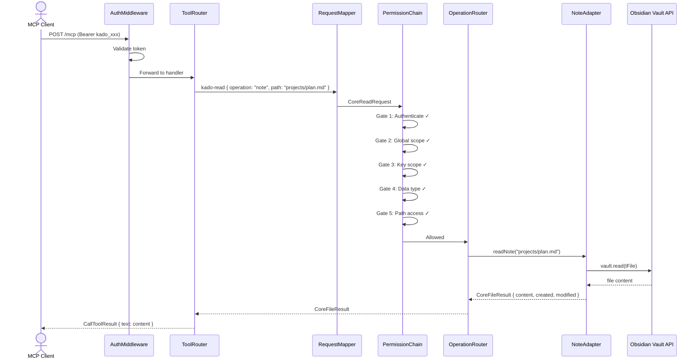
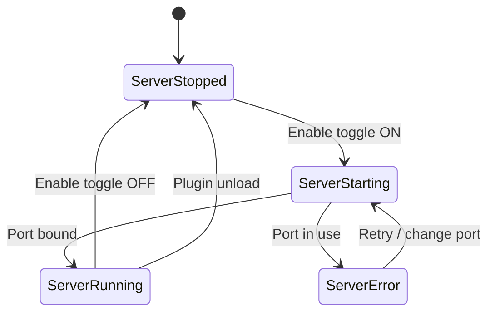

# Solution Design Document

## Validation Checklist

### CRITICAL GATES (Must Pass)

- [x] All required sections are complete
- [x] No [NEEDS CLARIFICATION] markers remain
- [x] Architecture pattern is clearly stated with rationale
- [x] **All architecture decisions confirmed by user**
- [x] Every interface has specification

### QUALITY CHECKS (Should Pass)

- [x] All context sources are listed with relevance ratings
- [x] Project commands are discovered from actual project files
- [x] Constraints → Strategy → Design → Implementation path is logical
- [x] Every component in diagram has directory mapping
- [x] Error handling covers all error types
- [x] Quality requirements are specific and measurable
- [x] Component names consistent across diagrams
- [x] A developer could implement from this design
- [ ] Implementation examples use actual schema column names (not pseudocode), verified against migration files
- [ ] Complex queries include traced walkthroughs with example data showing how the logic evaluates

---

## Constraints

CON-1 **Language/Framework**: TypeScript 5.8+, Obsidian Plugin API (Electron/Node.js), esbuild (CJS output targeting ES2018). No additional frameworks beyond Express.js for HTTP server.

CON-2 **Runtime**: Runs inside Obsidian's Electron renderer process with Node.js integration. Desktop only (Windows, macOS, Linux). No mobile support (no TCP binding on iOS/Android).

CON-3 **Build/Lint/Test**: esbuild for bundling, Vitest with jsdom + Obsidian mock for testing, ESLint with typescript-eslint + eslint-plugin-obsidianmd. TDD required per Constitution L1.

CON-4 **Security**: Default-deny access model. All vault operations through Obsidian's official Plugin API. API keys stored in cleartext in plugin `data.json` (OS-level protection is the security boundary per Constitution L2). No external services, no telemetry.

CON-5 **Performance**: No synchronous blocking on Obsidian's main UI thread (Constitution L1). Chunked/paginated responses for large result sets. Obsidian-API-first for search (MetadataCache before file scans).

CON-6 **Dependencies**: No strong copyleft licenses (Constitution L1). Bounded semver ranges, no bare `*` or `latest` for core dependencies. Minimize dependency footprint for security-critical paths.

CON-7 **Code Quality**: Max ~300-500 LOC per core file (Constitution L2). Clean separation of domain logic from AI-orchestration glue (Constitution L1). Lint with zero errors before merge.

## Implementation Context

### Required Context Sources

#### Documentation Context
```yaml
- doc: docs/XDD/specs/001-kado/prd.md
  relevance: CRITICAL
  why: "Product requirements — all 21 must-have features, acceptance criteria, business rules"

- doc: docs/XDD/adr/MCP Server with Payload Versioning and Anti-Corruption Layer.md
  relevance: CRITICAL
  why: "ADR-001: Dual ACL architecture decision — 4-layer model, canonical internal types"

- doc: Constitution.md
  relevance: HIGH
  why: "Project governance rules — L1/L2/L3 rules for security, architecture, testing, dependencies, performance"
```

#### Code Context
```yaml
- file: src/main.ts
  relevance: HIGH
  why: "Current plugin entry point (template) — will be refactored to KadoPlugin"

- file: src/settings.ts
  relevance: HIGH
  why: "Current settings implementation (template) — will be refactored to Kado settings"

- file: test/__mocks__/obsidian.ts
  relevance: HIGH
  why: "Obsidian API mock — must be extended for new API usage (processFrontMatter, etc.)"

- file: package.json
  relevance: MEDIUM
  why: "Dependencies, scripts, build configuration"

- file: esbuild.config.mjs
  relevance: MEDIUM
  why: "Build externals — obsidian, electron, node builtins must remain external"

- file: tsconfig.json
  relevance: MEDIUM
  why: "Strict mode enabled, noImplicitAny, strictNullChecks — all new code must comply"
```

#### External APIs
```yaml
- service: MCP TypeScript SDK
  doc: https://github.com/modelcontextprotocol/typescript-sdk
  relevance: CRITICAL
  why: "McpServer, NodeStreamableHTTPServerTransport, tool registration, Zod schemas"

- service: Obsidian Plugin API
  doc: node_modules/obsidian/obsidian.d.ts
  relevance: CRITICAL
  why: "Vault CRUD, MetadataCache, FileManager.processFrontMatter, PluginSettingTab, normalizePath"

- service: Express.js
  doc: https://expressjs.com/
  relevance: HIGH
  why: "HTTP server for MCP Streamable HTTP transport endpoint"
```

### Implementation Boundaries

- **Must Preserve**: Obsidian plugin lifecycle (`onload`/`onunload`), existing test infrastructure, build pipeline, CI/CD
- **Can Modify**: `src/main.ts`, `src/settings.ts` (both are template code to be replaced), `test/__mocks__/obsidian.ts` (extend with new API mocks)
- **Must Not Touch**: `.github/workflows/`, `esbuild.config.mjs` (unless new externals needed), `Constitution.md`, `docs/XDD/specs/001-kado/prd.md`

### External Interfaces

#### System Context Diagram



#### Interface Specifications

```yaml
# Inbound Interfaces
inbound:
  - name: "MCP Streamable HTTP"
    type: HTTP
    format: JSON-RPC 2.0 over Streamable HTTP
    authentication: Bearer token (API key)
    endpoint: "http://{host}:{port}/mcp"
    methods: POST (requests), GET (SSE stream), DELETE (session end)
    data_flow: "Tool calls from MCP clients → Kado → vault operations"

  - name: "Obsidian Settings UI"
    type: Obsidian PluginSettingTab
    format: Native Obsidian Setting components
    authentication: None (local UI)
    data_flow: "User configuration → data.json persistence"

# Data Interfaces
data:
  - name: "Plugin Configuration"
    type: Obsidian plugin.loadData() / plugin.saveData()
    storage: .obsidian/plugins/kado/data.json
    data_flow: "Global config, API keys, per-key scopes, server settings"

  - name: "Vault Files"
    type: Obsidian Vault API
    connection: Plugin API (app.vault, app.fileManager, app.metadataCache)
    data_flow: "Note CRUD, frontmatter processing, file operations, metadata queries"
```

### Project Commands

```bash
# Core Commands
Install: npm ci
Dev:     npm run dev          # esbuild watch, outputs ./main.js (hot-reload)
Test:    npm test             # vitest run
Watch:   npm run test:watch   # vitest watch mode
Cover:   npm run test:coverage
Lint:    npm run lint         # eslint .
Build:   npm run build        # tsc -noEmit + esbuild production → build/
```

---

## Solution Strategy

- **Architecture Pattern**: Four-layer Dual Anti-Corruption Layer (ADR-001). MCP API Handler → Kado Core → Obsidian Plugin Interface, with canonical internal types bridging the layers.
- **Integration Approach**: Kado runs as an Obsidian plugin. On `onload()`, it starts an Express HTTP server hosting the MCP Streamable HTTP endpoint. On `onunload()`, it shuts down the server and closes all sessions.
- **Justification**: The dual ACL isolates the Core from both MCP protocol changes and Obsidian API changes. The Core can be tested without either dependency. This satisfies Constitution L1 (clean separation of domain logic) and the ADR's stability goals.
- **Key Decisions**:
  - Streamable HTTP transport (current MCP standard, single `/mcp` endpoint)
  - Express.js for HTTP (proven in Obsidian plugins: obsidian-local-rest-api, obsidian-mcp-plugin)
  - 3 "fat" MCP tools with JSON sub-operations (minimizes LLM context cost)
  - Chain of Responsibility for permission gate evaluation
  - Optimistic concurrency via file timestamps
  - Self-parsed Dataview Inline Fields (no dependency on Dataview plugin)

---

## Building Block View

### Components



### Directory Map

```
src/
├── main.ts                          # MODIFY: KadoPlugin entry point (onload/onunload)
├── settings.ts                      # MODIFY: KadoSettingTab (global + per-key config UI)
├── types/
│   └── canonical.ts                 # NEW: Canonical request/response types, config types
├── mcp/
│   ├── server.ts                    # NEW: Express + StreamableHTTP setup, lifecycle
│   ├── tools.ts                     # NEW: kado-read/write/search tool registration (Zod schemas)
│   ├── auth.ts                      # NEW: Bearer token middleware
│   ├── request-mapper.ts            # NEW: MCP tool args → CoreRequest
│   └── response-mapper.ts           # NEW: CoreResult → MCP CallToolResult
├── core/
│   ├── permission-chain.ts          # NEW: Gate chain (authenticate → global → key → datatype → path)
│   ├── gates/
│   │   ├── authenticate.ts          # NEW: Gate 0 — API key lookup
│   │   ├── global-scope.ts          # NEW: Gate 1 — Global area + operation check
│   │   ├── key-scope.ts             # NEW: Gate 2 — Per-key area + operation check
│   │   ├── datatype-permission.ts   # NEW: Gate 3 — CRUD check per data type
│   │   └── path-access.ts           # NEW: Gate 4 — Path normalization + traversal check
│   ├── operation-router.ts          # NEW: Routes to correct adapter by operation + data type
│   ├── concurrency-guard.ts         # NEW: Timestamp validation for writes
│   ├── audit-logger.ts              # NEW: Access decision logging
│   └── config-manager.ts            # NEW: Config CRUD (reads/writes data.json via plugin API)
├── obsidian/
│   ├── note-adapter.ts              # NEW: Vault.read/modify/create/delete/process
│   ├── frontmatter-adapter.ts       # NEW: FileManager.processFrontMatter wrapper
│   ├── file-adapter.ts              # NEW: Vault.readBinary/createBinary/modifyBinary
│   ├── inline-field-adapter.ts      # NEW: Dataview inline field parser + modifier
│   └── search-adapter.ts            # NEW: MetadataCache queries, vault listing, tag search
test/
├── __mocks__/
│   └── obsidian.ts                  # MODIFY: Extend with processFrontMatter, stat, etc.
├── core/
│   ├── permission-chain.test.ts     # NEW: Gate chain tests (allow + deny per gate)
│   ├── concurrency-guard.test.ts    # NEW: Timestamp match/mismatch tests
│   └── config-manager.test.ts       # NEW: Config serialization tests
├── mcp/
│   ├── tools.test.ts                # NEW: Tool schema validation tests
│   ├── request-mapper.test.ts       # NEW: MCP → Canonical mapping tests
│   └── response-mapper.test.ts      # NEW: Canonical → MCP mapping tests
├── obsidian/
│   ├── note-adapter.test.ts         # NEW: Vault CRUD tests
│   ├── frontmatter-adapter.test.ts  # NEW: Frontmatter processing tests
│   ├── inline-field-adapter.test.ts # NEW: Inline field parse/modify tests
│   └── search-adapter.test.ts       # NEW: Search/listing tests
├── integration/
│   └── tool-roundtrip.test.ts       # NEW: End-to-end tool call tests (MCP → Core → mock Obsidian)
├── main.test.ts                     # MODIFY: Update for KadoPlugin
└── settings.test.ts                 # MODIFY: Update for KadoSettingTab
```

### Interface Specifications

#### Canonical Types (`src/types/canonical.ts`)

```typescript
// === Data Types ===

type DataType = 'note' | 'frontmatter' | 'file' | 'dataview-inline-field';
type CrudOperation = 'create' | 'read' | 'update' | 'delete';
type SearchOperation = 'byTag' | 'byName' | 'listDir' | 'listTags';

// === Core Requests ===

interface CoreReadRequest {
  apiKeyId: string;
  operation: DataType;
  path: string;
}

interface CoreWriteRequest {
  apiKeyId: string;
  operation: DataType;
  path: string;
  content: string | ArrayBuffer | Record<string, unknown>;
  expectedModified?: number;  // Required for updates, not for creates
}

interface CoreSearchRequest {
  apiKeyId: string;
  operation: SearchOperation;
  query?: string;             // Tag name, file name pattern, etc.
  path?: string;              // Scope to directory
  cursor?: string;            // Pagination token
  limit?: number;             // Page size (default: 50)
}

// === Core Results ===

interface CoreFileResult {
  path: string;
  content: string | ArrayBuffer | Record<string, unknown>;
  created: number;            // Unix timestamp ms
  modified: number;           // Unix timestamp ms
  size: number;               // Bytes
}

interface CoreWriteResult {
  path: string;
  created: number;
  modified: number;
}

interface CoreSearchResult {
  items: CoreSearchItem[];
  cursor?: string;            // Next page token, absent if last page
  total?: number;             // Total count if known
}

interface CoreSearchItem {
  path: string;
  name: string;
  created: number;
  modified: number;
  size: number;
  tags?: string[];            // For tag-bearing results
  frontmatter?: Record<string, unknown>;  // If frontmatter read is permitted
}

// === Errors ===

type CoreErrorCode =
  | 'UNAUTHORIZED'            // 401 — missing/invalid API key
  | 'FORBIDDEN'               // 403 — valid key, insufficient permissions
  | 'NOT_FOUND'               // 404 — file/path does not exist
  | 'CONFLICT'                // 409 — timestamp mismatch or file already exists
  | 'VALIDATION_ERROR'        // 400 — malformed input, path traversal attempt
  | 'INTERNAL_ERROR';         // 500 — unexpected failure

interface CoreError {
  code: CoreErrorCode;
  message: string;            // Non-leaking description
  gate?: string;              // Which gate denied (for FORBIDDEN)
}

// === Permission Gate ===

type GateResult =
  | { allowed: true }
  | { allowed: false; error: CoreError };

interface PermissionGate {
  name: string;
  evaluate(request: CoreRequest, config: KadoConfig): GateResult;
}

type CoreRequest = CoreReadRequest | CoreWriteRequest | CoreSearchRequest;
```

#### Configuration Types (`src/types/canonical.ts`)

```typescript
// === API Key ===

interface ApiKeyConfig {
  id: string;                 // kado_ + UUID
  label: string;              // Human-readable name
  enabled: boolean;
  createdAt: number;          // Unix timestamp ms
  areas: KeyAreaConfig[];     // Subset of global areas
}

interface KeyAreaConfig {
  areaId: string;             // References GlobalArea.id
  permissions: DataTypePermissions;
}

interface DataTypePermissions {
  note: CrudFlags;
  frontmatter: CrudFlags;
  file: CrudFlags;
  dataviewInlineField: CrudFlags;
}

interface CrudFlags {
  create: boolean;
  read: boolean;
  update: boolean;
  delete: boolean;
}

// === Global Config ===

interface GlobalArea {
  id: string;                 // Auto-generated UUID
  label: string;              // Human-readable name
  pathPatterns: string[];     // Glob patterns (e.g., "projects/**")
  permissions: DataTypePermissions;
}

interface ServerConfig {
  enabled: boolean;
  host: string;               // Default: "127.0.0.1"
  port: number;               // Default: 23026
}

interface AuditConfig {
  enabled: boolean;           // Default: true
  logFilePath: string;        // Default: ".obsidian/plugins/kado/audit.log"
  maxSizeBytes: number;       // Default: 10MB, rotation
}

interface KadoConfig {
  server: ServerConfig;
  globalAreas: GlobalArea[];
  apiKeys: ApiKeyConfig[];
  audit: AuditConfig;
}
```

#### MCP Tool Schemas (`src/mcp/tools.ts`)

```typescript
// kado-read input schema
const kadoReadSchema = z.object({
  operation: z.enum(['note', 'frontmatter', 'file', 'dataview-inline-field']),
  path: z.string().describe('Vault-relative path to the file'),
});

// kado-write input schema
const kadoWriteSchema = z.object({
  operation: z.enum(['note', 'frontmatter', 'file', 'dataview-inline-field']),
  path: z.string().describe('Vault-relative path to the file'),
  content: z.unknown().describe('Content to write (string for notes, object for frontmatter/inline fields, base64 string for binary files)'),
  expectedModified: z.number().optional().describe('Modified timestamp from a prior read. Required for updates to existing files. Omit for creates.'),
});

// kado-search input schema
const kadoSearchSchema = z.object({
  operation: z.enum(['byTag', 'byName', 'listDir', 'listTags']),
  query: z.string().optional().describe('Search term: tag name (e.g. "#project"), file name pattern, or omit for listing'),
  path: z.string().optional().describe('Scope search to this directory path'),
  cursor: z.string().optional().describe('Pagination cursor from previous response'),
  limit: z.number().optional().describe('Results per page (default: 50, max: 200)'),
});
```

#### Data Storage

No database schema changes. All configuration is stored in Obsidian's native `data.json`:

```yaml
Storage: .obsidian/plugins/kado/data.json
Format: JSON (serialized KadoConfig)
Access: plugin.loadData() / plugin.saveData()
Size: Small (< 100KB for typical configurations with dozens of API keys)
```

Audit log is a separate append-only file:
```yaml
Storage: .obsidian/plugins/kado/audit.log (configurable path)
Format: NDJSON (one JSON object per line)
Rotation: When file exceeds maxSizeBytes, rename to audit.log.1 and start new file
Fields per entry: { timestamp, apiKeyId, operation, dataType, path, decision, gate?, durationMs }
```

#### Integration Points

```yaml
# Internal layer communication (all in-process, no network)
- from: MCP API Handler
  to: Kado Core
  protocol: Direct function calls (TypeScript interfaces)
  data_flow: "CoreRequest → CoreResult | CoreError"

- from: Kado Core
  to: Obsidian Plugin Interface
  protocol: Direct function calls (TypeScript interfaces)
  data_flow: "Adapter-specific requests → Adapter results"

# External integration
- from: MCP Clients
  to: MCP API Handler
  protocol: HTTP (Streamable HTTP transport)
  endpoint: "http://{host}:{port}/mcp"
  data_flow: "JSON-RPC 2.0 tool calls with Bearer auth"
```

### Implementation Examples

#### Example: Permission Gate Chain

**Why this example**: The gate chain is the security-critical path. Every request must pass through all gates in order. A gate returning `{ allowed: false }` short-circuits the chain.

```typescript
// Core gate evaluation — no MCP or Obsidian dependencies
function evaluatePermissions(
  request: CoreRequest,
  config: KadoConfig,
  gates: PermissionGate[],
): GateResult {
  for (const gate of gates) {
    const result = gate.evaluate(request, config);
    if (!result.allowed) {
      return result;  // Short-circuit on first denial
    }
  }
  return { allowed: true };
}

// Gate order (matches PRD BR-P1 through BR-P9):
// 1. AuthenticateGate  — Is apiKeyId a known, enabled key?
// 2. GlobalScopeGate   — Is the path in any global area?
// 3. KeyScopeGate      — Is the path in this key's assigned areas?
// 4. DataTypeGate      — Does the key have the required CRUD right for this data type?
// 5. PathAccessGate    — Path normalization, traversal check, glob match
```

#### Example: Optimistic Concurrency Check

**Why this example**: Timestamp validation is the concurrency mechanism. It prevents silent overwrites when a file was modified between read and write.

```typescript
// In ConcurrencyGuard — runs after permission gates, before adapter call
function validateTimestamp(
  request: CoreWriteRequest,
  currentMtime: number,
): GateResult {
  // Creates don't need timestamps
  if (request.expectedModified === undefined) {
    return { allowed: true };  // Treat as create (adapter checks existence)
  }

  // Updates must match
  if (request.expectedModified !== currentMtime) {
    return {
      allowed: false,
      error: {
        code: 'CONFLICT',
        message: 'File was updated in the background. Re-read before retrying.',
      },
    };
  }

  return { allowed: true };
}
```

#### Example: Dataview Inline Field Parsing

**Why this example**: Inline field parsing is non-trivial with three syntax variants and code block exclusion.

```typescript
// Three inline field patterns
// 1. Full-line:  key:: value
// 2. Bracket:    [key:: value]
// 3. Paren:      (key:: value)

interface InlineField {
  key: string;
  value: string;
  line: number;          // 0-based line index
  start: number;         // Character offset in line
  end: number;           // Character offset in line
  wrapping: 'none' | 'bracket' | 'paren';
}

// Parsing strategy:
// 1. Split content into lines
// 2. Track fenced code block state (``` toggles inCodeBlock flag)
// 3. Skip frontmatter block (between --- delimiters at file start)
// 4. For each non-skipped line:
//    a. Try bracket pattern: /\[([^\[\]#*_`:]+?)\s*::\s*([^\]]*?)\]/g
//    b. Try paren pattern:   /\(([^\(\)#*_`:]+?)\s*::\s*([^\)]*?)\)/g
//    c. Try full-line pattern (after stripping list markers):
//       /^([^\n\[\]()#*_`:]+\w)\s*::\s*(.*)$/
// 5. Return array of InlineField with exact positions

// Modification: splice line at recorded positions, preserve wrapping style
```

---

## Runtime View

### Primary Flow: MCP Tool Call (kado-read example)

1. MCP client sends POST to `/mcp` with `tools/call` request for `kado-read`
2. Express middleware validates Bearer token → sets `req.auth`
3. StreamableHTTPServerTransport dispatches to tool handler
4. ToolRouter invokes `kado-read` handler
5. RequestMapper translates MCP args to `CoreReadRequest`
6. PermissionChain evaluates gates 1-5 sequentially
7. If any gate denies → return `CoreError` (short-circuit, no vault access)
8. OperationRouter selects adapter based on `operation` field
9. Adapter reads from vault via Obsidian API
10. Adapter returns `CoreFileResult` with content + timestamps
11. ResponseMapper translates to MCP `CallToolResult`
12. Response sent to client



### Primary Flow: kado-write with Concurrency Check

1. Client sends `kado-write` with `expectedModified` timestamp
2. Auth + permission gates pass
3. ConcurrencyGuard checks `expectedModified` against `file.stat.mtime`
4. If mismatch → 409 Conflict error
5. If match → adapter performs write via Obsidian API
6. Response includes new `modified` timestamp

### Primary Flow: kado-search

1. Client sends `kado-search` with operation (e.g., `byTag`)
2. Auth + permission gates pass (read permission required)
3. SearchAdapter queries MetadataCache for matching files
4. Results filtered to key's effective scope
5. If results exceed `limit`, paginate with cursor token
6. Response includes items with timestamps + optional next cursor

### Error Handling

| Error Source | Response | HTTP-equivalent |
|---|---|---|
| Missing/invalid Bearer token | `UNAUTHORIZED` — "Invalid or missing API key" | 401 |
| Valid key, denied by any gate | `FORBIDDEN` — "Operation not permitted" (no path/content leak) | 403 |
| File not found in vault | `NOT_FOUND` — "File does not exist at path" | 404 |
| Timestamp mismatch on write | `CONFLICT` — "File was updated in the background" | 409 |
| Path traversal (`../`) detected | `VALIDATION_ERROR` — "Invalid path" | 400 |
| Malformed YAML in frontmatter update | `VALIDATION_ERROR` — "Invalid frontmatter content" | 400 |
| Unknown operation in tool call | `VALIDATION_ERROR` — "Unknown operation" | 400 |
| Obsidian API throws unexpectedly | `INTERNAL_ERROR` — "Internal server error" (no stack trace leak) | 500 |

All errors are returned as MCP `CallToolResult` with `isError: true` and a non-leaking text message. The audit log records the full error details (if audit is enabled).

---

## Deployment View

### Single Application Deployment

No change to existing deployment model. Kado is an Obsidian plugin:

- **Environment**: Obsidian Desktop (Electron, Windows/macOS/Linux)
- **Installation**: Copy `main.js`, `manifest.json`, `styles.css` to `.obsidian/plugins/kado/` or install via Obsidian Community Plugin browser
- **Configuration**: All via Obsidian Settings UI → Kado tab. Persisted to `data.json`
- **Dependencies**: No external services. Express.js + MCP SDK bundled into `main.js` by esbuild
- **Performance**: Server binds to configured port on plugin load. ~50ms startup. Memory footprint proportional to number of concurrent sessions (each session holds a transport instance)

### Build Output

esbuild bundles everything into a single `main.js` (CJS). External modules (`obsidian`, `electron`, Node builtins) are excluded. Express.js and `@modelcontextprotocol/sdk` are bundled in.

```
build/
├── main.js          # Bundled plugin (CJS)
├── manifest.json    # Obsidian plugin manifest
└── styles.css       # Plugin styles
```

---

## Cross-Cutting Concepts

### Pattern Documentation

```yaml
# Existing patterns used
- pattern: Obsidian Plugin lifecycle (onload/onunload, register() for cleanup)
  relevance: CRITICAL
  why: "All server and event lifecycle must use register() for automatic cleanup"

- pattern: Obsidian PluginSettingTab + Setting builder
  relevance: HIGH
  why: "Settings UI built with native Obsidian components"

# New patterns created
- pattern: Dual Anti-Corruption Layer (ADR-001)
  relevance: CRITICAL
  why: "Core isolation from MCP and Obsidian — the fundamental architecture"

- pattern: Fat Tools with JSON sub-operations
  relevance: HIGH
  why: "3 MCP tools with operation routing via JSON field"

- pattern: Chain of Responsibility for permission gates
  relevance: HIGH
  why: "Sequential fail-fast evaluation of 5 security gates"
```

### User Interface & UX

**Settings Tab Structure:**

```
┌─────────────────────────────────────────────┐
│  Kado Settings                              │
├─────────────────────────────────────────────┤
│                                             │
│  ── Server ──────────────────────────────── │
│  Status:     ● Running on 127.0.0.1:23026  │
│  Enable:     [✓]                            │
│  Host:       [127.0.0.1        ]            │
│  Port:       [23026            ]            │
│                                             │
│  ── Global Areas ────────────────────────── │
│  [+ Add Area]                               │
│                                             │
│  ┌ Projects ─────────────────────────────┐  │
│  │ Paths: projects/**                    │  │
│  │ Notes: [C][R][U][ ] FM: [C][R][U][ ] │  │
│  │ Files: [ ][R][ ][ ] DV: [ ][R][U][ ] │  │
│  │                         [Edit] [Del]  │  │
│  └───────────────────────────────────────┘  │
│                                             │
│  ── API Keys ────────────────────────────── │
│  [+ Generate Key]                           │
│                                             │
│  ┌ Tomo - Work Assistant ────────────────┐  │
│  │ Key: kado_a1b2c3d4-e5f6-... [Copy]   │  │
│  │ Areas: Projects ✓  Journal ✗          │  │
│  │ Status: Enabled         [Configure]   │  │
│  └───────────────────────────────────────┘  │
│                                             │
│  ── Audit ───────────────────────────────── │
│  Enable:     [✓]                            │
│  Log path:   [.obsidian/plugins/kado/audit] │
│  Max size:   [10 ] MB                       │
│                                             │
└─────────────────────────────────────────────┘
```

**Per-Key Configuration (expands on [Configure]):**

```
┌─────────────────────────────────────────────┐
│  Configure: Tomo - Work Assistant           │
├─────────────────────────────────────────────┤
│  Label:  [Tomo - Work Assistant    ]        │
│  Status: [✓] Enabled                        │
│                                             │
│  ── Area: Projects ──────────────────────── │
│  Assigned: [✓]                              │
│  Notes: [C][R][U][ ]  (Global max: CRUD)   │
│  FM:    [ ][R][U][ ]  (Global max: CRUD)   │
│  Files: [ ][R][ ][ ]  (Global max: R)      │
│  DV:    [ ][R][ ][ ]  (Global max: RU)     │
│                                             │
│  ── Effective Permissions ───────────────── │
│  projects/** → Notes: CRU, FM: RU,         │
│                Files: R, DV: R              │
│                                             │
│  [Back to main settings]                    │
└─────────────────────────────────────────────┘
```

**Interaction States:**



### System-Wide Patterns

- **Security**: Bearer token auth on every request. Fail-fast gate chain. Path normalization with traversal rejection. No content in error messages or audit logs.
- **Error Handling**: All errors wrapped in `CoreError` with non-leaking messages. Obsidian API exceptions caught at adapter boundary and translated to `INTERNAL_ERROR`. No unhandled promise rejections.
- **Performance**: Obsidian MetadataCache used for search before file reads. Chunked responses with configurable page size. No sync blocking on main thread.
- **Logging**: Always-on console logging: plugin load/unload, server start/stop, config changes, errors. Toggleable audit log for access decisions.

---

## Architecture Decisions

- [x] **ADR-1: Dual Anti-Corruption Layer Architecture**
  - Choice: Four-layer architecture (MCP Handler → Core → Obsidian Interface) with canonical types
  - Rationale: Isolates Core from both MCP protocol changes and Obsidian API changes
  - Trade-offs: Two mapping steps per request; more boilerplate than monolithic approach
  - User confirmed: ✓ (ADR-001, confirmed in design brainstorm)

- [x] **ADR-2: Streamable HTTP Transport**
  - Choice: `NodeStreamableHTTPServerTransport` from `@modelcontextprotocol/sdk` with Express.js
  - Rationale: Current MCP standard (protocol 2025-06-18). SSE is deprecated. Single `/mcp` endpoint is simpler. Supported by Claude Code, Claude Desktop, Cursor.
  - Trade-offs: Newer transport, but proven in existing Obsidian plugin (aaronsb/obsidian-mcp-plugin)
  - User confirmed: ✓

- [x] **ADR-3: Fat Tools Pattern (3 MCP Tools)**
  - Choice: `kado-read`, `kado-write`, `kado-search` with JSON `operation` field for sub-routing
  - Rationale: Minimizes LLM context cost. Permission check maps cleanly to tool type (read/write/search). Extensible via new operations without new tools.
  - Trade-offs: Slightly more complex tool input schemas. LLM must know valid operations.
  - User confirmed: ✓

- [x] **ADR-4: Chain of Responsibility for Permission Gates**
  - Choice: 5 sequential gates, each independently testable, short-circuit on first denial
  - Rationale: Maps 1:1 to PRD gate model. Each gate testable in isolation. Easy to add/reorder gates.
  - Trade-offs: More files than a single evaluator function
  - User confirmed: ✓

- [x] **ADR-5: Single data.json via Obsidian Native API**
  - Choice: All config (global areas, API keys, server settings) in one `data.json`
  - Rationale: Obsidian-native, works with Obsidian Sync, no custom file I/O
  - Trade-offs: All config in one blob, but data volume is small for v1
  - User confirmed: ✓

- [x] **ADR-6: API Key Format (kado_ + UUID)**
  - Choice: `kado_` prefix + `crypto.randomUUID()`, stored in cleartext
  - Rationale: Simple, identifiable, PRD-compliant (key visible in settings). OS-level protection as security boundary.
  - Trade-offs: Cleartext storage. Acceptable per Constitution L2 for local-only service.
  - User confirmed: ✓

- [x] **ADR-7: Self-Parsed Dataview Inline Fields**
  - Choice: Regex-based parsing of all three syntax variants (bare, bracket, paren). No Dataview plugin dependency.
  - Rationale: Works whether or not Dataview is installed. Dataview API is read-only anyway. Pattern is well-defined.
  - Trade-offs: Must maintain parser ourselves. Edge cases possible.
  - User confirmed: ✓

- [x] **ADR-8: Optimistic Concurrency via Timestamps**
  - Choice: Read returns `modified` timestamp. Write requires `expectedModified` matching current `file.stat.mtime`. Mismatch → 409 Conflict.
  - Rationale: Simple, proven pattern. No queue needed for writes. Client must re-read before retry.
  - Trade-offs: Client bears retry responsibility. No automatic conflict resolution.
  - User confirmed: ✓

---

## Quality Requirements

- **Performance**: MCP tool call latency < 100ms for single-file read operations on a vault with < 10,000 files. Search/listing operations return first page within 500ms.
- **Security**: 100% of requests pass through all 5 permission gates. Zero unauthorized vault access. Path traversal attempts detected and rejected.
- **Reliability**: Server recovers from port-in-use errors with clear user feedback. Plugin unload always releases the port. No orphaned HTTP connections.
- **Testability**: Core layer achieves > 90% line coverage. Every permission gate has tests for both allow and deny cases. Integration tests cover tool registration → call → response roundtrip.
- **Usability**: Settings UI renders within 200ms. Effective permissions view accurately reflects the intersection of global + key config. API key copy-to-clipboard works on all desktop platforms.

---

## Acceptance Criteria

**Authentication & Authorization (PRD Features 1-7)**

- [x] WHEN a request arrives without a Bearer token, THE SYSTEM SHALL return UNAUTHORIZED before any vault access
- [x] WHEN a request arrives with an unknown or disabled API key, THE SYSTEM SHALL return UNAUTHORIZED
- [x] WHEN a valid key requests an operation outside its global scope, THE SYSTEM SHALL return FORBIDDEN
- [x] WHEN a valid key requests an operation outside its key-specific scope, THE SYSTEM SHALL return FORBIDDEN
- [x] WHEN a valid key requests an operation it lacks CRUD rights for on the target data type, THE SYSTEM SHALL return FORBIDDEN
- [x] WHEN a path contains `../` or traversal sequences, THE SYSTEM SHALL return VALIDATION_ERROR before any vault access
- [x] THE SYSTEM SHALL evaluate all 5 permission gates before any vault operation begins (fail-fast)

**Read Operations (PRD Features 17-21)**

- [x] WHEN kado-read is called with operation "note" on an authorized path, THE SYSTEM SHALL return the full note content with created/modified timestamps
- [x] WHEN kado-read is called with operation "frontmatter", THE SYSTEM SHALL return the frontmatter as a structured object
- [x] WHEN kado-read is called with operation "frontmatter" on a note without frontmatter, THE SYSTEM SHALL return an empty object
- [x] WHEN kado-read is called with operation "dataview-inline-field", THE SYSTEM SHALL return all inline fields as key-value pairs
- [x] WHEN kado-read is called with operation "file" on a binary file, THE SYSTEM SHALL return the content as base64

**Write Operations (PRD Features 1, 5-6)**

- [x] WHEN kado-write creates a new note at an authorized path, THE SYSTEM SHALL create the file and return the new timestamps
- [x] WHEN kado-write targets a path that already exists without expectedModified, THE SYSTEM SHALL return CONFLICT
- [x] WHEN kado-write provides expectedModified that matches the current mtime, THE SYSTEM SHALL perform the write
- [x] WHEN kado-write provides expectedModified that does NOT match, THE SYSTEM SHALL return CONFLICT with "File was updated in the background"
- [x] WHEN kado-write updates frontmatter, THE SYSTEM SHALL modify only the frontmatter block, preserving the note body exactly
- [x] WHEN kado-write updates a Dataview inline field, THE SYSTEM SHALL modify only the target field, preserving surrounding text

**Search Operations (PRD Features 17-19)**

- [x] WHEN kado-search is called with operation "listDir", THE SYSTEM SHALL return only entries within the key's effective scope
- [x] WHEN kado-search is called with operation "byTag", THE SYSTEM SHALL return matching notes using MetadataCache
- [x] WHEN search results exceed the limit, THE SYSTEM SHALL return a cursor for pagination
- [x] THE SYSTEM SHALL never include results from paths outside the key's effective scope

**Server Lifecycle (PRD Feature 10)**

- [x] WHEN the plugin loads and server is enabled, THE SYSTEM SHALL start the HTTP server on the configured host:port
- [x] WHEN the plugin unloads, THE SYSTEM SHALL close all sessions, stop the server, and release the port
- [x] WHEN the configured port is already in use, THE SYSTEM SHALL report an error in settings and console

**Configuration (PRD Features 8-16)**

- [x] WHEN a new API key is created, THE SYSTEM SHALL default to no permissions and no scope
- [x] WHEN global config changes, THE SYSTEM SHALL apply changes to subsequent requests immediately
- [x] WHEN a global area is removed, THE SYSTEM SHALL revoke effective access for all keys referencing it

---

## Risks and Technical Debt

### Known Technical Issues

- 6 pre-existing lint errors from template code (`obsidianmd/sample-names` rule on `MyPlugin`, `SampleModal`, `SampleSettingTab`). Will be resolved when renaming to Kado classes.
- `manifest.json` still has template values (`sample-plugin` id, `Obsidian` author). Must be updated before any release.
- `package.json` name is `obsidian-sample-plugin`. Must be renamed.

### Technical Debt

- Template code in `src/main.ts` and `src/settings.ts` is placeholder. Full replacement planned.
- Test vault `test/MiYo-Kado/` contains hot-reload config pointing to current directory. May need adjustment per developer.

### Implementation Gotchas

- **Express.js in Obsidian**: Express works in Electron's renderer process with Node integration, but `require('http')` resolves to Node's built-in module. esbuild must keep `http`, `https`, `net`, `tls`, `stream`, `events`, `crypto` as externals (they already are via the `node:*` external pattern).
- **`vault.read()` vs `vault.cachedRead()`**: Must use `vault.read()` (disk read) before any write operation to get accurate content for modification. `cachedRead()` may return stale data.
- **`processFrontMatter()` atomicity**: `FileManager.processFrontMatter()` is atomic (read-modify-write). But our timestamp concurrency check happens before the call. There's a tiny race window between our mtime check and the actual write. Acceptable for v1 — the window is milliseconds, not seconds.
- **MetadataCache timing**: Cache may not be populated immediately after vault load. Register handlers inside `app.workspace.onLayoutReady()` for initial file listing. The `metadataCache.on('resolved')` event signals all files are cached.
- **Inline field regex edge cases**: The bracket pattern `[key:: value]` could conflict with Obsidian's markdown link syntax if the key contains `|`. Our regex excludes `]` from keys, which prevents this, but should be tested thoroughly.
- **Port binding on macOS**: macOS may prompt for firewall permission if binding to a non-localhost IP. This is expected behavior for Feature 10 (configurable server exposure).

---

## Glossary

### Domain Terms

| Term | Definition | Context |
|------|------------|---------|
| Vault | An Obsidian knowledge base — a directory of markdown files and attachments | The data Kado protects and provides access to |
| Global Area | A named scope (glob pattern) defining which vault paths are eligible for MCP access | Configured in Kado's global settings; API keys select from these |
| API Key | A `kado_`-prefixed UUID token identifying an MCP client and its permissions | Created in settings, passed as Bearer token in MCP requests |
| Effective Permissions | The intersection of global area permissions and per-key permissions | What an API key can actually do — never broader than global config |
| Dataview Inline Field | A `key:: value` annotation in note body text (three syntax variants) | Treated as a distinct data type with its own CRUD permissions |
| Fat Tool | An MCP tool that handles multiple sub-operations via a JSON `operation` field | Kado exposes 3 fat tools instead of 15+ individual tools |

### Technical Terms

| Term | Definition | Context |
|------|------------|---------|
| Streamable HTTP | Current MCP transport (protocol 2025-06-18) — single `/mcp` endpoint with POST/GET/DELETE | How MCP clients connect to Kado's server |
| ACL (Anti-Corruption Layer) | A design pattern that translates between two systems to prevent coupling | Kado has two: MCP→Core and Core→Obsidian |
| Canonical Model | The internal type system shared between Kado's layers | CoreReadRequest, CoreWriteRequest, CoreSearchRequest, etc. |
| Gate | One step in the permission evaluation chain | 5 gates: authenticate, global scope, key scope, data type, path access |
| Optimistic Concurrency | A strategy where writes check a version token (timestamp) rather than locking | Kado uses `file.stat.mtime` as the version token |

### API/Interface Terms

| Term | Definition | Context |
|------|------------|---------|
| `kado-read` | MCP tool for all read operations (note, frontmatter, file, inline fields) | Sub-operation selected via `operation` field |
| `kado-write` | MCP tool for all write operations | Requires `expectedModified` timestamp for updates |
| `kado-search` | MCP tool for search and listing (byTag, byName, listDir, listTags) | Returns paginated results with cursor |
| Bearer token | HTTP Authorization header format: `Bearer kado_xxxx` | How MCP clients authenticate with Kado |
