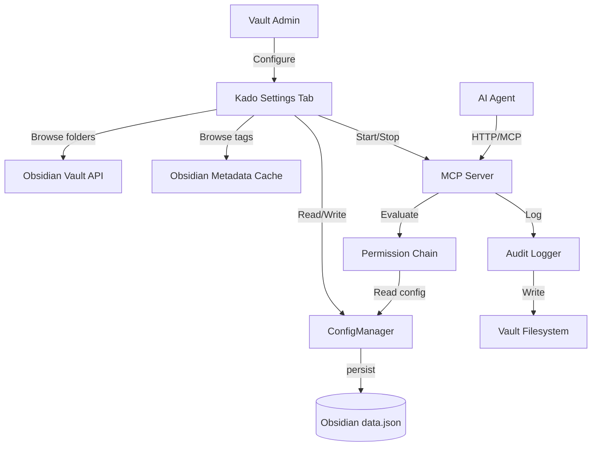
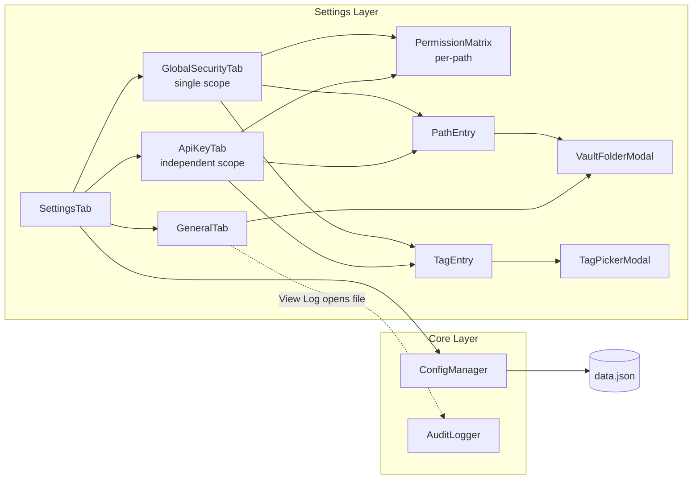
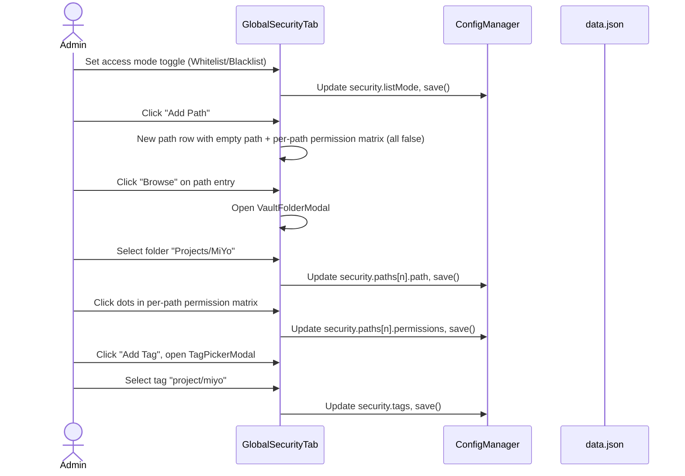
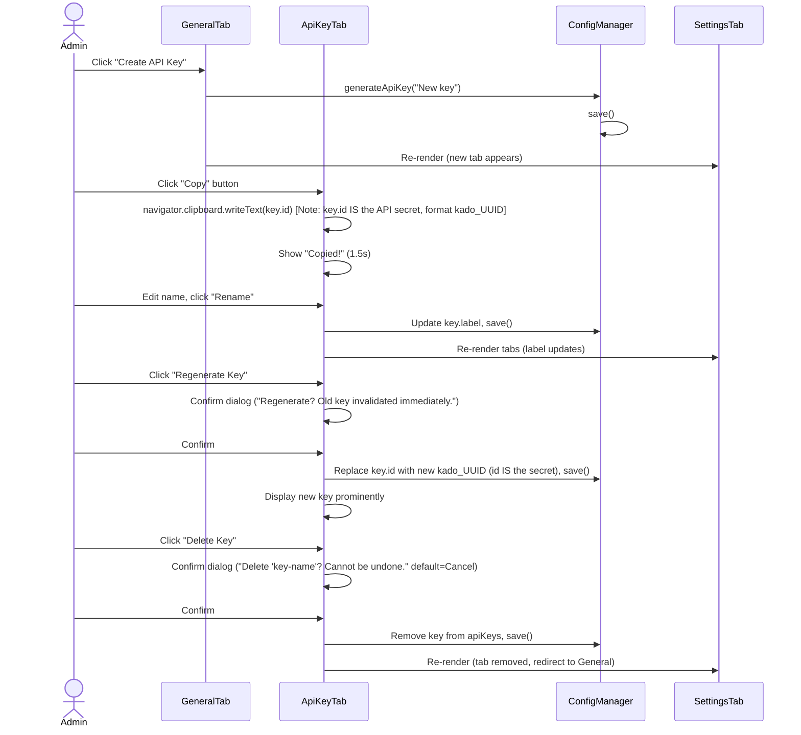
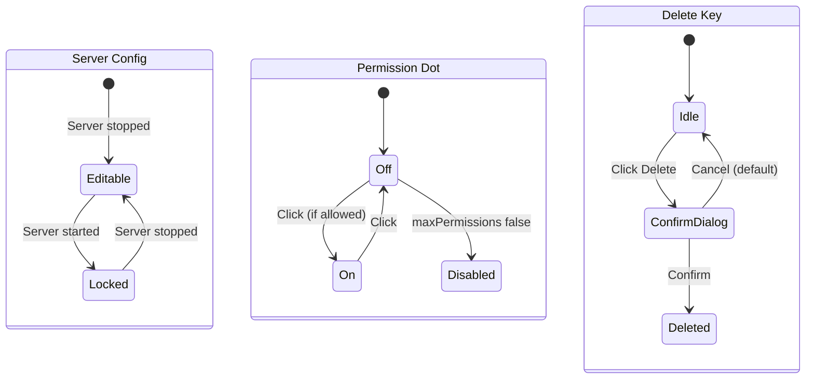

> **v2.0 (2026-04-01):** Updated for the v2 rework. Key changes: multi-area replaced by single `SecurityConfig` scope, per-path permissions, independent key listMode, ISO 8601 audit timestamps, version header from manifest, scope-resolver for enforcement logic. See `docs/XDD/ideas/2026-04-01-settings-ui-rework-v2.md` for full rationale.

# Solution Design Document

## Validation Checklist

### CRITICAL GATES (Must Pass)

- [x] All required sections are complete
- [x] No [NEEDS CLARIFICATION] markers remain
- [x] Architecture pattern is clearly stated with rationale
- [x] **All architecture decisions confirmed by user**
- [x] Every interface has specification

### QUALITY CHECKS (Should Pass)

- [x] All context sources are listed with relevance ratings
- [x] Project commands are discovered from actual project files
- [x] Constraints → Strategy → Design → Implementation path is logical
- [x] Every component in diagram has directory mapping
- [x] Error handling covers all error types
- [x] Quality requirements are specific and measurable
- [x] Component names consistent across diagrams
- [x] A developer could implement from this design

---

## Constraints

- **CON-1**: Obsidian Plugin API only — `PluginSettingTab`, `Setting`, `Modal` classes. No external UI frameworks (React, Vue, etc.). Vanilla DOM + Obsidian API.
- **CON-2**: Single JSON blob storage via `plugin.loadData()` / `plugin.saveData()`. No separate config files.
- **CON-3**: Inherit Obsidian's native theme — use CSS variables (`--background-primary`, `--text-normal`, `--interactive-accent`, etc.). No custom color palette. Only `.kado-` prefixed classes for layout/structure.
- **CON-4**: Default-deny security model (L1 constitutional rule). UI must reinforce that nothing is accessible until explicitly granted.
- **CON-5**: No backward compatibility needed — test instance only. Config can be reset during development.
- **CON-6**: TypeScript strict mode, ES2018 target, CommonJS output via esbuild.

## Implementation Context

### Required Context Sources

#### Documentation Context
```yaml
- doc: docs/XDD/specs/002-ui-settings-rework/requirements.md
  relevance: CRITICAL
  why: "PRD defining all features and acceptance criteria"

- doc: CLAUDE.md
  relevance: HIGH
  why: "Build commands, project conventions"

- doc: docs/live-testing.md
  relevance: MEDIUM
  why: "How to test with the Obsidian test vault"
```

#### Code Context
```yaml
- file: src/settings.ts
  relevance: CRITICAL
  why: "Current settings tab — will be replaced entirely"

- file: src/types/canonical.ts
  relevance: CRITICAL
  why: "All type definitions — will be extended"

- file: src/core/config-manager.ts
  relevance: HIGH
  why: "Config CRUD — may need new methods for tags/listMode"

- file: src/core/audit-logger.ts
  relevance: HIGH
  why: "Audit logger — rotation logic needs extension for retention count"

- file: src/main.ts
  relevance: HIGH
  why: "Plugin entry point — audit path resolution changes"

- file: src/mcp/tools.ts
  relevance: MEDIUM
  why: "Tool registration — search filter by tags needs awareness"

- file: src/obsidian/search-adapter.ts
  relevance: MEDIUM
  why: "Tag search — byTag uses metadataCache.getFileCache().tags"

- file: package.json
  relevance: MEDIUM
  why: "Dependencies: obsidian 1.7.2, express 5.2.1, zod 4.3.6, MCP SDK 1.29.0"

- file: manifest.json
  relevance: LOW
  why: "Plugin version for settings header display"
```

### Implementation Boundaries

- **Must Preserve**: Core permission chain (5 gates), MCP tool handlers, adapter layer, all existing tests
- **Can Modify**: `settings.ts` (replace entirely), `types/canonical.ts` (extend — replace GlobalArea[] with SecurityConfig, update ApiKeyConfig), `config-manager.ts` (update for new model), `audit-logger.ts` (rotation extension, ISO timestamps), `main.ts` (audit path resolution)
- **New Files**: `core/scope-resolver.ts` (whitelist/blacklist enforcement per scope layer)
- **Must Not Touch**: `mcp/server.ts`, `mcp/auth.ts`, `mcp/request-mapper.ts`, `mcp/response-mapper.ts`, `core/gates/*`, `core/permission-chain.ts`, `core/glob-match.ts`, `obsidian/*-adapter.ts`

### External Interfaces

#### System Context Diagram



### Project Commands

```bash
# Core Commands (from package.json)
Install: npm install
Dev:     npm run dev          # esbuild watch mode
Build:   npm run build        # TypeScript check + esbuild production
Lint:    npm run lint          # ESLint
Test:    npx vitest            # Unit tests
```

## Solution Strategy

- **Architecture Pattern**: Component-based settings UI within the existing four-layer architecture (Interface → Core → MCP → Settings). The settings layer is decomposed from a single monolithic file into a tab manager + tab renderers + reusable UI components.
- **Integration Approach**: The new settings UI replaces `settings.ts` entirely. It reads/writes config through the existing `ConfigManager`. It uses Obsidian's `Modal` for pickers. No changes to the MCP layer or permission chain.
- **Justification**: The existing architecture already separates concerns cleanly. The UI rework is confined to the settings layer. Decomposition into components prevents the settings code from becoming unmaintainable as features grow.
- **Key Decisions**: See Architecture Decisions section (ADR-1 through ADR-5, all confirmed).

## Building Block View

### Components



### Directory Map

**Component**: Settings UI (NEW — replaces `src/settings.ts`)
```
src/
├── settings.ts                          # DELETE (replaced by settings/)
├── settings/
│   ├── SettingsTab.ts                   # NEW: Tab bar, routing, version header
│   ├── tabs/
│   │   ├── GeneralTab.ts               # NEW: Server config, API key creation, audit
│   │   ├── GlobalSecurityTab.ts         # NEW: Single security scope with list mode, per-path permissions, tags
│   │   └── ApiKeyTab.ts                # NEW: Per-key scope (independent listMode), constrained permissions, rename, copy, delete, regen
│   └── components/
│       ├── PermissionMatrix.ts          # NEW: 4×4 resource × CRUD grid (supports constrained/greyed-out state)
│       ├── PathEntry.ts                 # NEW: Path row with browse + per-path matrix
│       ├── TagEntry.ts                  # NEW: Tag row with picker + read indicator
│       ├── VaultFolderModal.ts          # NEW: Directory picker modal
│       └── TagPickerModal.ts            # NEW: Tag picker modal
├── types/
│   └── canonical.ts                     # MODIFY: Replace GlobalArea[] with SecurityConfig, update ApiKeyConfig
├── core/
│   ├── scope-resolver.ts               # NEW: resolveScope() for whitelist/blacklist interpretation per layer
│   ├── config-manager.ts               # MODIFY: Update for SecurityConfig, remove area helpers
│   └── audit-logger.ts                 # MODIFY: Multi-file rotation with retention, ISO 8601 timestamps
├── main.ts                              # MODIFY: Audit path resolution (vault-relative)
└── styles.css                           # MODIFY: Add .kado- layout classes
```

### Interface Specifications

#### Data Storage Changes

```yaml
# types/canonical.ts modifications

Type: SecurityConfig (NEW — replaces globalAreas: GlobalArea[])
  listMode: ListMode                           # default: 'whitelist'
  paths: Array<PathPermission>                 # per-path permissions
  tags: string[]                               # stored without '#'

Type: PathPermission (NEW)
  path: string                                 # vault-relative path
  permissions: DataTypePermissions             # 4x4 CRUD matrix for this path

Type: ApiKeyConfig (MODIFIED — replaces areas: KeyAreaConfig[])
  EXISTING: id, label
  REMOVE: areas: KeyAreaConfig[]
  ADD: listMode: ListMode                      # independent per key, default: 'whitelist'
  ADD: paths: Array<PathPermission>            # per-path permissions, constrained by global
  ADD: tags: string[]                          # subset of global security tags

Type: AuditConfig (MODIFIED)
  EXISTING: enabled, maxSizeBytes
  REMOVE: logFilePath
  ADD: logDirectory: string                    # vault-relative folder, default: 'logs'
  ADD: logFileName: string                     # filename only, default: 'kado-audit.log'
  ADD: maxRetainedLogs: number                 # rotation count, default: 3

Type: AuditEntry (MODIFIED)
  EXISTING: action, keyId, path, ...
  CHANGE: timestamp: string                    # was number (epoch ms), now ISO 8601 with local TZ offset
                                               # e.g. "2026-03-31T14:29:06.365+02:00"

Type: ListMode (NEW)
  = 'whitelist' | 'blacklist'

Type: ServerConfig (MODIFIED)
  EXISTING: enabled, host, port
  ADD: connectionType: 'local' | 'public'   # default: 'local'
  NOTE: When connectionType='local', host is forced to '127.0.0.1'.
        When connectionType='public', host is user-selected from IP dropdown.

# Factory updates
createDefaultConfig():
  server.connectionType: 'local'             # NEW default
  security.listMode: 'whitelist'             # NEW (replaces globalAreas: [])
  security.paths: []                          # NEW
  security.tags: []                           # NEW
  audit.logDirectory: 'logs'                   # NEW default
  audit.logFileName: 'kado-audit.log'          # NEW default
  audit.maxRetainedLogs: 3                     # NEW default
```

#### Application Data Models

```pseudocode
ENTITY: SecurityConfig (NEW — replaces GlobalArea[])
  FIELDS:
    listMode: ListMode — default 'whitelist'
    paths: Array<PathPermission>
    tags: string[] — stored without '#'

  BEHAVIORS:
    resolveScope(requestPath): Perms | null — interprets listMode for path matching
    tag matching: prefix match for wildcards (tag/*), exact match otherwise

ENTITY: PathPermission (NEW)
  FIELDS:
    path: string — vault-relative path
    permissions: DataTypePermissions — 4x4 CRUD matrix for this specific path

ENTITY: ApiKeyConfig (MODIFIED)
  FIELDS:
    id: string
    label: string
    - areas: KeyAreaConfig[] (REMOVED)
    + listMode: ListMode (NEW) — independent per key, default 'whitelist'
    + paths: Array<PathPermission> (NEW) — constrained by global security
    + tags: string[] (NEW) — subset of global security tags

  BEHAVIORS:
    resolveScope(requestPath): Perms | null — same as SecurityConfig but independent listMode

ENTITY: AuditEntry (MODIFIED)
  FIELDS:
    ~ timestamp: string (CHANGED from number — ISO 8601 with local TZ offset)

ENTITY: AuditConfig (MODIFIED)
  FIELDS:
    enabled: boolean
    ~ logDirectory: string (CHANGED from logFilePath — vault-relative folder)
    + logFileName: string (NEW — filename only)
    maxSizeBytes: number
    + maxRetainedLogs: number (NEW — default 3)

  BEHAVIORS:
    ~ resolvedPath(): logDirectory + '/' + logFileName (CHANGED — was configDir-relative)
    + rotate(): shifts .1→.2→...→.N, deletes beyond maxRetainedLogs (CHANGED)
```

### Implementation Examples

#### Example: Tab Bar with Scroll Overflow

**Why this example**: The custom tab bar with scroll buttons is the most non-standard Obsidian UI pattern in this project. Clarifies how to build it without a framework.

```typescript
// SettingsTab.ts — tab bar rendering concept
// Uses Obsidian's containerEl + vanilla DOM

export class KadoSettingsTab extends PluginSettingTab {
  private activeTab = 'general';
  private contentEl: HTMLElement;

  display(): void {
    const { containerEl } = this;
    containerEl.empty();
    containerEl.addClass('kado-settings');

    // Version header (Feature 12)
    this.renderVersionHeader(containerEl);

    // Tab bar with scroll
    const tabBar = containerEl.createDiv({ cls: 'kado-tab-bar' });
    const scrollLeft = tabBar.createEl('button', { cls: 'kado-tab-scroll kado-tab-scroll-left', text: '\u2039' });
    const tabStrip = tabBar.createDiv({ cls: 'kado-tab-strip' });
    const scrollRight = tabBar.createEl('button', { cls: 'kado-tab-scroll kado-tab-scroll-right', text: '\u203A' });

    // Scroll button visibility
    const updateScrollButtons = () => {
      scrollLeft.toggleClass('kado-hidden', tabStrip.scrollLeft <= 0);
      scrollRight.toggleClass('kado-hidden',
        tabStrip.scrollLeft >= tabStrip.scrollWidth - tabStrip.clientWidth);
    };
    scrollLeft.addEventListener('click', () => { tabStrip.scrollLeft -= 120; });
    scrollRight.addEventListener('click', () => { tabStrip.scrollLeft += 120; });
    tabStrip.addEventListener('scroll', updateScrollButtons);

    // Render tabs: General, Global Security, + one per API key
    this.addTab(tabStrip, 'general', 'General');
    this.addTab(tabStrip, 'security', 'Global Security');
    for (const key of config.apiKeys) {
      this.addTab(tabStrip, `key-${key.id}`, `API Key \u00b7 ${key.label}`);
    }

    // Content area
    this.contentEl = containerEl.createDiv({ cls: 'kado-tab-content' });
    this.renderActiveTab();
    updateScrollButtons();
  }
}
```

#### Example: Permission Matrix Component

**Why this example**: The 4×4 dot grid is the most complex reusable UI widget. Clarifies the DOM structure and toggle interaction.

```typescript
// components/PermissionMatrix.ts — concept

const RESOURCES = ['note', 'frontmatter', 'dataviewInlineField', 'file'] as const;
const RESOURCE_LABELS: Record<string, string> = {
  note: 'Notes', frontmatter: 'Frontmatter',
  dataviewInlineField: 'Dataview', file: 'Files',
};
const CRUD = ['create', 'read', 'update', 'delete'] as const;
const CRUD_LABELS = ['C', 'R', 'U', 'D'];

export function renderPermissionMatrix(
  containerEl: HTMLElement,
  permissions: DataTypePermissions,
  options: {
    listMode: ListMode;                     // current scope's list mode (affects display rendering)
    maxPermissions?: DataTypePermissions;   // ceiling from global security (for key tabs)
    readOnly?: boolean;
    onChange: () => void;
  }
): void {
  const grid = containerEl.createDiv({ cls: 'kado-perm-matrix' });

  // Header row: empty corner + C R U D
  const header = grid.createDiv({ cls: 'kado-perm-row kado-perm-header' });
  header.createDiv({ cls: 'kado-perm-label' }); // corner
  for (const label of CRUD_LABELS) {
    header.createDiv({ cls: 'kado-perm-col-label', text: label, title: CRUD[CRUD_LABELS.indexOf(label)] });
  }

  // One row per resource
  for (const resource of RESOURCES) {
    const row = grid.createDiv({ cls: 'kado-perm-row' });
    row.createDiv({ cls: 'kado-perm-label', text: RESOURCE_LABELS[resource] });

    for (const op of CRUD) {
      const cell = row.createDiv({ cls: 'kado-perm-cell' });
      const isOn = permissions[resource][op];
      const isAllowed = !options.maxPermissions || options.maxPermissions[resource][op];

      const dot = cell.createDiv({
        cls: `kado-dot ${isOn ? 'is-active' : ''} ${!isAllowed ? 'is-disabled' : ''}`,
        title: `${op} — ${RESOURCE_LABELS[resource]}`,
      });

      if (!options.readOnly && isAllowed) {
        dot.addEventListener('click', () => {
          permissions[resource][op] = !permissions[resource][op];
          dot.toggleClass('is-active', permissions[resource][op]);
          options.onChange();
        });
      }
    }
  }
}
```

#### Example: VaultFolderModal

**Why this example**: Shows how to build a filterable folder picker using Obsidian's Modal class, which is the primary new UI pattern.

```typescript
// components/VaultFolderModal.ts — concept

import { App, Modal, TFolder } from 'obsidian';

export class VaultFolderModal extends Modal {
  private onSelect: (path: string) => void;
  private folders: TFolder[];

  constructor(app: App, onSelect: (path: string) => void) {
    super(app);
    this.onSelect = onSelect;
    this.folders = this.getAllFolders();
  }

  private getAllFolders(): TFolder[] {
    return this.app.vault.getAllLoadedFiles()
      .filter((f): f is TFolder => f instanceof TFolder && f.path !== '')
      .sort((a, b) => a.path.localeCompare(b.path));
  }

  onOpen(): void {
    const { contentEl } = this;
    contentEl.empty();
    contentEl.addClass('kado-folder-picker');

    // Search input
    const searchInput = contentEl.createEl('input', {
      type: 'text',
      placeholder: 'Search folders...',
      cls: 'kado-picker-search',
    });

    const listEl = contentEl.createDiv({ cls: 'kado-picker-list' });

    const renderList = (filter: string) => {
      listEl.empty();
      const filtered = this.folders.filter(f =>
        f.path.toLowerCase().includes(filter.toLowerCase())
      );
      if (filtered.length === 0) {
        listEl.createDiv({ cls: 'kado-picker-empty', text: 'No matching folders' });
        return;
      }
      for (const folder of filtered) {
        const item = listEl.createDiv({ cls: 'kado-picker-item', text: folder.path });
        item.addEventListener('click', () => {
          this.onSelect(folder.path);
          this.close();
        });
      }
    };

    searchInput.addEventListener('input', () => renderList(searchInput.value));
    renderList('');
    searchInput.focus();
  }
}
```

#### Example: TagPickerModal

**Why this example**: Shows how to merge frontmatter and inline tags from Obsidian's metadata cache into a single selectable list.

```typescript
// components/TagPickerModal.ts — concept

import { App, Modal } from 'obsidian';

export class TagPickerModal extends Modal {
  private onSelect: (tag: string) => void;
  private availableTags: string[];  // optional filter to only show globally-allowed tags

  constructor(app: App, onSelect: (tag: string) => void, availableTags?: string[]) {
    super(app);
    this.onSelect = onSelect;
    this.availableTags = availableTags ?? [];
  }

  private getAllVaultTags(): string[] {
    // app.metadataCache.getTags() returns Record<string, number>
    // Keys include '#' prefix, merges both frontmatter and inline tags
    const tagCounts = (this.app.metadataCache as any).getTags() as Record<string, number>;
    const allTags = Object.keys(tagCounts)
      .map(t => t.startsWith('#') ? t.slice(1) : t)  // normalize: remove '#'
      .sort();

    if (this.availableTags.length > 0) {
      return allTags.filter(t => this.availableTags.includes(t));
    }
    return allTags;
  }

  onOpen(): void {
    const { contentEl } = this;
    contentEl.empty();
    contentEl.addClass('kado-tag-picker');

    // Manual text entry input
    const manualInput = contentEl.createEl('input', {
      type: 'text',
      placeholder: '#tag, #nested/tag, tag/*',
      cls: 'kado-picker-search',
    });

    // Confirm manual entry button
    const confirmBtn = contentEl.createEl('button', { text: 'Add', cls: 'mod-cta' });
    confirmBtn.addEventListener('click', () => {
      const normalized = normalizeTag(manualInput.value);
      if (normalized) {
        this.onSelect(normalized);
        this.close();
      }
    });

    // Divider
    contentEl.createEl('hr');

    // Picker list (same pattern as VaultFolderModal)
    const listEl = contentEl.createDiv({ cls: 'kado-picker-list' });
    const tags = this.getAllVaultTags();

    const renderList = (filter: string) => {
      listEl.empty();
      const filtered = tags.filter(t => t.toLowerCase().includes(filter.toLowerCase()));
      if (filtered.length === 0) {
        listEl.createDiv({ cls: 'kado-picker-empty', text: 'No matching tags' });
        return;
      }
      for (const tag of filtered) {
        const item = listEl.createDiv({ cls: 'kado-picker-item', text: `#${tag}` });
        item.addEventListener('click', () => {
          this.onSelect(tag);  // already normalized (without #)
          this.close();
        });
      }
    };

    manualInput.addEventListener('input', () => renderList(manualInput.value.replace(/^#/, '')));
    renderList('');
    manualInput.focus();
  }
}
```

#### Example: Audit Log Rotation with Retention

**Why this example**: The current rotation only does log → log.1. The new rotation shifts N files.

```typescript
// audit-logger.ts rotation extension — concept

// Current: deps.rotate() moves log → log.1
// New: shift chain with retention count

async function rotateWithRetention(
  basePath: string,
  maxRetained: number,
  deps: { exists: (p: string) => Promise<boolean>; rename: (from: string, to: string) => Promise<void>; remove: (p: string) => Promise<void>; write: (p: string, content: string) => Promise<void> }
): Promise<void> {
  // Delete oldest if at limit
  const oldest = `${basePath}.${maxRetained}`;
  if (await deps.exists(oldest)) {
    await deps.remove(oldest);
  }

  // Shift: .N-1 → .N, .N-2 → .N-1, ..., .1 → .2
  for (let i = maxRetained - 1; i >= 1; i--) {
    const from = `${basePath}.${i}`;
    const to = `${basePath}.${i + 1}`;
    if (await deps.exists(from)) {
      await deps.rename(from, to);
    }
  }

  // Current → .1
  if (await deps.exists(basePath)) {
    await deps.rename(basePath, `${basePath}.1`);
  }

  // Create fresh empty log
  await deps.write(basePath, '');
}
```

## Runtime View

### Primary Flow: Settings Tab Navigation

1. User opens Kado plugin settings
2. `SettingsTab.display()` renders version header + tab bar + default tab (General)
3. User clicks a tab → `SettingsTab` clears content area, calls appropriate tab renderer
4. Each tab reads config from `ConfigManager.getConfig()` and renders UI
5. User changes a setting → `onChange` handler updates config, calls `plugin.saveSettings()`
6. If server config changed while running → fields are disabled (read-only)

### Primary Flow: Configure Global Security



### Primary Flow: API Key Lifecycle



### Error Handling

- **Invalid port input**: Validate on blur, revert to previous value if outside 1-65535. Show Obsidian `Notice` with error message.
- **Invalid path (traversal/absolute)**: Reject in `onChange`, show inline error text below input, do not save.
- **Invalid tag format**: Normalize silently (strip `#`, trim whitespace). If empty after normalization, do not add.
- **Server start failure (EADDRINUSE)**: Current behavior preserved — log error, show "Stopped" status. No UI change needed.
- **Clipboard write failure**: Catch error, show `Notice("Failed to copy to clipboard")`.
- **Modal with no results**: Show "No matching folders/tags" empty state.

## Deployment View

No change to existing deployment. The plugin is a single `main.js` + `manifest.json` + `styles.css` bundle deployed to `.obsidian/plugins/miyo-kado/`. esbuild handles bundling.

## Cross-Cutting Concepts

### Pattern Documentation

```yaml
# Existing patterns reused
- pattern: Dependency injection via callbacks
  relevance: CRITICAL
  why: "ConfigManager, AuditLogger already use this. New components follow same pattern."

- pattern: Obsidian Setting fluent API
  relevance: HIGH
  why: "All settings rows use new Setting(el).setName().addToggle/addText/addButton()"

- pattern: Factory functions for adapters/components
  relevance: HIGH
  why: "createNoteAdapter, createSearchAdapter pattern. New components follow same factory approach."

# New patterns
- pattern: Tab-based settings navigation
  relevance: HIGH
  why: "Custom tab bar with scroll overflow. New pattern for this codebase, common in Obsidian ecosystem."

- pattern: Reusable UI components via render functions
  relevance: HIGH
  why: "PermissionMatrix, PathEntry, TagEntry are render functions that take a container + data + onChange. Not classes — just functions that build DOM."
```

### User Interface & UX

**Information Architecture:**
```
Kado Settings
├── [Version + Docs Link]
├── Tab Bar (scrollable)
│   ├── General
│   │   ├── Server Section
│   │   │   ├── Status indicator (Running/Stopped)
│   │   │   ├── Enable toggle
│   │   │   ├── Connection type (Local/Public toggle + IP dropdown)
│   │   │   └── Port input
│   │   ├── API Keys Section
│   │   │   └── Create API Key button
│   │   └── Audit Logging Section
│   │       ├── Enable toggle
│   │       ├── Log directory (picker) + Log filename (text)
│   │       ├── Max log size (MB)
│   │       ├── Max retained logs (number)
│   │       └── View Log button (if log exists)
│   ├── Global Security
│   │   ├── Access Mode toggle (Whitelist / Blacklist) + description text
│   │   ├── Paths Section
│   │   │   ├── [Path entries, each with its own per-path permission matrix]
│   │   │   └── + Add Path button
│   │   └── Tags Section
│   │       ├── [Tag entries with fixed Read permission]
│   │       └── + Add Tag button
│   └── API Key · [name] (one per key)
│       ├── Key Management
│       │   ├── Key name + Rename button
│       │   ├── Key value (full display) + Copy button
│       │   └── Regenerate Key button
│       ├── Key Scope (independent listMode)
│       │   ├── Access Mode toggle (Whitelist / Blacklist)
│       │   ├── Paths (picked from global, per-path constrained permission matrix — greyed out = globally unavailable)
│       │   └── Tags (picked from global)
│       └── Delete Key button (danger, with confirmation)
```

**Component States:**



**Interaction Design:**
- **State Management**: All state in `ConfigManager.getConfig()`. UI reads on render, writes on change. No local UI state except `activeTab` and `expandedKeyId`.
- **Feedback**: Obsidian `Notice` for transient messages (copied, errors). Inline text for mode descriptions.
- **Accessibility**: Use Obsidian's built-in `Setting` component which handles keyboard navigation. Custom dots need `role="checkbox"`, `tabindex="0"`, `aria-checked`, and keyboard enter/space handlers.

### System-Wide Patterns

- **Security**: UI enforces default-deny visually (all dots off on new path). Whitelist/blacklist description text updates dynamically. Key permissions constrained by global security ceiling (greyed-out cells). Each scope has independent listMode.
- **Error Handling**: Validate at input boundary (onChange handlers). Never save invalid state. Show inline errors, not alerts.
- **Logging**: Settings changes logged to audit log if audit is enabled (via existing AuditLogger).
- **Auto-save**: Every Setting onChange triggers `plugin.saveSettings()`. No explicit "Save" button.

### CSS Architecture

```css
/* styles.css — structural classes only, colors from Obsidian theme */

/* Tab bar */
.kado-settings { /* root container */ }
.kado-tab-bar { display: flex; align-items: center; border-bottom: 1px solid var(--background-modifier-border); }
.kado-tab-strip { display: flex; overflow-x: hidden; flex: 1; gap: 4px; }
.kado-tab { padding: 8px 16px; cursor: pointer; white-space: nowrap; border-bottom: 2px solid transparent; }
.kado-tab.is-active { border-bottom-color: var(--interactive-accent); color: var(--interactive-accent); }
.kado-tab-scroll { /* arrow buttons, hidden when not needed */ }
.kado-hidden { display: none; }

/* Permission matrix */
.kado-perm-matrix { display: grid; grid-template-columns: auto repeat(4, 28px); gap: 4px; align-items: center; }
.kado-perm-label { font-size: var(--font-smallest); color: var(--text-muted); }
.kado-perm-col-label { text-align: center; font-size: var(--font-smallest); font-weight: 600; }
.kado-dot { width: 20px; height: 20px; border-radius: 4px; border: 1px solid var(--background-modifier-border); cursor: pointer; display: flex; align-items: center; justify-content: center; }
.kado-dot.is-active { background: var(--interactive-accent); border-color: var(--interactive-accent); }
.kado-dot.is-active::after { content: '\2713'; color: var(--text-on-accent); font-size: 12px; }
.kado-dot.is-disabled { opacity: 0.3; cursor: not-allowed; }

/* Path/Tag entries */
.kado-path-entry { display: flex; align-items: flex-start; gap: 8px; padding: 8px 0; border-bottom: 1px solid var(--background-modifier-border); }
.kado-tag-entry { display: flex; align-items: center; gap: 8px; padding: 6px 0; }
.kado-tag-read-badge { font-size: var(--font-smallest); color: var(--text-muted); padding: 2px 6px; border-radius: 4px; background: var(--background-secondary); }

/* Picker modal */
.kado-picker-search { width: 100%; margin-bottom: 8px; }
.kado-picker-list { max-height: 300px; overflow-y: auto; }
.kado-picker-item { padding: 6px 8px; cursor: pointer; font-family: var(--font-monospace); }
.kado-picker-item:hover { background: var(--background-modifier-hover); }
.kado-picker-empty { color: var(--text-muted); padding: 12px; text-align: center; }

/* List mode toggle */
.kado-listmode { display: flex; align-items: center; gap: 8px; margin-bottom: 12px; }
.kado-listmode-label { font-weight: 500; }
.kado-listmode-label.is-active { color: var(--interactive-accent); }
.kado-listmode-desc { font-size: var(--font-smallest); color: var(--text-muted); margin-top: 4px; }

/* Danger zone */
.kado-danger-zone { margin-top: 24px; padding-top: 16px; border-top: 1px solid var(--background-modifier-border); }
```

## Architecture Decisions

- [x] **ADR-1 Settings File Decomposition**: Split monolithic `settings.ts` into `settings/SettingsTab.ts` + `tabs/` + `components/`. Each file < 150 lines, single responsibility.
  - Rationale: Current file will grow 3-4x with new features. Components reused across tabs (matrix in global + key tabs).
  - Trade-offs: More files to navigate, but each is focused and testable.
  - User confirmed: **Yes**

- [x] **ADR-2 Data Model Extensions** (v2: revised): Replace `globalAreas: GlobalArea[]` with `security: SecurityConfig` (single scope, per-path permissions). Replace `ApiKeyConfig.areas: KeyAreaConfig[]` with `ApiKeyConfig.listMode` + `.paths` + `.tags` (independent key scope). Change `AuditEntry.timestamp` from `number` to `string` (ISO 8601). Extend `AuditConfig` with `logDirectory` + `logFileName` + `maxRetainedLogs`.
  - Rationale: Single scope is simpler than multi-area. Per-path permissions give more granular control. Independent key listMode allows flexible configurations. ISO timestamps are human-readable in log files.
  - Trade-offs: No area labels or grouping (simpler but less organizational). Keys reference paths by value, not by area ID.
  - User confirmed: **Yes**

- [x] **ADR-3 Obsidian Modal for Pickers**: Use `Modal` class (not `SuggestModal` or `FuzzySuggestModal`) for both folder and tag pickers.
  - Rationale: Full control over search/filter UX. SuggestModal enforces single-result pattern that doesn't fit our needs.
  - Trade-offs: Slightly more code than using built-in suggest, but complete layout control.
  - User confirmed: **Yes**

- [x] **ADR-4 Tag Storage & Matching**: Store without `#`, normalize on input. Use merged tag set from `getAllTags(metadataCache)` (frontmatter + inline). Wildcard `*` only at end → prefix match.
  - Rationale: Canonical form avoids frontmatter/inline inconsistency. getAllTags() provides complete tag inventory.
  - Trade-offs: Must strip `#` on input and add on display. Wildcard limited to suffix only.
  - User confirmed: **Yes**

- [x] **ADR-5 Whitelist/Blacklist as Independent Per-Scope Property** (v2: revised): `listMode` on `SecurityConfig` (global) and independently on each `ApiKeyConfig`. Keys do NOT inherit from global — each scope has its own toggle. When toggling, only `listMode` changes; permission booleans stay the same; display rendering inverts.
  - Rationale: Independent listMode per scope allows 4 combinations (WL/WL, WL/BL, BL/WL, BL/BL) for flexible security patterns. Config preservation on flip prevents accidental data loss.
  - Trade-offs: More complex enforcement logic (resolveScope per layer, AND intersection). Cannot mix whitelist paths with blacklist tags in same scope.
  - User confirmed: **Yes**

## Quality Requirements

- **Performance**: Settings tab renders in < 100ms with 10 areas and 20 keys. Picker modals populate in < 200ms for vaults with 1000+ folders/tags.
- **Usability**: First-time setup completable in < 3 minutes. All interactive elements keyboard-accessible. Permission matrix dots have tooltips.
- **Security**: Default-deny reinforced visually. No setting change grants access without explicit user action. Delete/regenerate require confirmation.
- **Reliability**: Config saved after every change (no data loss on crash). Invalid input rejected at boundary, never persisted.

## Acceptance Criteria

**Server Configuration (PRD F2, F3)**
- [x] WHILE the MCP server is running, THE SYSTEM SHALL disable host, port, connection type, and IP dropdown fields
- [x] WHEN the user toggles the server off, THE SYSTEM SHALL re-enable all server config fields
- [x] WHEN the user selects "Local" connection type, THE SYSTEM SHALL disable the IP dropdown and set host to 127.0.0.1

**Audit Logging (PRD F4)**
- [x] WHEN the user clicks Browse for audit directory, THE SYSTEM SHALL open VaultFolderModal showing all vault folders
- [x] THE SYSTEM SHALL store audit log at `{logDirectory}/{logFileName}` relative to vault root
- [x] IF the user enters a path containing `..` or an absolute path, THEN THE SYSTEM SHALL reject and show an inline error
- [x] WHEN audit log exceeds maxSizeBytes, THE SYSTEM SHALL rotate files: current→.1, .1→.2, ..., delete beyond maxRetainedLogs

**Permission Configuration (PRD F5, F6, F7)**
- [x] WHEN a new path is added to global security, THE SYSTEM SHALL set all its permissions to false (default-deny) and the global listMode defaults to 'whitelist'
- [x] THE SYSTEM SHALL render a 4×4 permission matrix (Notes, Frontmatter, Dataview, Files × C, R, U, D) per path entry (not shared across paths)
- [x] WHEN the user toggles listMode, THE SYSTEM SHALL update only the listMode field; per-path permission booleans SHALL NOT change; display rendering SHALL invert (whitelist true=checkmark, blacklist true=empty; whitelist false=empty, blacklist false=X cross)
- [x] WHEN a scope is in blacklist mode with zero rules, THE SYSTEM SHALL display a warning: "Blacklist with no rules grants full access"
- [x] WHEN the user adds a tag, THE SYSTEM SHALL normalize it (strip `#`, trim) and display with `#` prefix
- [x] THE SYSTEM SHALL display tag permissions as Read-only (fixed, no CUD toggles)
- [x] WHEN a tag includes `/*` suffix, THE SYSTEM SHALL match all descendant tags via prefix matching

**API Key Management (PRD F8, F9)**
- [x] WHEN the user clicks "Delete Key", THE SYSTEM SHALL show a confirmation dialog with default selection on Cancel
- [x] WHEN the user clicks "Regenerate Key", THE SYSTEM SHALL replace the key secret, preserve all scope configuration, and display the new key
- [x] THE SYSTEM SHALL constrain key per-path permissions to the global maximum for the same path (disabled/greyed-out dots at 0.3 opacity for globally unavailable operations)
- [x] WHEN a global path permission changes, THE SYSTEM SHALL reflect the constraint on the key's permission matrix on next render (greyed-out state, no silent data deletion)

**Tab Navigation (PRD F1)**
- [x] THE SYSTEM SHALL render a horizontal tab bar with scroll buttons when tabs overflow
- [x] WHEN the user creates/deletes an API key, THE SYSTEM SHALL add/remove the corresponding tab

## Risks and Technical Debt

### Known Technical Issues

- `styles.css` is currently empty — all CSS must be written from scratch.
- Current `settings.ts` uses Obsidian's `Setting` component exclusively. Custom DOM (tab bar, matrix, modals) is new territory for this codebase.

### Technical Debt

- Current audit log rotation only handles single backup (log → log.1). Must be extended for N-file rotation.
- `search-adapter.ts` `byTag()` uses per-file `metadataCache.getFileCache().tags` iteration. For the tag picker, use `app.metadataCache.getTags()` which returns the vault-wide merged tag set.
- `filterResultsByScope()` in `mcp/tools.ts` filters search results by key's permitted paths. Must be updated to use the new `SecurityConfig` / `ApiKeyConfig` structure (no more area IDs). Verify it also applies to `byTag` results — tag queries must return only files within allowed paths (tag x path intersection rule).
- The new `scope-resolver.ts` handles listMode interpretation per layer. This is new enforcement logic that must be integrated with the existing permission chain.

### Implementation Gotchas

- **Vault-wide tag enumeration**: Use `(app.metadataCache as any).getTags()` which returns `Record<string, number>` with `#`-prefixed keys. This merges both frontmatter and inline tags. Note: this method is not in the public type definitions but is available at runtime. Do NOT use `getAllTags()` from `obsidian` — that function operates on a single file's `CachedMetadata`, not the whole vault.
- **`DataType` vs `DataTypePermissions` keys**: `DataType` uses kebab-case (`'dataview-inline-field'`) while `DataTypePermissions` uses camelCase (`dataviewInlineField`). The permission matrix uses camelCase keys to index `DataTypePermissions`. Don't confuse these.
- **`key.id` IS the API secret**: `ApiKeyConfig.id` (format: `kado_UUID`) serves as both the unique identifier and the Bearer token. There is no separate `secret` field. Copy, regenerate, and auth all use this single field.
- **`TFolder` import**: Must import `TFolder` from `obsidian` and use `instanceof TFolder` check on results from `vault.getAllLoadedFiles()`.
- **Tab re-rendering**: When a key is created/deleted/renamed, the entire `display()` must re-render. Use `this.activeTab` state to preserve position.
- **Clipboard API**: `navigator.clipboard.writeText()` returns a Promise. Must handle rejection (some browsers/Electron versions restrict clipboard access).
- **Modal lifecycle**: Obsidian `Modal.close()` removes DOM. Don't hold references to modal DOM elements after close.
- **CSS variable names**: Obsidian uses `--background-modifier-border` (not `--border-color`), `--text-on-accent` (not `--text-inverse`). Check Obsidian's `app.css` for exact variable names.
- **Config merge on load**: `ConfigManager.load()` merges stored config with defaults. New top-level `security` object (replacing `globalAreas`) and new fields on `ApiKeyConfig` (`listMode`, `paths`, `tags`) must have defaults in `createDefaultConfig()` so old configs get them automatically.
- **Scope resolution**: `scope-resolver.ts` implements `resolveScope()` which interprets listMode per layer. The outer enforcement function intersects (AND) global and key results. Global is always the ceiling. See the v2 rework doc for the 4-combination matrix.
- **Audit timestamps**: `createAuditEntry()` must emit ISO 8601 strings with local timezone offset (e.g., `2026-03-31T14:29:06.365+02:00`), not `Date.now()`. The `AuditEntry.timestamp` type is `string`, not `number`.

## Glossary

### Domain Terms

| Term | Definition | Context |
|------|------------|---------|
| Security Scope | A flat permission scope defining which vault paths/tags are accessible and with what per-path CRUD permissions | Two instances: one global (SecurityConfig), one per API key (on ApiKeyConfig). Replaces the former multi-area concept. |
| List Mode | Whether a scope operates as whitelist (only listed items accessible) or blacklist (everything except listed items accessible) | Independent per scope (global and each key). Default: whitelist. |
| Permission Matrix | 4×4 grid of resources (Notes, Frontmatter, Dataview, Files) × CRUD operations | Visual representation of DataTypePermissions |
| Default-Deny | Security model where nothing is accessible until explicitly granted | L1 constitutional rule. All new areas/keys start with zero permissions. |
| Tag Filter | Read-only scope narrowing by Obsidian tag. Results are intersection of tag matches AND allowed paths. | Tags don't grant access — they narrow it. |

### Technical Terms

| Term | Definition | Context |
|------|------------|---------|
| NDJSON | Newline-delimited JSON — one JSON object per line | Audit log format |
| Gate Chain | Sequential permission evaluator: authenticate → global-scope → key-scope → datatype-permission → path-access | Short-circuits on first denial |
| ConfigManager | Singleton managing KadoConfig lifecycle — load, save, generate keys, add/remove areas | Dependency-injected with load/save callbacks |
| Vault-relative path | Path relative to the Obsidian vault root directory (not `.obsidian/` config dir) | Used for audit logs and path patterns |
