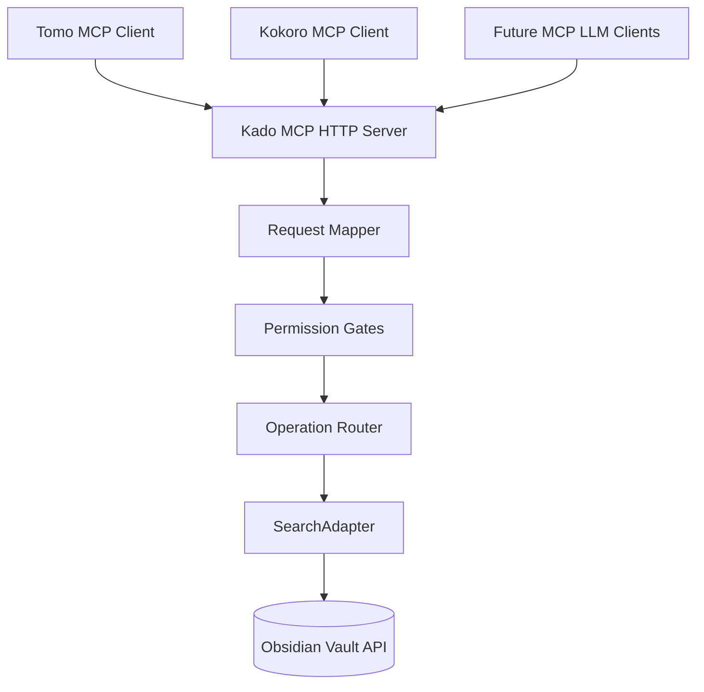
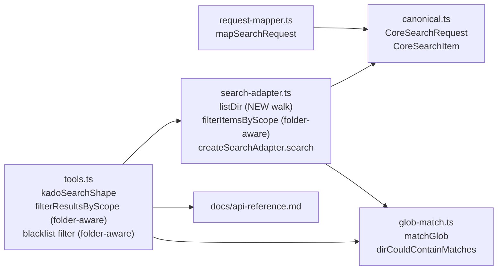

# Solution Design Document

## Validation Checklist

### CRITICAL GATES (Must Pass)

- [x] All required sections are complete
- [x] No [NEEDS CLARIFICATION] markers remain
- [x] Architecture pattern is clearly stated with rationale
- [x] All architecture decisions confirmed by user (see Architecture Decisions section)
- [x] Every interface has specification

### QUALITY CHECKS (Should Pass)

- [x] All context sources are listed with relevance ratings
- [x] Project commands are discovered from actual project files
- [x] Constraints → Strategy → Design → Implementation path is logical
- [x] Every component in diagram has directory mapping
- [x] Error handling covers all error types
- [x] Quality requirements are specific and measurable
- [x] Component names consistent across diagrams
- [x] A developer could implement from this design
- [x] Implementation examples use actual type/field names, verified against source files
- [x] Complex scope-filter logic includes traced walkthroughs with example data

---

## Constraints

CON-1 **Platform.** Obsidian plugin running in Electron (desktop) and potentially mobile. TypeScript strict mode (`"strict": true`, no `any`, `"strict"` enforced per `src/CLAUDE.md`). Node builtins, `obsidian` package, and local modules only — no new runtime dependencies introduced by this feature.

CON-2 **TDD discipline.** Per `src/CLAUDE.md`: no implementation code before a failing test. RED → GREEN → REFACTOR cycle for every change.

CON-3 **ACL boundary.** The four-layer architecture (MCP → Core → Interface → Obsidian) must be preserved. No `obsidian` or MCP SDK imports outside the designated layers. Request validation happens at the mapper; permission gates live in `src/core/gates/`.

CON-4 **Backward compatibility at the schema level.** All listDir response-item fields added by this spec are optional on `CoreSearchItem`. Existing consumers that ignore unknown fields continue to work. Behavior-visible changes (folders in default response, errors instead of empty lists, `/` as root) are acceptable because MCP consumers are LLM clients that read the updated tool schema each session.

CON-5 **TFile, TFolder, TAbstractFile from `obsidian`.** Must be imported as runtime values (not type-only) for `instanceof` narrowing to work. `App` stays type-only per existing convention at `src/obsidian/search-adapter.ts:9`.

CON-6 **Semantic-release versioning.** The change is committed as `feat:` and bumps the version from `0.1.5` to `0.2.0`. Conventional Commits.

## Implementation Context

### Required Context Sources

#### Documentation Context

```yaml
- doc: docs/XDD/specs/004-listdir-depth-type-folders/requirements.md
  relevance: CRITICAL
  why: "PRD this SDD implements — 7 Must + 1 Should features, 24 Gherkin acceptance criteria"

- doc: docs/XDD/ideas/2026-04-11-listdir-depth-type-folders.md
  relevance: HIGH
  why: "Brainstorm source with full implementation sketch (§7) and gap-review decisions"

- doc: docs/api-reference.md
  relevance: HIGH
  why: "Public listDir contract at lines 487-509 — must be updated in sync with implementation"

- doc: src/CLAUDE.md
  relevance: HIGH
  why: "TDD rules, TypeScript strict-mode constraints, import-order convention"

- doc: _inbox/from-kokoro/2026-04-09_kokoro-to-kado_listdir-depth-and-folder-items.md
  relevance: MEDIUM
  why: "Original consumer request from Kokoro; acknowledgement obligation post-ship"

- doc: _inbox/from-tomo/2026-04-11_tomo-to-kado_listdir-api-gaps.md
  relevance: MEDIUM
  why: "Original consumer request from Tomo; 4 workarounds to be removed post-ship"
```

#### Code Context

```yaml
- file: src/obsidian/search-adapter.ts
  relevance: CRITICAL
  why: "Contains listDir (line 111-114), mapFileToItem (line 30-38), filterItemsByScope (line 85-88), and createSearchAdapter.search switch (line 248-270). The primary file changed by this feature."

- file: src/mcp/request-mapper.ts
  relevance: CRITICAL
  why: "mapSearchRequest (line 102-113) adds depth validation and the path='' / path='/' handling. normalizeDirPath (line 90-94) retained for byContent use."

- file: src/types/canonical.ts
  relevance: CRITICAL
  why: "CoreSearchRequest (line 49-62) and CoreSearchItem (line 88-96) need additive type changes."

- file: src/core/glob-match.ts
  relevance: HIGH
  why: "dirCouldContainMatches (line 75-80) is the existing helper to reuse for folder scope filtering. matchGlob is the base pattern matcher."

- file: src/mcp/tools.ts
  relevance: HIGH
  why: "kadoSearchShape (around line 68) adds depth. registerSearchTool (around line 280) updated tool description. filterResultsByScope (line 93-102) and blacklist filter (line 307-309) both need folder awareness."

- file: src/core/gates/path-access.ts
  relevance: MEDIUM
  why: "Gate 4 — path validation. Unchanged by this spec but referenced to confirm undefined-path short-circuit at line 57-59."

- file: src/core/operation-router.ts
  relevance: MEDIUM
  why: "SearchAdapter interface that createSearchAdapter returns — confirm the error-return shape aligns."

- file: node_modules/obsidian/obsidian.d.ts
  relevance: MEDIUM
  why: "TFolder class (line 5929), children: TAbstractFile[] (line 5934), vault.getRoot() (line 6186), getAbstractFileByPath (line 6179). Reference only, not edited."

- file: test/obsidian/search-adapter.test.ts
  relevance: HIGH
  why: "listDir test block (line 81-144, 753, 820) must be updated to use TFolder mocks instead of getFiles mocks"

- file: test/integration/tool-roundtrip.test.ts
  relevance: HIGH
  why: "listDir integration test (line 419-452) must be updated for the new walk-based implementation"

- file: test/mcp/request-mapper.test.ts
  relevance: MEDIUM
  why: "Needs new test cases for depth validation, path='' rejection, path='/' normalization"

- file: test/MiYo-Kado/
  relevance: HIGH
  why: "Fixture vault must be extended with deeper nesting, empty folder, folder-only-subfolders case"
```

### Implementation Boundaries

- **Must Preserve:**
  - `normalizeDirPath` in request-mapper (retained for byContent prefix logic)
  - `mapFileToItem` in search-adapter (left unchanged — only listDir uses the new shape)
  - `path-access.ts` gate (no changes)
  - `CoreSearchItem` backward-compat: all new fields are optional
  - `paginate()` and the cursor base64 encoding
  - All other search operations (`byName`, `byTag`, `byContent`, `byFrontmatter`, `listTags`) — untouched except where they share the scope-filter refactor
- **Can Modify:**
  - `listDir` function body in search-adapter.ts — replaced wholesale
  - `filterItemsByScope` in search-adapter.ts — extended for folder awareness
  - `filterResultsByScope` and the blacklist filter in tools.ts — extended for folder awareness
  - `createSearchAdapter.search` switch case for `listDir` — updated to handle error return
  - `mapSearchRequest` in request-mapper.ts — adds depth, `/` root marker, and empty-path rejection
  - `CoreSearchRequest` and `CoreSearchItem` in canonical.ts — additive fields
  - `kadoSearchShape` in tools.ts — adds depth parameter and updates tool description
  - `docs/api-reference.md` — listDir section
  - Tests in `test/obsidian/`, `test/mcp/`, `test/integration/`, `test/live/`
  - Test vault at `test/MiYo-Kado/` — extended with new fixture folders
- **Must Not Touch:**
  - `src/core/gates/*` other than referenced for context
  - `src/core/operation-router.ts` signatures
  - Any file under `src/settings/`
  - The Obsidian plugin entrypoint (`src/main.ts`) lifecycle

### External Interfaces

#### System Context Diagram



#### Interface Specifications

```yaml
inbound:
  - name: "kado-search MCP tool (listDir operation)"
    type: HTTPS
    format: JSON-RPC / MCP
    authentication: API key via MCP headers
    doc: docs/api-reference.md (updated in this spec)
    data_flow: |
      Request: { operation: "listDir", path?: string, depth?: number,
                 cursor?: string, limit?: number }
      Response: { items: CoreSearchItem[], total: number, cursor?: string }
               | { code: CoreErrorCode, message: string }

outbound:
  - name: "Obsidian Vault API"
    type: In-process (Electron)
    format: TypeScript method calls
    authentication: None (in-process)
    doc: node_modules/obsidian/obsidian.d.ts
    data_flow: |
      TFolder traversal via vault.getRoot() and getAbstractFileByPath().
      TFolder.children: TAbstractFile[] read access.
      TFile.stat for file timestamps.
    criticality: CRITICAL

data:
  - name: "Audit log (NDJSON)"
    type: filesystem
    connection: AuditLogger
    doc: src/core/audit-log.ts (existing)
    data_flow: "listDir invocations logged for post-ship observability"
```

### Cross-Component Boundaries

Not applicable — this feature is internal to a single Obsidian plugin. No cross-team ownership, no shared resources, no breaking-change policy negotiations needed beyond the two consumer handoffs (Tomo, Kokoro) which are coordinated via the inbox/outbox protocol.

### Project Commands

```bash
# Discovered from package.json
Install:    npm install
Dev:        npm run dev      # esbuild watch mode
Test:       npm test         # vitest
Lint:       npm run lint     # eslint
Build:      npm run build    # tsc + esbuild production

# TDD cycle (per src/CLAUDE.md)
Watch:      npm test -- --watch
Single:     npm test -- test/obsidian/search-adapter.test.ts
```

## Solution Strategy

- **Architecture Pattern:** Retain the existing **four-layer architecture** (MCP → Core → Interface → Obsidian). All changes are targeted refactors inside existing layers. No new layers, no new modules, no new directories.
- **Integration Approach:** Replace the `listDir` implementation in `src/obsidian/search-adapter.ts` with a `TFolder`-based recursive walk. Extend the two scope-filter sites (`filterItemsByScope` in the adapter and `filterResultsByScope` + blacklist filter in `tools.ts`) with folder-aware logic using the existing `dirCouldContainMatches` helper from `src/core/glob-match.ts`. Add a `depth` parameter plus `/` root marker and empty-path rejection in `src/mcp/request-mapper.ts`. Add optional `type`/`childCount` fields to `CoreSearchItem` and a `depth` field to `CoreSearchRequest` in `src/types/canonical.ts`.
- **Justification:** The existing layers already cleanly separate request validation, permission enforcement, and vault access. The problem is not architectural — it is a gap in the listDir primitive's capability and a correctness gap in the scope filter. Adding structural primitives within the existing boundaries preserves CON-3 (four-layer architecture) and minimizes blast radius on security-critical code paths (path-access gate, permission chain).
- **Key Decisions (formal ADRs below):**
  - Numeric `depth` parameter (vs. boolean recursive or separate operation)
  - `TFolder.children` walk (vs. keeping `getFiles()` + prefix filter)
  - Folders in default recursive response (vs. folders only when depth is set)
  - Filtered `childCount` (vs. raw)
  - Hidden folder targets return `NOT_FOUND` (vs. VALIDATION_ERROR)
  - Reuse `dirCouldContainMatches` (vs. inline probe)
  - Scope-filter refactor spans both `search-adapter.ts` and `tools.ts`

## Building Block View

### Components



Flow: Incoming MCP tool call → `Tools.registerSearchTool` (inbound ACL) → `Mapper.mapSearchRequest` (validates depth, handles `/` and `""`) → permission gates → `Adapter.createSearchAdapter.search` switch → `Adapter.listDir` (walks TFolder, returns items-or-error) → early-return on error, else `Adapter.filterItemsByScope` (folder-aware) → `paginate` → back up to `Tools.registerSearchTool` → `Tools.filterResultsByScope` (folder-aware, secondary check) → MCP response.

### Directory Map

```
.
├── src/
│   ├── types/
│   │   └── canonical.ts                 # MODIFY: add depth? to CoreSearchRequest; add type?/childCount? to CoreSearchItem
│   ├── mcp/
│   │   ├── request-mapper.ts             # MODIFY: mapSearchRequest adds depth validation, / handling, "" rejection
│   │   └── tools.ts                      # MODIFY: kadoSearchShape adds depth; filterResultsByScope + blacklist filter become folder-aware; tool descriptions updated
│   ├── obsidian/
│   │   └── search-adapter.ts             # MODIFY: listDir replaced wholesale; filterItemsByScope extended; switch case for listDir handles error return
│   └── core/
│       └── glob-match.ts                 # READ ONLY: dirCouldContainMatches reused
├── test/
│   ├── obsidian/
│   │   └── search-adapter.test.ts        # MODIFY: listDir tests rewritten for TFolder mock; new test cases for depth, type, childCount, errors, hidden filter, folders-first sort
│   ├── mcp/
│   │   └── request-mapper.test.ts        # MODIFY: new cases for depth validation, path="", path="/"
│   ├── integration/
│   │   └── tool-roundtrip.test.ts        # MODIFY: listDir integration test rewritten
│   ├── live/
│   │   └── mcp-live.test.ts              # MODIFY: assertions updated for new response shape; add trailing-slash reproducer for Bug #1
│   └── MiYo-Kado/                        # MODIFY: fixture vault extended with nesting depth ≥ 3, empty folder, folder-with-only-subfolders
└── docs/
    └── api-reference.md                  # MODIFY: listDir section rewritten (lines 487-509)
```

### Interface Specifications

#### Interface Documentation References

```yaml
interfaces:
  - name: "kado-search MCP tool"
    doc: docs/api-reference.md
    relevance: CRITICAL
    sections: [listDir]
    why: "Public contract for the operation being changed"

  - name: "SearchAdapter internal interface"
    doc: src/core/operation-router.ts
    relevance: HIGH
    sections: [SearchAdapter]
    why: "The return signature of search() must still match this interface — we're adding an error branch to listDir internally but createSearchAdapter.search still returns Promise<SearchResult>"

  - name: "MCP tool schema (Zod)"
    doc: src/mcp/tools.ts (kadoSearchShape, line 68)
    relevance: CRITICAL
    sections: [kadoSearchShape]
    why: "LLM consumers see this schema; depth param added, path description updated, tool description updated"
```

#### Data Storage Changes

Not applicable — Kado uses the Obsidian Vault filesystem API directly; there is no internal database for this feature.

#### Internal API Changes

```yaml
# kado-search listDir operation — the only API contract change

Operation: kado-search listDir (MCP tool call)
  Zod Schema:
    operation: z.literal('listDir')
    path?: string        # "/" = vault root; "" is rejected; trailing slash accepted
    depth?: number       # positive integer; omit for unlimited recursion
    cursor?: string
    limit?: number

  Response (success):
    items: CoreSearchItem[]       # each with type: 'file'|'folder', files have real stat, folders have size=0/created=0/modified=0/childCount
    total: number
    cursor?: string

  Response (error):
    code: 'NOT_FOUND'       # path does not resolve, OR any segment starts with '.'
    message: "Path not found: {path}"

    code: 'VALIDATION_ERROR'
    messages:
      - "depth must be a positive integer"             # from mapper
      - "path must not be empty. Use '/' to list the vault root."  # from mapper
      - "listDir target must be a folder, got file: {path}"         # from adapter

# Other search operations — contract unchanged, but filterResultsByScope
# extension affects every search operation that returns scope-filtered items.
# Verified no observable change because those ops never return folder items.
```

#### Application Data Models

```pseudocode
# src/types/canonical.ts — CoreSearchRequest (MODIFIED)

ENTITY: CoreSearchRequest (MODIFIED)
  FIELDS (unchanged):
    apiKeyId: string
    operation: SearchOperation
    query?: string
    path?: string
    cursor?: string
    limit?: number
    scopePatterns?: string[]
    allowedTags?: string[]
    resolvedKey?: ApiKeyConfig
  FIELDS (NEW):
    + depth?: number                   # Positive integer; undefined = unlimited recursion

# src/types/canonical.ts — CoreSearchItem (MODIFIED)

ENTITY: CoreSearchItem (MODIFIED)
  FIELDS (unchanged):
    path: string
    name: string
    created: number                    # files: TFile.stat.ctime; folders: 0
    modified: number                   # files: TFile.stat.mtime; folders: 0
    size: number                       # files: TFile.stat.size; folders: 0
    tags?: string[]
    frontmatter?: Record<string, unknown>
  FIELDS (NEW):
    + type?: 'file' | 'folder'         # Populated only by listDir
    + childCount?: number              # Populated only on listDir folder items; filtered count of visible children
```

#### Integration Points

```yaml
# Inter-component communication (all within the Kado plugin process)

- from: tools.ts (MCP layer)
  to: search-adapter.ts (via operation-router)
  protocol: Direct function call
  doc: src/core/operation-router.ts
  data_flow: CoreSearchRequest in, CoreSearchResult | CoreError out

- from: search-adapter.ts
  to: glob-match.ts
  protocol: Direct function call
  doc: src/core/glob-match.ts
  data_flow: Pattern matching for scope filter (matchGlob, dirCouldContainMatches)

- from: search-adapter.ts
  to: obsidian App API
  protocol: In-process method call
  doc: obsidian.d.ts
  data_flow: vault.getRoot(), vault.getAbstractFileByPath(), TFolder.children

# External integration (cross-repo handoffs post-ship)

Tomo_repository:
  doc: _inbox/from-tomo/2026-04-11_tomo-to-kado_listdir-api-gaps.md
  integration: "Post-ship outbox note notifying Tomo that 4 workarounds can be removed and warning about depth:-1 rejection and item.type guard"
  critical_data: [listDir response shape change notification]

Kokoro_repository:
  doc: _inbox/from-kokoro/2026-04-09_kokoro-to-kado_listdir-depth-and-folder-items.md
  integration: "Post-ship outbox note notifying Kokoro to update their external global/references/kado-v1-api-contract.md"
  critical_data: [contract doc update request]
```

### Implementation Examples

Three strategic examples document the complex or security-sensitive parts of the implementation. These are guidance, not prescriptive code.

#### Example 1: The `listDir` walk and error returns

**Why this example:** The walk is the structural heart of the feature. It must respect `depth` semantics, skip hidden entries (including as the walk start target), return a discriminated union of result-or-error, and produce scope-aware `childCount` values.

```typescript
// src/obsidian/search-adapter.ts (excerpt — after change)

import {TFile, TFolder} from 'obsidian';
import type {App} from 'obsidian';

type ResolveResult =
  | {kind: 'folder'; folder: TFolder}
  | {kind: 'file'}       // path points to a TFile — VALIDATION_ERROR
  | {kind: 'missing'};   // path does not resolve — NOT_FOUND

function hasDotSegment(path: string): boolean {
  return path.split('/').some(seg => seg.startsWith('.'));
}

function resolveFolder(app: App, path: string | undefined): ResolveResult {
  // Mapper has already normalized "/" and "" — at this point, path is either
  // undefined (root) or a non-root folder path (possibly trailing /).
  if (path === undefined) return {kind: 'folder', folder: app.vault.getRoot()};

  // Security: reject any request that targets a hidden (dot-prefixed) segment.
  // Returning 'missing' (NOT_FOUND) rather than a new error code avoids
  // confirming the folder's existence to callers without read access.
  if (hasDotSegment(path)) return {kind: 'missing'};

  const clean = path.replace(/\/$/, '');
  const target = app.vault.getAbstractFileByPath(clean);
  if (target === null) return {kind: 'missing'};
  if (target instanceof TFolder) return {kind: 'folder', folder: target};
  return {kind: 'file'};
}

function listDir(app: App, request: CoreSearchRequest): CoreSearchItem[] | CoreError {
  const resolved = resolveFolder(app, request.path);
  if (resolved.kind === 'missing') {
    return {code: 'NOT_FOUND', message: `Path not found: ${request.path ?? '/'}`};
  }
  if (resolved.kind === 'file') {
    return {
      code: 'VALIDATION_ERROR',
      message: `listDir target must be a folder, got file: ${request.path}`,
    };
  }
  const scope = request.scopePatterns;
  const items: CoreSearchItem[] = [];
  walk(resolved.folder, 0, request.depth, scope, items);
  items.sort(compareListDirItems);
  return items;
}

function walk(
  folder: TFolder,
  currentDepth: number,
  maxDepth: number | undefined,
  scope: string[] | undefined,
  out: CoreSearchItem[],
): void {
  for (const child of folder.children) {
    if (child.name.startsWith('.')) continue; // hidden filter
    if (child instanceof TFolder) {
      if (scope && !folderInScope(child.path, scope)) continue;
      out.push({
        path: child.path,
        name: child.name,
        type: 'folder',
        created: 0,
        modified: 0,
        size: 0,
        childCount: visibleChildCount(child, scope),
      });
      const shouldRecurse = maxDepth === undefined || currentDepth + 1 < maxDepth;
      if (shouldRecurse) walk(child, currentDepth + 1, maxDepth, scope, out);
    } else if (child instanceof TFile) {
      // Scope filtering for file items happens post-walk in filterItemsByScope,
      // mirroring the existing pattern for the other search operations.
      out.push({
        path: child.path,
        name: child.name,
        type: 'file',
        created: child.stat.ctime,
        modified: child.stat.mtime,
        size: child.stat.size,
      });
    }
  }
}

function visibleChildCount(folder: TFolder, scope: string[] | undefined): number {
  let count = 0;
  for (const child of folder.children) {
    if (child.name.startsWith('.')) continue;
    if (child instanceof TFolder) {
      if (!scope || folderInScope(child.path, scope)) count++;
    } else if (child instanceof TFile) {
      if (!scope || scope.some(p => matchGlob(p, child.path))) count++;
    }
  }
  return count;
}

function compareListDirItems(a: CoreSearchItem, b: CoreSearchItem): number {
  const aIsFolder = a.type === 'folder';
  const bIsFolder = b.type === 'folder';
  if (aIsFolder !== bIsFolder) return aIsFolder ? -1 : 1;
  return a.path.localeCompare(b.path, undefined, {sensitivity: 'variant'});
}
```

**Switch-case update in `createSearchAdapter.search` (line 249-251):**

```typescript
// Before
case 'listDir':
    items = listDir(app, request);
    break;

// After (mirrors the existing byTag pattern at line 252-257)
case 'listDir': {
    const listResult = listDir(app, request);
    if ('code' in listResult) return listResult;
    items = listResult;
    break;
}
```

**Edge cases:**
- Empty vault root: `walk` iterates zero children, returns empty items array, `sort` is no-op, result is `{items: [], total: 0}`.
- Folder whose only children are hidden: `walk` pushes the folder item with `childCount: 0` (from `visibleChildCount`), and the recursion into it finds no children.
- `request.path = "Atlas/.hidden"`: `hasDotSegment` returns true → `kind: 'missing'` → `NOT_FOUND`.

#### Example 2: Folder-aware scope filtering with the existing `dirCouldContainMatches` helper

**Why this example:** The scope-filter extension spans two files (`search-adapter.ts` and `tools.ts`) and must stay consistent. Using the pre-existing helper in `src/core/glob-match.ts:75-80` prevents drift between the two sites and avoids reinventing probe logic.

```typescript
// src/obsidian/search-adapter.ts — filterItemsByScope (MODIFIED, lines 85-88)

function folderInScope(folderPath: string, patterns: string[]): boolean {
  return dirCouldContainMatches(folderPath, patterns);
}

function filterItemsByScope(items: CoreSearchItem[], patterns: string[]): CoreSearchItem[] {
  if (patterns.length === 0) return [];
  return items.filter((item) => {
    if (item.type === 'folder') return folderInScope(item.path, patterns);
    return patterns.some((p) => matchGlob(p, item.path));
  });
}
```

```typescript
// src/mcp/tools.ts — filterResultsByScope (MODIFIED, lines 93-102)

function filterResultsByScope(result: CoreSearchResult, patterns: string[]): CoreSearchResult {
  if (patterns.length === 0) return {...result, items: []};
  const filtered = result.items.filter((item) => {
    if (item.type === 'folder') return dirCouldContainMatches(item.path, patterns);
    return isPathInScope(item.path, patterns);  // existing file-path logic
  });
  return {...result, items: filtered, total: filtered.length};
}

// Blacklist filter at line 307-309 follows the same pattern: folders go through
// a folder-aware inversion check, files through the existing rule.
```

**Traced walkthrough — scope `["Atlas/**"]` with three folders:**

| Folder path | `p.startsWith('Atlas/Private/')` | `dirCouldContainMatches('Atlas/Private', ['Atlas/**'])` | Visible? |
|-------------|----------------------------------|-------------------------------------------------------|----------|
| `Atlas` (root listing) | `"Atlas/**".startsWith("Atlas/")` → true | helper returns true | ✅ |
| `Atlas/Private` | `"Atlas/**".startsWith("Atlas/Private/")` → false | helper: `matchGlob("Atlas/**", "Atlas/Private/__probe__")` → true | ✅ |
| `Notes` (sibling of Atlas) | `"Atlas/**".startsWith("Notes/")` → false | helper: `matchGlob("Atlas/**", "Notes/__probe__")` → false | ❌ |

All three outcomes match the intended "folder visible iff the caller has access to anything inside" rule. The three scope patterns that broke the inlined version of this logic during security research (`Atlas/Public/**` vs `Atlas/Private`, `**/*.md` vs `Private`, `*.md` vs `Atlas`) all evaluate correctly through `dirCouldContainMatches`.

#### Example 3: Request-mapper updates for `depth`, `/`, and empty-path rejection

**Why this example:** The mapper is the ACL boundary and must validate before anything reaches the gates. The existing `limit` extraction pattern (line 110) is the template for `depth`; the existing `normalizeDirPath` (line 90-94) is retained but gated by new branching for root and empty-string handling.

```typescript
// src/mcp/request-mapper.ts — mapSearchRequest (MODIFIED, lines 102-113)

export function mapSearchRequest(args: Args, keyId: string): CoreSearchRequest {
  const operation = requireString(args, 'operation', 'mapSearchRequest') as CoreSearchRequest['operation'];

  const result: CoreSearchRequest = {apiKeyId: keyId, operation};

  if (typeof args['query'] === 'string') result.query = args['query'];
  if (typeof args['cursor'] === 'string') result.cursor = args['cursor'];
  if (typeof args['limit'] === 'number') result.limit = args['limit'];

  // Depth: validate and extract
  if ('depth' in args && args['depth'] !== undefined) {
    const d = args['depth'];
    if (typeof d !== 'number' || !Number.isInteger(d) || d < 1) {
      throw new Error('mapSearchRequest: depth must be a positive integer');
    }
    result.depth = d;
  }

  // Path: / = root, "" = rejected, else normalize trailing slash for byContent prefix match
  if (typeof args['path'] === 'string') {
    if (args['path'] === '') {
      throw new Error("mapSearchRequest: path must not be empty. Use '/' to list the vault root.");
    }
    if (args['path'] === '/') {
      // leave result.path undefined — canonical vault-root marker
    } else {
      result.path = normalizeDirPath(args['path'], operation);
    }
  }

  return result;
}
```

## Runtime View

### Primary Flow — listDir with depth=1 on a scope-restricted subtree

1. Tomo sends `kado-search listDir` with `path: "Atlas/"`, `depth: 1`, and an authenticated API key whose scope is `["Atlas/**"]`.
2. `registerSearchTool` in `tools.ts` extracts the key ID.
3. `mapSearchRequest` validates: depth is `1` (positive integer OK), path is `"Atlas/"` → normalized via `normalizeDirPath` to `"Atlas/"`. Returns `CoreSearchRequest`.
4. Permission gates run: key-validity gate → path-access gate (path is valid) → data-type gate. All pass.
5. `createSearchAdapter.search` enters the `listDir` case. Calls the new `listDir(app, request)`.
6. `resolveFolder` strips trailing slash (`"Atlas"`), calls `getAbstractFileByPath("Atlas")`, returns `{kind: 'folder', folder: <TFolder Atlas>}`.
7. `walk(Atlas, 0, 1, ["Atlas/**"], out)` iterates `Atlas.children`. For each child:
   - Hidden filter (`.`-prefix) — skip any.
   - Folder child: `folderInScope(child.path, scope)` → reuses `dirCouldContainMatches`. Push folder item with `childCount = visibleChildCount(child, scope)`. Recurse? `0 + 1 < 1` → false. Do not recurse.
   - File child: push file item. (Scope filter for files runs post-walk.)
8. `items.sort(compareListDirItems)` places folders before files, alphabetical within each group.
9. Error branch check: `listDir` returned `CoreSearchItem[]`, not `CoreError`. Control falls through to `filterItemsByScope(items, scope)`.
10. `filterItemsByScope` runs the per-item filter: folder items via `folderInScope`, file items via `matchGlob`. This is the second line of defense — the walk already applied scope filtering for folders during traversal, so this is a no-op for folders but still filters files.
11. `paginate(items, cursor, limit)` slices.
12. Back in `tools.ts`, `filterResultsByScope` runs (third line of defense — redundant but consistent with the existing architecture). Response returned to the MCP client.

```mermaid
sequenceDiagram
    actor Tomo
    participant Tools as tools.ts
    participant Mapper as request-mapper
    participant Gates as permission gates
    participant Adapter as search-adapter
    participant Vault as Obsidian Vault

    Tomo->>Tools: kado-search listDir path=Atlas/ depth=1
    Tools->>Mapper: mapSearchRequest(args)
    Mapper->>Mapper: validate depth=1; normalize path
    Mapper-->>Tools: CoreSearchRequest
    Tools->>Gates: run permission chain
    Gates-->>Tools: allowed
    Tools->>Adapter: search(request)
    Adapter->>Adapter: listDir(app, request)
    Adapter->>Vault: getAbstractFileByPath("Atlas")
    Vault-->>Adapter: TFolder
    Adapter->>Adapter: walk(Atlas, 0, 1, scope, out)
    loop For each child (hidden skipped)
        Adapter->>Vault: child.children access (folders) / child.stat (files)
        Adapter->>Adapter: scope check, push item
    end
    Adapter->>Adapter: sort folders-first
    Adapter-->>Adapter: CoreSearchItem[]
    Adapter->>Adapter: filterItemsByScope (secondary)
    Adapter->>Adapter: paginate
    Adapter-->>Tools: CoreSearchResult
    Tools->>Tools: filterResultsByScope (tertiary)
    Tools-->>Tomo: { items, total, cursor }
```

### Error Handling

| Error Source | Condition | Code | Message | Layer |
|--------------|-----------|------|---------|-------|
| Mapper | `depth` not positive integer | `VALIDATION_ERROR` | `"depth must be a positive integer"` | request-mapper.ts |
| Mapper | `path === ""` | `VALIDATION_ERROR` | `"path must not be empty. Use '/' to list the vault root."` | request-mapper.ts |
| Gate | Path validation fails (traversal, null byte, etc.) | `VALIDATION_ERROR` | Existing gate messages | path-access gate (unchanged) |
| Adapter | Path resolves to a file | `VALIDATION_ERROR` | `"listDir target must be a folder, got file: {path}"` | search-adapter.ts |
| Adapter | Path does not resolve OR contains `.`-prefixed segment | `NOT_FOUND` | `"Path not found: {path}"` | search-adapter.ts |
| Adapter (byTag) | Tag scope denial (existing) | `FORBIDDEN` | `"Access denied"` | search-adapter.ts (unchanged) |

All errors propagate up through `createSearchAdapter.search`'s early-return mechanism — unchanged from the existing `byTag` pattern. The `tools.ts` layer translates `CoreError` into an MCP error response via existing machinery.

### Complex Logic — Depth recursion

```
ALGORITHM: walk(folder, currentDepth, maxDepth, scope, out)
INPUT:  folder (TFolder), currentDepth (integer starting at 0),
        maxDepth (positive integer | undefined),
        scope (string[] | undefined), out (mutable item array)
OUTPUT: (mutates out)

1. FOR each child in folder.children:
   2. IF child.name starts with '.': CONTINUE (hidden filter)
   3. IF child is TFolder:
        a. IF scope is defined AND folderInScope(child.path, scope) is false: CONTINUE
        b. PUSH folder item with visibleChildCount(child, scope) into out
        c. shouldRecurse = (maxDepth === undefined) OR (currentDepth + 1 < maxDepth)
        d. IF shouldRecurse: walk(child, currentDepth + 1, maxDepth, scope, out)
   4. ELSE IF child is TFile:
        a. PUSH file item into out   (scope filter for files runs post-walk)
```

## Deployment View

### Single Application Deployment

- **Environment:** Obsidian desktop plugin (Electron). No changes to deployment target.
- **Configuration:** No new environment variables or settings. `manifest.json` version bumped from `0.1.5` to `0.2.0`.
- **Dependencies:** No new runtime dependencies. TypeScript strict-mode unchanged.
- **Performance:** See Quality Requirements below. Expected net latency win for shallow-scan use cases; no regression for deep-scan use cases.

### Multi-Component Coordination

Not applicable — single-component deployment. The two cross-repo coordination items (Tomo workaround removal, Kokoro external doc update) are handled via the inbox/outbox handoff protocol, not via deployment orchestration.

## Cross-Cutting Concepts

### Pattern Documentation

```yaml
- pattern: Four-layer ACL (MCP → Core → Interface → Obsidian)
  relevance: CRITICAL
  why: "Existing architectural invariant; this feature preserves layer boundaries"

- pattern: Discriminated union for result-or-error
  relevance: HIGH
  why: "Existing byTag operation uses CoreSearchItem[] | CoreError; listDir extends this pattern"

- pattern: Post-walk scope filter via filterItemsByScope
  relevance: HIGH
  why: "Existing operations route through the same scope filter; extended here for folder-awareness"

- pattern: dirCouldContainMatches helper reuse
  relevance: HIGH
  why: "Existing helper at src/core/glob-match.ts:75-80 is the canonical folder-scope probe; reused instead of reinvented"
```

### User Interface & UX

Not applicable — this feature has no UI surface. All interaction is via the MCP tool schema.

### System-Wide Patterns

- **Security:** Three lines of defense for scope filtering — adapter walk-time filter (new), adapter post-walk `filterItemsByScope` (extended), and tools-layer `filterResultsByScope` + blacklist filter (extended). Folder-aware logic is applied consistently at all three sites using the same `dirCouldContainMatches` helper. Hidden-entry filtering applies both to the walk children and to the walk-start target (via `hasDotSegment` in `resolveFolder`).
- **Error Handling:** Local (function-scoped) error returns as discriminated unions; propagated by early-return through `createSearchAdapter.search`. No exceptions for business-rule violations; `throw` is used only at the mapper boundary for inbound validation failures, matching the existing mapper pattern.
- **Performance:** TFolder walk is O(visited nodes), not O(total vault files). `childCount` is O(direct children). `localeCompare` sort is O(n log n). No caching introduced.
- **Logging/Auditing:** Existing audit-log pipeline captures all tool invocations including `listDir`. No new log events. Post-ship observability relies on existing NDJSON audit log plus handoff acknowledgement documents.

### Multi-Component Patterns

Not applicable — single component.

## Architecture Decisions

All ADRs below were decided during the brainstorm and research phases with explicit user confirmation. They are listed here formally for the SDD record.

- [x] **ADR-1 Depth semantics — numeric `depth` parameter, undefined = unlimited.**
  - Choice: `depth?: number` on `CoreSearchRequest` and the MCP schema. Omit for unlimited recursion. Positive integers ≥ 1 for bounded walks. `0`, negative, non-integer, or non-number rejected with `VALIDATION_ERROR`.
  - Rationale: Matches Kokoro's original proposal. Supports arbitrary depths if ever needed. Simpler validation surface than a union type.
  - Trade-offs: Slightly more complex than a boolean `recursive: boolean`. Kokoro's original `depth: -1` convention is rejected; a migration note goes to Kokoro via the reply outbox.
  - User confirmed: Yes (brainstorm API-shape selection, decision logged in README)

- [x] **ADR-2 Walk implementation — replace `vault.getFiles()` with `TFolder.children` traversal.**
  - Choice: New `listDir` calls `app.vault.getAbstractFileByPath` (or `getRoot()` for `/`), then recursively walks `TFolder.children` respecting depth and hidden-entry filters. Old `vault.getFiles()` + prefix filter is deleted for listDir.
  - Rationale: O(visited nodes) instead of O(total vault files). Native access to folder entries. Backed by Obsidian's live in-memory tree — no I/O.
  - Trade-offs: Larger diff. Existing `listDir` tests that mock `getFiles` must be rewritten to mock `TFolder` hierarchies.
  - User confirmed: Yes (brainstorm implementation sketch §7, gap-review pass)

- [x] **ADR-3 Folders appear in the default recursive response.**
  - Choice: `depth` omitted returns unlimited recursion with both files AND folders in the result. There is no mode that returns files only.
  - Rationale: All Kado consumers are MCP LLM clients that read the updated tool schema. No dumb-parser clients exist. Folder-less responses would require a separate mode that nobody asked for.
  - Trade-offs: This is a visible behavior change for any consumer that iterates results assuming files-only. Tomo's reply handoff explicitly warns about the `item.type` guard requirement.
  - User confirmed: Yes (brainstorm folder-visibility question)

- [x] **ADR-4 `childCount` reflects the filtered count of visible children.**
  - Choice: `childCount` excludes hidden entries (`.`-prefixed) and out-of-scope children. It is computed by a `visibleChildCount` helper that mirrors the walk's filter logic.
  - Rationale: Prevents information leak. A caller who cannot see a folder's children also cannot infer how many exist. Consistent with "what you see is what you get."
  - Trade-offs: Per-folder O(direct children) cost for the scope and hidden filter — minor and acceptable per performance research.
  - User confirmed: Yes (research gap-review decision)

- [x] **ADR-5 Hidden folder targets return `NOT_FOUND`, not `VALIDATION_ERROR`.**
  - Choice: `resolveFolder` checks every `.`-prefixed segment in the requested path. If any segment is hidden, return the `missing` kind, which becomes a `NOT_FOUND` response.
  - Rationale: A `VALIDATION_ERROR` would confirm the folder's existence to callers without access; `NOT_FOUND` is indistinguishable from a typo. Closes the "caller targets `.obsidian` directly" bypass identified in security research.
  - Trade-offs: None meaningful. Legitimate Kado operations do not target dot-prefixed paths.
  - User confirmed: Yes (research gap-review decision)

- [x] **ADR-6 `/` is the canonical vault-root marker; `""` is rejected.**
  - Choice: Mapper recognizes `path: "/"` → `result.path = undefined` (canonical root). Mapper rejects `path: ""` with `VALIDATION_ERROR` message `"path must not be empty. Use '/' to list the vault root."`. Omitted `path` also means root.
  - Rationale: Removes the undocumented "omit path = root" convention. Gives callers an explicit, documentable root form. Helpful error message when they get it wrong.
  - Trade-offs: Tomo's current workaround (drop path arg when empty) still works, but the preferred form post-ship is `path: "/"`. Documented in the reply outbox to Tomo.
  - User confirmed: Yes (user comment on brainstorm spec)

- [x] **ADR-7 Folders-first sort, alphabetical within each group, locale-independent.**
  - Choice: `compareListDirItems` sorts all folder items before all file items. Within each group, `a.path.localeCompare(b.path, undefined, {sensitivity: 'variant'})` for deterministic case-sensitive ordering.
  - Rationale: A paginated consumer knows the complete folder set is visible as soon as the first file item appears. Avoids fetching all pages to determine "any more folders?". `{sensitivity: 'variant'}` guarantees runtime-locale-independence for cursor stability.
  - Trade-offs: Not pure alphabetical — slight learning curve for new consumers, mitigated by the tool description.
  - User confirmed: Yes (user comment on brainstorm spec)

- [x] **ADR-8 Error semantics — `NOT_FOUND` for missing, `VALIDATION_ERROR` for file target.**
  - Choice: Missing path (or hidden segment) → `NOT_FOUND`. Path resolves to a `TFile` → `VALIDATION_ERROR` with `"got file"` message. Neither case returns an empty list.
  - Rationale: Explicit errors are more informative than silent empty. Different codes let the caller distinguish "typo" from "wrong type". Security tradeoff (minor info leak about exists-as-file) accepted as deliberate design intent.
  - Trade-offs: A caller without scope access to `Admin/secrets` can distinguish "doesn't exist" from "exists as file". Accepted because explicit errors are the stated design direction; documented in the Risks section.
  - User confirmed: Yes (user comment on brainstorm spec)

- [x] **ADR-9 Scope-filter refactor extends to both `search-adapter.ts` and `tools.ts`.**
  - Choice: Folder-aware scope filtering is added in three places: (a) during `walk` for folder visibility and `visibleChildCount`; (b) in `filterItemsByScope` in `search-adapter.ts` for the post-walk secondary filter; (c) in `filterResultsByScope` + the blacklist filter in `tools.ts` for the tertiary tools-layer check. All three sites use `dirCouldContainMatches` from `src/core/glob-match.ts` as the shared helper.
  - Rationale: The tools-layer filters run *after* the adapter and cannot be skipped without weakening the existing defense-in-depth architecture. Extending all three sites keeps the architecture consistent. Reusing `dirCouldContainMatches` prevents logic drift between sites.
  - Trade-offs: Three sites to keep in sync. Mitigated by the shared helper and by explicit unit tests for each site.
  - User confirmed: Yes (research finding flagged as critical; SDD design explicit)

- [x] **ADR-10 Reuse `dirCouldContainMatches` instead of reinventing probe logic.**
  - Choice: Import `dirCouldContainMatches` from `src/core/glob-match.ts` and call it directly from `folderInScope` helpers in both `search-adapter.ts` and `tools.ts`.
  - Rationale: The helper already exists with correct semantics. Research flagged the brainstorm's inline probe as a DRY violation. Reuse prevents divergent behavior between sites.
  - Trade-offs: None — purely a cleanup.
  - User confirmed: Yes (research gap-review decision, implicit in ADR-9)

## Quality Requirements

- **Performance:**
  - `listDir({path: "X/", depth: 1})` on a folder with N direct children must visit only N tree nodes (not the full subtree). Verifiable via a test fixture with 10 direct children and 1000 descendants at depth ≥ 2.
  - `listDir` on the vault root with `depth` omitted must not exceed the CPU or memory cost of the current `vault.getFiles()` + filter implementation on the same vault. Verifiable via a benchmark test on the existing `test/MiYo-Kado/` fixture (or a larger variant).
  - Sort cost is acceptable for result sets up to 10,000 items. No cap enforced in this spec; parking-lot candidate for later if a consumer reports a regression.
- **Security:**
  - No hidden (`.`-prefixed) file or folder appears in any listDir response, regardless of the request path.
  - No out-of-scope file or folder appears in any listDir response for a scope-restricted key.
  - `childCount` on any folder item never reveals the existence of hidden or out-of-scope children.
  - Explicit `listDir({path: ".obsidian"})` returns `NOT_FOUND`, not `VALIDATION_ERROR`.
- **Reliability:**
  - All 24 Gherkin acceptance criteria from the PRD pass in the test suite.
  - All existing `listDir` tests pass after the mock migration.
  - `npm run build` succeeds under TypeScript strict mode with zero new warnings.
  - `npm run lint` passes with no new rule violations.
- **Usability** (for MCP LLM consumers):
  - Tool description in `kadoSearchShape` describes: depth parameter, folders-first sort, `type` discriminator, `/` root marker, error codes and messages. A consumer LLM reading the schema alone should know how to call the operation correctly.

## Acceptance Criteria

Translated from the 24 Gherkin criteria in `requirements.md` into EARS-format system-level specifications. Each criterion is traceable to a PRD feature (F1–F8).

**Main Flow Criteria (F1, F2, F5):**
- [ ] `THE SYSTEM SHALL` return items with `type: 'file' | 'folder'` on every listDir response.
- [ ] `WHEN depth is a positive integer N, THE SYSTEM SHALL` walk no deeper than N levels below the requested path.
- [ ] `WHEN depth is omitted, THE SYSTEM SHALL` walk all descendants of the requested path.
- [ ] `THE SYSTEM SHALL` set `childCount` on every folder item to the count of visible direct children.
- [ ] `THE SYSTEM SHALL` set `size`, `created`, and `modified` to 0 on every folder item.
- [ ] `THE SYSTEM SHALL NOT` set `type` or `childCount` on any item returned by `byName`, `byTag`, `byContent`, `byFrontmatter`, or `listTags`.

**Trailing Slash and Root Marker Criteria (F3, F4):**
- [ ] `WHEN path carries a trailing slash on any valid folder, THE SYSTEM SHALL` return a success response equivalent to the same path without the trailing slash.
- [ ] `IF path is "/", THEN THE SYSTEM SHALL` treat the request as a vault-root listing (equivalent to omitting path).
- [ ] `IF path is an empty string, THEN THE SYSTEM SHALL` reject the request with `VALIDATION_ERROR` and message `"path must not be empty. Use '/' to list the vault root."`.
- [ ] `IF path is "/" on a byContent request, THEN THE SYSTEM SHALL` return the same result as omitting path (whole-vault search).

**Error Handling Criteria (F6):**
- [ ] `IF path does not resolve to any existing entry, THEN THE SYSTEM SHALL` return `NOT_FOUND` with message `"Path not found: {path}"`.
- [ ] `IF path resolves to a file, THEN THE SYSTEM SHALL` return `VALIDATION_ERROR` with message `"listDir target must be a folder, got file: {path}"`.
- [ ] `IF depth is not a positive integer, THEN THE SYSTEM SHALL` return `VALIDATION_ERROR` with message `"depth must be a positive integer"`.
- [ ] `THE SYSTEM SHALL NOT` return an empty items array in place of any of the above errors.

**Security Criteria (F7):**
- [ ] `THE SYSTEM SHALL NOT` include any file or folder whose name starts with `.` in any listDir response.
- [ ] `IF any segment of the requested path starts with ".", THEN THE SYSTEM SHALL` return `NOT_FOUND` (not `VALIDATION_ERROR`).
- [ ] `WHERE scopePatterns is non-empty, THE SYSTEM SHALL` include a folder item only if at least one scope pattern could match a child of that folder (via `dirCouldContainMatches`).
- [ ] `THE SYSTEM SHALL` set `childCount` on each folder item to the count of children that pass both the hidden-entry filter and the scope filter.

**Ordering and Pagination Criteria (F8):**
- [ ] `THE SYSTEM SHALL` order listDir response items with all folder items preceding all file items.
- [ ] `WITHIN each type group, THE SYSTEM SHALL` sort items by `path` via `localeCompare` with `{sensitivity: 'variant'}` for runtime-locale-independent ordering.
- [ ] `WHEN paginated, THE SYSTEM SHALL` let cursors be valid only for requests with identical parameters (documented, not runtime-enforced).

## Risks and Technical Debt

### Known Technical Issues

- **HTTP 406 on trailing-slash listDir** (Bug #1, tomo): root cause unknown at spec time. The mapper already normalizes trailing slashes; the error must originate in the MCP transport layer, Zod schema validation, or a downstream layer not yet isolated. Plan phase begins with a reproducer test that drives the investigation. Contingency: if root cause is outside our codebase, fall back to stripping trailing slashes in the mapper.
- **Test mock fragility:** existing `listDir` tests mock `app.vault.getFiles()`. The new implementation does not call `getFiles()`. Every mocked test breaks and must be rewritten with a `TFolder` hierarchy mock. Estimated scope: `test/obsidian/search-adapter.test.ts` (lines 81-144, 753, 820), `test/integration/tool-roundtrip.test.ts` (419-452), and one or more `test/live/mcp-live.test.ts` assertions.

### Technical Debt

- **Duplicate scope-filter logic across `search-adapter.ts` and `tools.ts`.** The defense-in-depth pattern is preserved but duplicates folder-aware logic in three places. Mitigated by the shared `dirCouldContainMatches` helper. A follow-up refactor could consolidate the three sites behind a single entry point, but that is out of scope for this spec.
- **`listTags` repurposes `size` for tag count** (`search-adapter.ts:218-225`). Pre-existing quirk, not changed by this spec, noted in the SDD so future readers don't conflate it with folder `size: 0`.

### Implementation Gotchas

- **`import type` vs runtime import.** The existing line at `search-adapter.ts:9` is `import type {App, TFile} from 'obsidian';`. The new walk needs `TFile` and `TFolder` as **runtime values** for `instanceof` narrowing. `App` stays as `import type`. Split into two imports. TypeScript will not catch this if `TFolder` is used via type-only import and `instanceof` silently compiles — the error surfaces at runtime as `ReferenceError: TFolder is not defined`.
- **`hasDotSegment` must apply to every path segment, not just the first.** `Atlas/.hidden` must be rejected; `hasDotSegment` splits on `/` and checks each segment.
- **`visibleChildCount` and `walk` share filter logic.** Keep them in sync. If the hidden-entry rule ever changes (e.g., allowlist for `.obsidian` debug views), both functions must be updated together.
- **`sort` mutates in place.** The walk builds `out` via `push`, then `items.sort(compareListDirItems)` mutates the array. This is fine because `items` is a fresh local array, but any future change that keeps `items` as a shared reference must re-check.
- **Cursor stability is documented only, not enforced.** A client replaying a cursor with different `depth` gets garbage results silently. Acceptable per ADR; document clearly in tool description.
- **Empty vault or empty target folder** returns `items: []` with `total: 0`. This is a legitimate "empty" result, NOT an error. Test fixture must cover this path explicitly or test authors will conflate "empty" with "not found".

## Glossary

### Domain Terms

| Term | Definition | Context |
|------|------------|---------|
| Vault | An Obsidian user's note collection — the filesystem tree rooted at the vault folder | The scope of every Kado operation |
| Scope pattern | A glob pattern like `Atlas/**` or `**/*.md` that restricts an API key's visible paths | Enforced by `filterItemsByScope` and `filterResultsByScope` |
| Hidden entry | Any file or folder whose name starts with `.` (e.g., `.obsidian`, `.trash`, `.gitignore`) | Invisible by convention; matches Obsidian File Explorer's default |
| Handoff | A structured markdown file exchanged between MiYo agents via the inbox/outbox protocol | Drives cross-repo coordination (see `_inbox/`, `_outbox/`) |

### Technical Terms

| Term | Definition | Context |
|------|------------|---------|
| TFolder | Obsidian class representing a folder in the vault tree | `node_modules/obsidian/obsidian.d.ts:5929`; accessed via `vault.getAbstractFileByPath` |
| TFile | Obsidian class representing a file in the vault tree | Same header; inherits from TAbstractFile |
| TAbstractFile | Base class for TFile and TFolder | Used as the union type for `TFolder.children` |
| CoreSearchRequest | Kado's canonical request type for search operations | `src/types/canonical.ts:49-62` |
| CoreSearchItem | Kado's canonical response item type | `src/types/canonical.ts:88-96` |
| CoreError | Kado's canonical error type with code, message, and gate label | `src/types/canonical.ts:119-123` |
| ACL boundary | The point where untyped external data enters the typed core pipeline | `src/mcp/request-mapper.ts` is the search-op ACL boundary |

### API/Interface Terms

| Term | Definition | Context |
|------|------------|---------|
| MCP | Model Context Protocol — the LLM-to-tool protocol that drives Kado | Every Kado operation is an MCP tool call |
| listDir | The search operation that lists directory contents | Target of this spec |
| `depth` | New optional parameter on `listDir` — positive integer or undefined for unlimited | Added by this spec |
| `childCount` | Filtered count of visible direct children on folder items | Added by this spec |
| `dirCouldContainMatches` | Existing helper in `src/core/glob-match.ts:75-80` — returns true iff any glob pattern could match a file under the given directory path | Reused for folder scope filtering |
| EARS | Easy Approach to Requirements Syntax — the "WHEN/IF ... THEN THE SYSTEM SHALL ..." format | Used in the Acceptance Criteria section |
