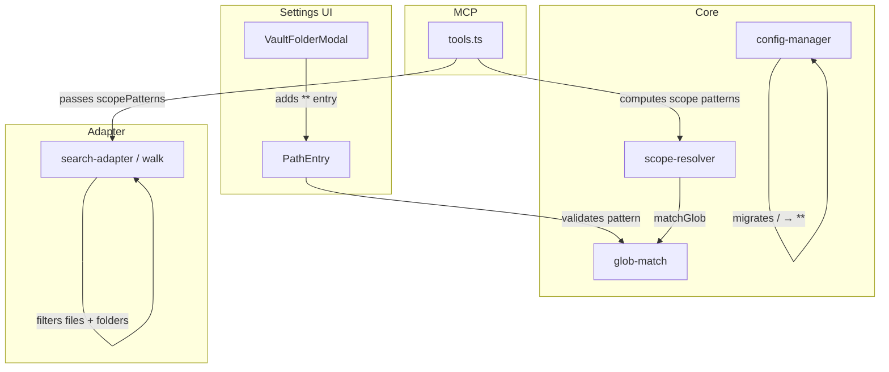

# Solution Design Document

## Validation Checklist

### CRITICAL GATES (Must Pass)

- [x] All required sections are complete
- [x] No [NEEDS CLARIFICATION] markers remain
- [x] Architecture pattern is clearly stated with rationale
- [x] **All architecture decisions confirmed by user**
- [x] Every interface has specification

### QUALITY CHECKS (Should Pass)

- [x] All context sources are listed with relevance ratings
- [x] Project commands are discovered from actual project files
- [x] Constraints → Strategy → Design → Implementation path is logical
- [x] Every component in diagram has directory mapping
- [x] Error handling covers all error types
- [x] Quality requirements are specific and measurable
- [x] Component names consistent across diagrams
- [x] A developer could implement from this design
- [x] Implementation examples use actual schema column names, verified against source
- [x] Complex queries include traced walkthroughs with example data

---

## Constraints

- CON-1: TypeScript strict mode, Obsidian plugin API, esbuild bundler
- CON-2: Existing 5-gate permission chain must remain intact — changes are additive
- CON-3: Backward compatible — existing named-path configs unchanged
- CON-4: No new dependencies

## Implementation Context

### Required Context Sources

#### Code Context
```yaml
- file: src/core/glob-match.ts
  relevance: HIGH
  why: "validateGlobPattern warns on **; matchGlob is the core matching function"

- file: src/core/gates/scope-resolver.ts
  relevance: HIGH
  why: "resolveScope uses matchGlob — ** must work correctly here"

- file: src/obsidian/search-adapter.ts
  relevance: HIGH
  why: "walk() adds files without scope check; listDir returns unfiltered files"

- file: src/core/config-manager.ts
  relevance: HIGH
  why: "load() has existing migration pattern for legacy fields"

- file: src/settings/components/VaultFolderModal.ts
  relevance: HIGH
  why: "Folder picker excludes root; needs ** entry"

- file: src/settings/components/PathEntry.ts
  relevance: MEDIUM
  why: "Rejects / on input; should suggest ** for full vault"

- file: src/mcp/tools.ts
  relevance: MEDIUM
  why: "computeScopePatterns provides scope to adapter; tool description"
```

#### Documentation Context
```yaml
- doc: README.md
  relevance: HIGH
  why: "Security section needs ** documentation"

- doc: docs/configuration.md
  relevance: HIGH
  why: "Path patterns section needs ** and glob reference"

- doc: docs/api-reference.md
  relevance: HIGH
  why: "listDir docs need scope-filtering update; clarify / vs **"

- doc: docs/development.md
  relevance: LOW
  why: "Minor — project structure unchanged"

- doc: docs/live-testing.md
  relevance: MEDIUM
  why: "Test scenarios should include **"
```

### Implementation Boundaries

- **Must Preserve**: 5-gate permission chain, existing matchGlob behavior for named paths, MCP tool interface contract (no breaking changes)
- **Can Modify**: walk() file filtering, validateGlobPattern warning, VaultFolderModal entries, PathEntry validation message, config-manager load migrations, documentation
- **Must Not Touch**: Permission gate ordering, MCP protocol transport, Obsidian plugin lifecycle

### Project Commands

```bash
Install: npm install
Dev:     npm run dev
Test:    npx vitest run
Lint:    npm run lint
Build:   npm run build
```

## Solution Strategy

- **Architecture Pattern**: Surgical modifications to existing layered architecture — no new components, no new patterns. Each change is isolated to one layer (settings UI, core glob, adapter, config manager).
- **Integration Approach**: Changes integrate at well-defined boundaries already tested by the existing suite.
- **Justification**: The permission system architecture is sound; these are fixes to specific behaviors within it, not structural changes.
- **Key Decisions**: See Architecture Decisions section.

## Building Block View

### Components



### Directory Map

```
src/
├── core/
│   ├── glob-match.ts              # MODIFY: suppress ** warning
│   ├── config-manager.ts          # MODIFY: add / → ** migration in load()
│   └── gates/
│       └── scope-resolver.ts      # NO CHANGE (** already works)
├── obsidian/
│   └── search-adapter.ts          # MODIFY: filter files in walk()
├── settings/
│   └── components/
│       ├── VaultFolderModal.ts     # MODIFY: add ** (Full vault) entry
│       └── PathEntry.ts            # MODIFY: improve / rejection message
├── mcp/
│   └── tools.ts                   # MODIFY: update tool description
docs/
├── README.md                      # MODIFY: document **
├── configuration.md               # MODIFY: path patterns, ** reference
├── api-reference.md               # MODIFY: listDir scope filtering, / vs **
├── live-testing.md                 # MODIFY: add ** test scenario
└── ai/memory/
    └── domain.md                  # MODIFY: add ** pattern rule
test/
├── core/
│   ├── glob-match.test.ts         # MODIFY: add ** validation test
│   └── config-manager.test.ts     # MODIFY: add / → ** migration test
└── obsidian/
    └── search-adapter.test.ts     # MODIFY: add file scope filtering tests
```

### Interface Specifications

No new interfaces. No database changes. No external API changes.

#### Internal Changes

**VaultFolderModal** — adds synthetic entry:
```yaml
Entry: "** (Full vault)"
  Position: first item, before all vault folders
  Behavior: onSelect callback receives "**"
  Note: not a real TFolder — injected before folder list
```

**PathEntry validation** — improved error for `/`:
```yaml
Current: generic validation error (red border, no message)
New: "/ is not a valid path. Use ** for full vault access or pick a folder."
```

**config-manager load() migration**:
```yaml
Trigger: during load(), after merging defaults
Scope: security.paths and every apiKey.paths
Rule: if entry.path === "/" then entry.path = "**"
Note: only exact "/" match — not startsWith("/")
```

**walk() file filtering**:
```yaml
Current: files added unconditionally (line 216-225)
New: files checked against scopePatterns before adding
Rule: if scope defined, file must match at least one pattern via matchGlob
```

**validateGlobPattern**:
```yaml
Current: warns "pattern '**' matches the entire vault"
New: no warning for "**" — it is an intentionally supported pattern
```

### Implementation Examples

#### Example 1: walk() file scope filtering

**Why this example**: The core bug fix — clarifies exact insertion point and logic.

```typescript
// search-adapter.ts — walk() function, file handling block
// BEFORE (current):
} else if (child instanceof TFile) {
    out.push({
        path: child.path,
        name: child.name,
        type: 'file',
        created: child.stat.ctime,
        modified: child.stat.mtime,
        size: child.stat.size,
    });
}

// AFTER (fixed):
} else if (child instanceof TFile) {
    if (scope && !pathMatchesPatterns(child.path, scope)) continue;
    out.push({
        path: child.path,
        name: child.name,
        type: 'file',
        created: child.stat.ctime,
        modified: child.stat.mtime,
        size: child.stat.size,
    });
}
```

**Traced walkthrough** — vault root with scope `["Atlas"]`:

| Child | Type | Check | Result |
|-------|------|-------|--------|
| `Atlas` | folder | `folderInScope("Atlas", ["Atlas"])` → `dirCouldContainMatches("Atlas", "Atlas/")` → true | included, recurse |
| `Calendar` | folder | `folderInScope("Calendar", ["Atlas"])` → false | skipped |
| `000 Index.md` | file | `pathMatchesPatterns("000 Index.md", ["Atlas"])` → `matchGlob("Atlas", "000 Index.md")` → false | skipped |
| `@.md` | file | `pathMatchesPatterns("@.md", ["Atlas"])` → false | skipped |

With scope `["**"]`:

| Child | Type | Check | Result |
|-------|------|-------|--------|
| `Atlas` | folder | `folderInScope("Atlas", ["**"])` → true | included |
| `Calendar` | folder | `folderInScope("Calendar", ["**"])` → true | included |
| `000 Index.md` | file | `pathMatchesPatterns("000 Index.md", ["**"])` → `matchGlob("**", "000 Index.md")` → regex `^.*$` → true | included |
| `@.md` | file | `pathMatchesPatterns("@.md", ["**"])` → true | included |

#### Example 2: config-manager migration

**Why this example**: Shows the exact insertion point in the existing migration pattern.

```typescript
// config-manager.ts — inside load(), after existing migrations
// Existing pattern (lines 48-53): security scope migration
// New: migrate legacy "/" path to "**"

// Migrate legacy "/" path entries to "**" (full vault)
for (const p of mergedSecurity.paths) {
    if (p.path === '/') p.path = '**';
}
// Same for API keys
for (const key of mergedKeys) {
    for (const p of key.paths) {
        if (p.path === '/') p.path = '**';
    }
}
```

#### Example 3: VaultFolderModal synthetic entry

**Why this example**: Shows how to inject a non-TFolder item into the picker.

```typescript
// VaultFolderModal.ts — onOpen(), before rendering the folder list
// Insert "** (Full vault)" as first entry, separate from real folders

const fullVaultItem = listEl.createEl('button', {
    cls: 'kado-picker-item kado-picker-full-vault',
    text: '** (Full vault)',
});
fullVaultItem.addEventListener('click', () => {
    this.onSelect('**');
    this.close();
});
```

#### Test Example: listDir file scope filtering

```typescript
// search-adapter.test.ts — new test
it('scope filters out root-level files that do not match patterns', () => {
    // Fixture: root has "Atlas/" folder and "root-file.md" file
    // Scope: ["Atlas"]
    const result = adapter.search({
        apiKeyId: 'test',
        operation: 'listDir',
        scopePatterns: ['Atlas'],
    });
    expect(result.items.map(i => i.path)).toContain('Atlas');
    expect(result.items.map(i => i.path)).not.toContain('root-file.md');
});

it('scope ** includes all files including root-level', () => {
    const result = adapter.search({
        apiKeyId: 'test',
        operation: 'listDir',
        scopePatterns: ['**'],
    });
    expect(result.items.map(i => i.path)).toContain('Atlas');
    expect(result.items.map(i => i.path)).toContain('root-file.md');
});
```

## Runtime View

### Primary Flow: listDir with scope filtering

1. MCP consumer calls `kado-search` with `operation: "listDir"`, `path: "/"`
2. `tools.ts` computes scope patterns from config (e.g., `["Atlas", "**"]`)
3. Permission chain evaluates — gates allow the request
4. `search-adapter.listDir` resolves `/` → vault root
5. `walk()` iterates root children:
   - Folders: checked via `folderInScope()` (unchanged)
   - Files: checked via `pathMatchesPatterns()` (new)
6. Results sorted folders-first, paginated, returned

### Primary Flow: Setting up full vault access

1. Administrator opens Kado settings → Global Security tab
2. Clicks "+ add path" → folder picker opens
3. Sees `** (Full vault)` as first entry, selects it
4. Path field shows `**`, permission matrix defaults to read-only
5. Saves settings → config persists `**` as path pattern

### Migration Flow

1. Kado plugin loads on Obsidian startup
2. `config-manager.load()` reads stored config
3. Migration loop finds `path: "/"` entries → replaces with `**`
4. In-memory config now has `**`; next save persists the change

### Error Handling

- `/` typed in path input → red border, message: "/ is not a valid path. Use ** for full vault access or pick a folder."
- Empty scope patterns `[]` → no files or folders returned (existing behavior, unchanged)
- `undefined` scope → no filtering applied (existing behavior, unchanged)

## Deployment View

No change — Obsidian plugin, single bundle via esbuild. Users get the update via Obsidian's plugin updater.

## Cross-Cutting Concepts

### Pattern Documentation

```yaml
- pattern: existing glob matching (glob-match.ts)
  relevance: CRITICAL
  why: "** already works in matchGlob; only validation warning changes"

- pattern: existing config migration (config-manager.ts load())
  relevance: HIGH
  why: "Established merge-on-load pattern reused for / → ** migration"
```

### User Interface & UX

**VaultFolderModal change**:
```
┌─────────────────────────────────────────┐
│  Search folders...                       │
├─────────────────────────────────────────┤
│  ** (Full vault)              ← NEW      │
│  100 Inbox                               │
│  Atlas                                   │
│  Calendar                                │
│  Calendar/301 Daily                      │
│  ...                                     │
└─────────────────────────────────────────┘
```

The `** (Full vault)` entry:
- Always appears first, even when search filter is active (unless search doesn't match)
- Uses the same button styling as folder entries
- Responds to search filter (typing "full" or "**" shows it)

**PathEntry change** — only the error message for `/` input improves. No layout changes.

### System-Wide Patterns

- **Security**: Permission chain unchanged. `**` goes through the same 5 gates as any other pattern. The only difference is `matchGlob("**", anything)` returns true.
- **Error Handling**: Existing validation and error propagation patterns reused.
- **Logging/Auditing**: Audit log entries include the path pattern as-is (`**`). Optional: log migration events.

## Architecture Decisions

- [x] ADR-1: Use `**` glob as the full-vault access pattern
  - Rationale: Already valid in the glob system (`matchGlob("**", path)` matches any path). No special-casing needed in permission engine. Consistent with glob conventions.
  - Trade-offs: Users must understand `**` means "everything" — mitigated by the picker showing `** (Full vault)` label.
  - User confirmed: Yes (2026-04-12)

- [x] ADR-2: Filter files in walk() rather than post-walk
  - Rationale: Consistent with how folders are already filtered (line 212). Avoids collecting thousands of items only to discard them. Better memory efficiency for large vaults.
  - Trade-offs: Slightly increases walk complexity. Alternative (post-walk filter via `filterItemsByScope`) would be simpler but wasteful.
  - User confirmed: Yes (2026-04-12)

- [x] ADR-3: Migrate `/` → `**` silently in config-manager load()
  - Rationale: Follows existing migration pattern (audit logFilePath, globalAreas). Transparent to user. Config self-heals on first load.
  - Trade-offs: Migration is silent — user won't know it happened unless they inspect config. Acceptable for a bug fix.
  - User confirmed: Yes (2026-04-12)

- [x] ADR-4: Remove validateGlobPattern warning for `**` entirely
  - Rationale: `**` is now an officially supported pattern with a dedicated UI entry. Warning would confuse users who selected it from the picker.
  - Trade-offs: Removes a safety check — but `**` in whitelist mode is intentional (user explicitly grants full access). The blacklist + `**` combination is nonsensical but harmless (blocks everything).
  - User confirmed: Yes (2026-04-12)

## Quality Requirements

- **Correctness**: Zero files appear in listDir that would fail a subsequent read permission check
- **Performance**: walk() file filtering adds one `pathMatchesPatterns` call per file — O(n×p) where n=files, p=patterns. For typical vaults (<10k files, <10 patterns), negligible
- **Backward Compatibility**: Existing configs with named paths (e.g., `Atlas`, `100 Inbox`) produce identical results before and after
- **Migration Reliability**: 100% of `/` patterns migrated on first load

## Acceptance Criteria

**Full Vault Access (PRD Feature 1)**
- [x] WHEN a user opens the VaultFolderModal, THE SYSTEM SHALL display `** (Full vault)` as the first entry
- [x] WHEN a user selects `** (Full vault)`, THE SYSTEM SHALL store `**` as the path pattern
- [x] WHEN scope patterns include `**`, THE SYSTEM SHALL match all non-hidden vault paths

**listDir File Filtering (PRD Feature 2)**
- [x] WHEN scope patterns are defined, THE SYSTEM SHALL exclude files that don't match any pattern from listDir results
- [x] WHEN scope patterns are undefined, THE SYSTEM SHALL return all files (no filtering)
- [x] WHEN scope is `["**"]`, THE SYSTEM SHALL return all non-hidden files and folders

**Migration (PRD Feature 3)**
- [x] WHEN config contains path `/` in global security, THE SYSTEM SHALL replace it with `**` during load
- [x] WHEN config contains path `/` in any API key, THE SYSTEM SHALL replace it with `**` during load

**Documentation (PRD Feature 4)**
- [x] THE SYSTEM SHALL document `**` as the full vault access pattern in README, configuration guide, and API reference
- [x] THE SYSTEM SHALL clarify that `/` in listDir path parameter means vault root (distinct from `**` scope pattern)

**Validation UX (PRD Feature 5)**
- [x] WHEN user types `/` in path input, THE SYSTEM SHALL show error suggesting `**` or the folder picker

## Risks and Technical Debt

### Known Technical Issues

- `visibleChildCount` in search-adapter counts files without scope filtering — after this fix, it must also exclude out-of-scope files to keep childCount consistent with actual listDir results.

### Technical Debt

- The `pathMatchesPatterns` import is already available in search-adapter (used by `filterItemsByScope`). No new code needed for the matching logic itself.

### Implementation Gotchas

- **VaultFolderModal filter**: The `** (Full vault)` entry is synthetic (not a TFolder). The search filter must handle it — match against the display text `** (Full vault)`, not a folder path.
- **childCount consistency**: After adding file filtering to walk(), `visibleChildCount` (line 177-193) must also filter files by scope, or folder childCounts will overcount.
- **Bare `**` in PathEntry**: The text input calls `validateGlobPattern` on change. After suppressing the warning, `**` must pass validation cleanly without triggering the error styling.

## Glossary

### Domain Terms

| Term | Definition | Context |
|------|------------|---------|
| Scope pattern | A glob string that defines which vault paths a key can access | Used in whitelist/blacklist to filter search results |
| Full vault access | Permission to read/write all non-hidden files in the vault | Represented by `**` pattern |
| Whitelist mode | Default-deny: only listed paths are accessible | Global and per-key security setting |

### Technical Terms

| Term | Definition | Context |
|------|------------|---------|
| `**` (double star) | Glob pattern matching zero or more path segments including `/` | Matches any vault path |
| `*` (single star) | Glob pattern matching characters except `/` | Matches within a single path segment |
| Bare name | A path pattern with no glob wildcards (e.g., `Atlas`) | Auto-expanded to `Atlas/**` by matchGlob |
| Walk | Recursive traversal of Obsidian's TFolder tree | Used by listDir to collect items |
