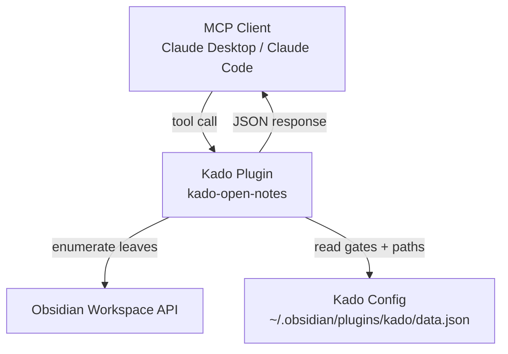
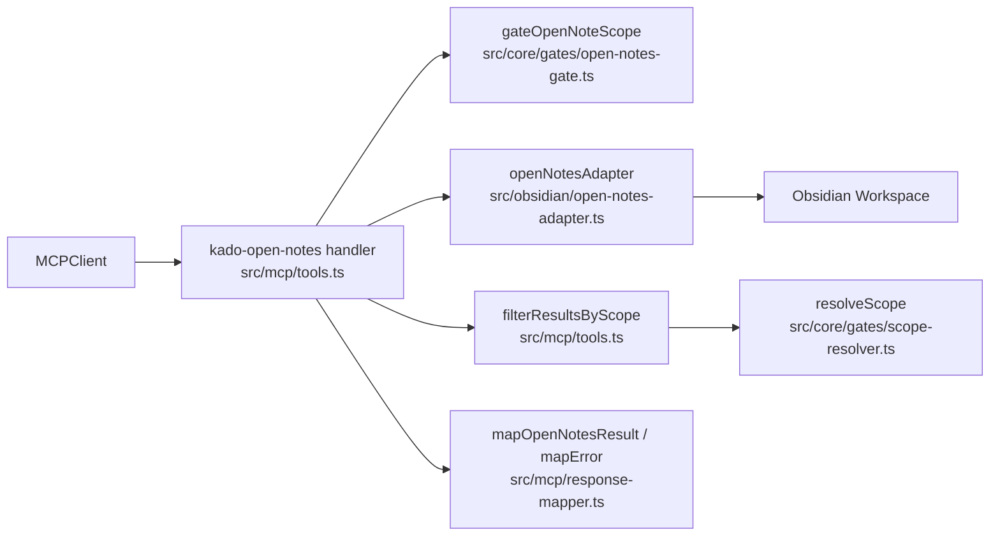
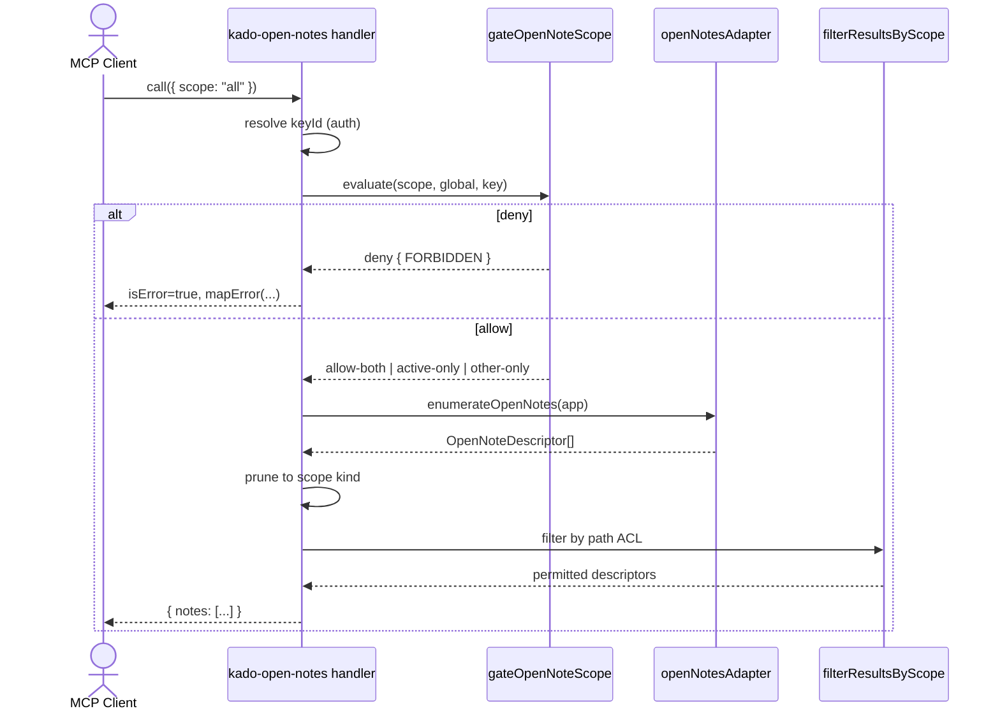
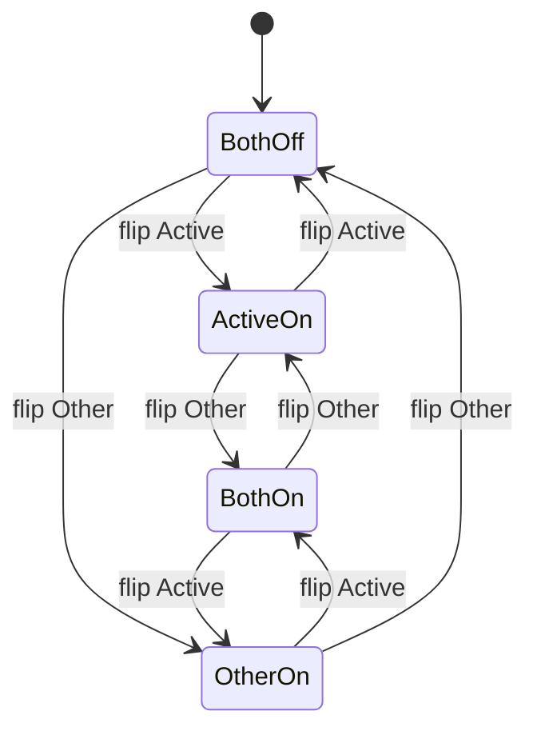

# Solution Design Document

## Validation Checklist

### CRITICAL GATES (Must Pass)

- [x] All required sections are complete
- [x] No [NEEDS CLARIFICATION] markers remain
- [x] Architecture pattern is clearly stated with rationale
- [x] All architecture decisions confirmed by user (see Architecture Decisions)
- [x] Every interface has specification

### QUALITY CHECKS (Should Pass)

- [x] All context sources are listed with relevance ratings
- [x] Project commands are discovered from actual project files
- [x] Constraints → Strategy → Design → Implementation path is logical
- [x] Every component in diagram has directory mapping
- [x] Error handling covers all error types
- [x] Quality requirements are specific and measurable
- [x] Component names consistent across diagrams
- [x] A developer could implement from this design
- [x] Implementation examples use actual type names verified against source
- [x] Complex logic includes traced walkthroughs

---

## Constraints

CON-1 **Existing Kado stack**: TypeScript strict, esbuild, Obsidian desktop + mobile Plugin API, MCP SDK (Zod v4). No new runtime dependencies.
CON-2 **Reuse the permission chain**: path-level ACL must go through `resolveScope` / `filterResultsByScope` — no parallel code path. Glob matching rules must match the existing `matchGlob` semantics (case-sensitive, `**`/`*`, bare-name prefix).
CON-3 **No schema version bump**: config migrations are additive defaults in `config-manager.ts`, not versioned. New fields must have safe defaults applied on load for existing configs.
CON-4 **TDD (see `src/CLAUDE.md`)**: RED first — failing test before implementation — across all modules touched.
CON-5 **Privacy invariant**: path-ACL denial MUST NOT leak note existence (no per-note error responses). Feature-gate denial MAY return explicit errors since the user controls the gate.
CON-6 **Obsidian API only**: no network calls, no external services. Must work in Obsidian desktop and mobile.
CON-7 **Read-only tool**: tool must not modify workspace state (no opening, closing, focusing leaves).

## Implementation Context

### Required Context Sources

#### Documentation Context
```yaml
- doc: docs/XDD/specs/006-open-notes-tool/requirements.md
  relevance: HIGH
  why: "PRD — drives all acceptance criteria"

- doc: docs/live-testing.md
  relevance: MEDIUM
  why: "How to run the plugin against a real Obsidian vault for verification"

- doc: docs/ai/memory/decisions.md
  relevance: MEDIUM
  why: "Existing architectural decisions (permission chain, config shape)"
```

#### Code Context
```yaml
- file: src/mcp/tools.ts
  relevance: HIGH
  why: "Tool registration pattern, Zod schemas, CallToolResult shape, filterResultsByScope"

- file: src/mcp/response-mapper.ts
  relevance: HIGH
  why: "mapError/mapFileResult — error/success envelope"

- file: src/mcp/request-mapper.ts
  relevance: MEDIUM
  why: "Pattern for mapping raw tool args → canonical CoreRequest"

- file: src/core/permission-chain.ts
  relevance: HIGH
  why: "evaluatePermissions() — gate chain entry point"

- file: src/core/gates/scope-resolver.ts
  relevance: HIGH
  why: "resolveScope() — the pure whitelist/blacklist decision we reuse"

- file: src/core/gates/key-scope.ts
  relevance: MEDIUM
  why: "Reference for how a gate is structured"

- file: src/core/glob-match.ts
  relevance: MEDIUM
  why: "matchGlob semantics — inherited for free via filterResultsByScope"

- file: src/types/canonical.ts
  relevance: HIGH
  why: "KadoConfig, SecurityConfig, ApiKeyConfig, CoreError — where new fields are added"

- file: src/core/config-manager.ts
  relevance: HIGH
  why: "Load-time default merging — migration surface"

- file: src/obsidian/note-adapter.ts
  relevance: MEDIUM
  why: "Existing workspace API usage (getLeavesOfType('markdown')) — mirror the pattern"

- file: src/settings/tabs/ApiKeyTab.ts
  relevance: HIGH
  why: "Section pattern, access-mode toggle precedent, render-redisplay flow"

- file: src/settings/tabs/GlobalSecurityTab.ts
  relevance: HIGH
  why: "renderAccessModeToggle helper — analogue for new section"

- file: src/settings/components/PermissionMatrix.ts
  relevance: LOW
  why: "listMode-aware wording precedent"

- file: src/main.ts
  relevance: MEDIUM
  why: "Plugin bootstrap — where app reference and tool deps are wired"
```

#### External APIs
Not applicable. Tool is local-only. Obsidian Plugin API only.

### Implementation Boundaries

- **Must Preserve**:
  - Existing MCP tool contracts (`kado-read`, `kado-write`, `kado-search`, `kado-delete`).
  - `CoreError` shape and `CoreErrorCode` enum (we reuse `FORBIDDEN`).
  - `resolveScope`, `filterResultsByScope`, `matchGlob` — internal callers depend on them.
  - Existing config migration behaviors.
- **Can Modify**:
  - `SecurityConfig` and `ApiKeyConfig` types (add two boolean fields each, default `false`).
  - `ApiKeyTab.ts` and `GlobalSecurityTab.ts` render order (insert new section).
  - Tool registration list in `src/mcp/tools.ts`.
- **Must Not Touch**:
  - Existing adapter code (`obsidian/note-adapter.ts` read/write logic).
  - Concurrency guard, audit logger signatures.
  - Any gate in `src/core/gates/` (we add a standalone feature-gate check outside the per-path chain).

### External Interfaces

#### System Context Diagram



#### Interface Specifications

```yaml
inbound:
  - name: "kado-open-notes MCP tool"
    type: "MCP (stdio or HTTP)"
    format: "JSON-RPC (MCP SDK)"
    authentication: "Bearer token → keyId resolution (existing flow)"
    doc: "This document — Interface Specifications below"
    data_flow: "scope request → notes list"

outbound:
  - name: "Obsidian Workspace API"
    type: "In-process (Plugin API)"
    format: "TypeScript objects"
    authentication: "n/a"
    doc: "https://docs.obsidian.md/Reference/TypeScript+API/Workspace"
    criticality: HIGH
    data_flow: "getLeavesOfType(viewType), activeLeaf"
```

### Project Commands

```bash
# From package.json
Install: npm install
Dev:     npm run dev
Test:    npm test         # vitest suite (if present; otherwise tsc + manual)
Lint:    npm run lint
Build:   npm run build    # tsc -noEmit + esbuild production bundle
Typecheck test files: npx tsc --noEmit -p tsconfig.test.json   # see memory: build does not cover test/**
```

## Solution Strategy

- **Architecture Pattern**: Add a new MCP tool that composes two independent permission layers: a **feature-gate check** (per-scope, per-key) and the **existing per-path ACL** (whitelist/blacklist). Reuse all path-filtering primitives. No changes to the gate chain used by other tools.
- **Integration Approach**: 
  1. Extend `SecurityConfig` and `ApiKeyConfig` with `allowActiveNote` / `allowOtherNotes` boolean fields (default `false`). 
  2. Default-merge in `config-manager.ts` on load (additive migration).
  3. Register `kado-open-notes` in `src/mcp/tools.ts` via the existing `registerTools` pattern. 
  4. New helper module `src/obsidian/open-notes-adapter.ts` encapsulates workspace-API enumeration.
  5. New pure function `gateOpenNoteScope(scope, globalCfg, keyCfg)` determines feature-gate outcome.
  6. Settings UI: insert "Open Notes" section between Access Mode and Paths in both `ApiKeyTab.ts` and `GlobalSecurityTab.ts`; wording flips with `listMode` (analogous to access-mode desc flip).
- **Justification**: Reusing `filterResultsByScope` gives us matching-rule parity for free (globs, whitelist/blacklist, case-sensitivity, bare-name prefix). Keeping the feature gate outside the per-request gate chain avoids polluting existing tools' code paths with a concept that only applies here.
- **Key Decisions**: See Architecture Decisions — ADR-1 through ADR-6.

## Building Block View

### Components



### Directory Map

**Component**: Kado plugin (single-component feature)
```
src/
├── mcp/
│   ├── tools.ts                          # MODIFY: add registerOpenNotesTool(), KADO_OPEN_NOTES_TOOL_DESCRIPTION, zod shape
│   ├── request-mapper.ts                 # MODIFY: add mapOpenNotesRequest() → CoreOpenNotesRequest
│   └── response-mapper.ts                # MODIFY: add mapOpenNotesResult() → CallToolResult
├── core/
│   ├── gates/
│   │   └── open-notes-gate.ts            # NEW: gateOpenNoteScope() pure function (feature gate)
│   └── config-manager.ts                 # MODIFY: default-merge the 4 new boolean fields
├── types/
│   └── canonical.ts                      # MODIFY: add allowActiveNote/allowOtherNotes to SecurityConfig and ApiKeyConfig; add CoreOpenNotesRequest and CoreOpenNotesResult types; update createDefaultSecurityConfig and createDefaultConfig
├── obsidian/
│   └── open-notes-adapter.ts             # NEW: enumerateOpenNotes(app) → OpenNoteDescriptor[]
└── settings/
    ├── components/
    │   └── OpenNotesSection.ts           # NEW: renderOpenNotesSection(container, scope, listMode, onChange)
    └── tabs/
        ├── ApiKeyTab.ts                  # MODIFY: insert renderOpenNotesSection() between Access Mode and Paths
        └── GlobalSecurityTab.ts          # MODIFY: insert renderOpenNotesSection() between Access Mode and Paths

test/
├── core/gates/open-notes-gate.spec.ts    # NEW
├── obsidian/open-notes-adapter.spec.ts   # NEW (uses mocked App/Workspace)
├── mcp/open-notes-tool.spec.ts           # NEW (end-to-end handler with mocked deps)
└── settings/open-notes-section.spec.ts   # NEW (render wording + toggle persistence)
```

### Interface Specifications

#### Tool Contract (inline spec)

```yaml
Tool: kado-open-notes
  Description: "List currently open Obsidian notes. Gated by per-key feature flags and path ACL. Read-only."
  Zod Input Schema:
    scope: z.enum(['active', 'other', 'all']).optional()
           .describe('active = focused leaf only; other = all non-active open files; all = both. Default: all.')
  Request mapping: raw args → CoreOpenNotesRequest
  Response:
    success: CallToolResult { content: [{ type: 'text', text: JSON.stringify({ notes: OpenNoteDescriptor[] }) }] }
    error:   CallToolResult { isError: true, content: [{ type: 'text', text: JSON.stringify(CoreError) }] }
  Error Codes:
    FORBIDDEN (gate='feature-gate') — requested scope is disabled by either global or key flag
    UNAUTHORIZED — bearer token invalid / key disabled (existing authenticate gate)
    INTERNAL_ERROR — unexpected Obsidian API failure
```

#### Data Storage Changes

No database. Plugin config file (`data.json`) gets additive fields. Migration is a default-merge in `config-manager.ts` — no version bump, no destructive transform.

**Config fields added:**
```yaml
SecurityConfig (src/types/canonical.ts):
  + allowActiveNote: boolean         # default: false
  + allowOtherNotes: boolean         # default: false

ApiKeyConfig (src/types/canonical.ts):
  + allowActiveNote: boolean         # default: false
  + allowOtherNotes: boolean         # default: false
```

Existing configs on disk lacking these fields → `config-manager` fills `false` on load (same mechanism used for `tags: []`, `listMode: 'whitelist'`).

#### Application Data Models

```typescript
// NEW canonical types (src/types/canonical.ts)

export type OpenNotesScope = 'active' | 'other' | 'all';

export interface CoreOpenNotesRequest {
  kind: 'openNotes';                 // discriminator consistent with other Core*Request types
  keyId: string;
  scope: OpenNotesScope;             // 'all' is the default applied by request-mapper
}

export type OpenNoteType =
  | 'markdown'
  | 'canvas'
  | 'pdf'
  | 'image'
  | string;                          // unknown Obsidian view types pass through as-is

export interface OpenNoteDescriptor {
  name: string;                      // Obsidian basename — the display name, e.g. "Meeting 2026-04-20"
  path: string;                      // vault-relative path — e.g. "Work/Meetings/Meeting 2026-04-20.md"
  active: boolean;                   // exactly one entry may be active: true in a response
  type: OpenNoteType;                // view-type string, lower-cased
}

export interface CoreOpenNotesResult {
  notes: OpenNoteDescriptor[];
}
```

Adds discriminated-union arm to existing Core request routing where applicable (see `CoreRequest` in `src/types/canonical.ts`).

#### Integration Points

Intra-plugin only. No external services.

```yaml
- from: tool handler (src/mcp/tools.ts)
  to: feature gate (src/core/gates/open-notes-gate.ts)
    - protocol: in-process function call
    - data_flow: "scope + config → { allow: 'all' | 'active-only' | 'other-only' | 'none-denied' }"

- from: tool handler (src/mcp/tools.ts)
  to: open-notes adapter (src/obsidian/open-notes-adapter.ts)
    - protocol: in-process function call
    - data_flow: "app reference → OpenNoteDescriptor[] (all open files, unfiltered)"

- from: tool handler (src/mcp/tools.ts)
  to: path ACL (src/mcp/tools.ts :: filterResultsByScope)
    - protocol: in-process function call
    - data_flow: "descriptors[] + keyId + config → permitted descriptors[]"
```

### Implementation Examples

#### Example 1: Feature-Gate Pure Function

**Why this example**: This function is the heart of the privacy model. The decision tree (explicit scope + off → error; scope=all + partial → filter; both off + scope=all → error) must be documented so the test suite can verify every branch.

```typescript
// src/core/gates/open-notes-gate.ts
import type {SecurityConfig, ApiKeyConfig, CoreError} from '../../types/canonical';
import type {OpenNotesScope} from '../../types/canonical';

export type FeatureGateOutcome =
  | { kind: 'allow-active-only' }
  | { kind: 'allow-other-only' }
  | { kind: 'allow-both' }
  | { kind: 'deny'; error: CoreError };

export function gateOpenNoteScope(
  scope: OpenNotesScope,
  global: SecurityConfig,
  key: ApiKeyConfig,
): FeatureGateOutcome {
  const activeOn = global.allowActiveNote && key.allowActiveNote;   // AND — no inheritance
  const otherOn = global.allowOtherNotes && key.allowOtherNotes;

  if (scope === 'active') {
    if (activeOn) return { kind: 'allow-active-only' };
    return { kind: 'deny', error: forbidden('active', global, key) };
  }
  if (scope === 'other') {
    if (otherOn) return { kind: 'allow-other-only' };
    return { kind: 'deny', error: forbidden('other', global, key) };
  }
  // scope === 'all'
  if (activeOn && otherOn) return { kind: 'allow-both' };
  if (activeOn) return { kind: 'allow-active-only' };          // silent filter of 'other'
  if (otherOn) return { kind: 'allow-other-only' };            // silent filter of 'active'
  return { kind: 'deny', error: forbidden('all', global, key) };
}

function forbidden(scope: OpenNotesScope, g: SecurityConfig, k: ApiKeyConfig): CoreError {
  const parts: string[] = [];
  if (scope === 'active' || scope === 'all') {
    if (!g.allowActiveNote) parts.push('global allowActiveNote is off');
    if (!k.allowActiveNote) parts.push('key allowActiveNote is off');
  }
  if (scope === 'other' || scope === 'all') {
    if (!g.allowOtherNotes) parts.push('global allowOtherNotes is off');
    if (!k.allowOtherNotes) parts.push('key allowOtherNotes is off');
  }
  return {
    code: 'FORBIDDEN',
    gate: 'feature-gate',
    message: `Open notes scope "${scope}" is not allowed (${parts.join('; ')}).`,
  };
}
```

**Traced walkthrough** (verify every criterion from PRD AC-3):

| Scope | global.active | key.active | global.other | key.other | Outcome |
|-------|---------------|------------|--------------|-----------|---------|
| `active` | true | true | * | * | `allow-active-only` |
| `active` | false | true | * | * | `deny` (FORBIDDEN, msg: "global allowActiveNote is off") |
| `active` | true | false | * | * | `deny` (FORBIDDEN, msg: "key allowActiveNote is off") |
| `all` | true | true | false | false | `allow-active-only` (silent filter of `other`) |
| `all` | false | false | true | true | `allow-other-only` (silent filter of `active`) |
| `all` | false | false | false | false | `deny` (FORBIDDEN, scope="all") |
| `all` | true | true | true | true | `allow-both` |

#### Example 2: Workspace Enumeration

**Why this example**: The Obsidian workspace API has several ways to list leaves; precedent in `note-adapter.ts:132` uses `getLeavesOfType`. We extend the same pattern to cover multiple view types and detect the focused leaf.

```typescript
// src/obsidian/open-notes-adapter.ts
import {App, MarkdownView, TFile, WorkspaceLeaf} from 'obsidian';
import type {OpenNoteDescriptor} from '../types/canonical';

const KNOWN_VIEW_TYPES = ['markdown', 'canvas', 'pdf', 'image'] as const;

export function enumerateOpenNotes(app: App): OpenNoteDescriptor[] {
  const active = app.workspace.activeLeaf ?? null;
  const seen = new Map<string, OpenNoteDescriptor>();  // de-dupe by path (linked panes)

  for (const type of KNOWN_VIEW_TYPES) {
    for (const leaf of app.workspace.getLeavesOfType(type)) {
      const descriptor = leafToDescriptor(leaf, active);
      if (!descriptor) continue;
      // First write wins, but upgrade `active: false` → `active: true` when active pane is the dup
      const prior = seen.get(descriptor.path);
      if (!prior) seen.set(descriptor.path, descriptor);
      else if (!prior.active && descriptor.active) seen.set(descriptor.path, descriptor);
    }
  }
  return [...seen.values()];
}

function leafToDescriptor(leaf: WorkspaceLeaf, activeLeaf: WorkspaceLeaf | null): OpenNoteDescriptor | null {
  const view = leaf.view;
  // Explicit precedent for skipping non-file views (src/obsidian/note-adapter.ts:131-138)
  const file: TFile | undefined = (view as any).file ?? undefined;
  if (!file) return null;
  return {
    name: file.basename,
    path: file.path,
    active: leaf === activeLeaf,
    type: view.getViewType(),
  };
}
```

**Edge case mapping:**
- No open notes → `enumerateOpenNotes` returns `[]` → tool returns `{ notes: [] }`.
- Active leaf is non-file (settings/graph/search) → its `view.file` is nullish → skipped; no entry has `active: true`.
- Two panes on the same file, one focused → single entry with `active: true`.
- Unknown view type (e.g., user plugin) → not iterated unless present in `KNOWN_VIEW_TYPES`. **Decision** (see ADR-3): enumerate only known types in v1 to avoid surfacing synthetic views from third-party plugins.

#### Example 3: Tool Handler Composition

**Why this example**: Shows the glue that enforces the privacy invariant (CON-5) — path-ACL denial uses `filterResultsByScope` (silent), while feature-gate denial returns an error.

```typescript
// src/mcp/tools.ts — simplified handler body
async (args, extra) => {
  const keyId = resolveKeyId(extra);           // existing helper
  const config = deps.configManager.getConfig();
  const key = config.apiKeys.find(k => k.id === keyId);
  if (!key) return mapError({ code: 'UNAUTHORIZED', message: 'Key not found', gate: 'authenticate' });

  const req = mapOpenNotesRequest(args, keyId);   // fills scope default = 'all'
  const gate = gateOpenNoteScope(req.scope, config.security, key);
  if (gate.kind === 'deny') return mapError(gate.error);

  const all = enumerateOpenNotes(app);
  const byScope = filterByScopeKind(all, gate.kind);   // strip active or other depending on outcome
  const permitted = filterDescriptorsByAcl(byScope, keyId, config); // reuses filterResultsByScope semantics
  return mapOpenNotesResult({ notes: permitted });
}
```

## Runtime View

### Primary Flow

#### Primary Flow: Client requests open notes

1. MCP client calls `kado-open-notes` with `scope: "all"`.
2. Handler resolves the API key via bearer token (existing authenticate step).
3. Handler invokes `gateOpenNoteScope(scope, global, key)`. If `deny`, returns `FORBIDDEN` immediately.
4. Handler calls `enumerateOpenNotes(app)` to list every open file.
5. Handler prunes to the scope kind returned by the gate (`allow-active-only` → drop non-active; `allow-other-only` → drop active; `allow-both` → keep all).
6. Handler runs path ACL via `filterResultsByScope`-equivalent — silently drops anything the key cannot read.
7. Handler serialises to `{ notes: [...] }` JSON and returns as `CallToolResult`.



### Error Handling

- **Missing/invalid bearer token** → `UNAUTHORIZED` (existing authenticate layer). Unchanged.
- **Feature gate denies** → `FORBIDDEN` with `gate: 'feature-gate'` and a message that names which flag(s) are off. Explicit messaging is acceptable because the user controls these flags.
- **Path ACL denies (per-note)** → entry silently omitted. Never surfaced as an error. If the final list is empty, return `{ notes: [] }` successfully.
- **No open notes at all** → `{ notes: [] }`.
- **Obsidian API throws** (unexpected) → caught, logged via `kadoLog`, mapped to `INTERNAL_ERROR`.
- **Unknown view type** → entry included with raw view-type string. Not an error.

### Complex Logic

See traced walkthrough table in Implementation Example 1 (feature gate decision matrix). The path-ACL branch reuses existing logic in `src/mcp/tools.ts:123-137` — no new algorithm.

## Deployment View

### Single Application Deployment
- **Environment**: Obsidian desktop (macOS/Windows/Linux) and Obsidian mobile. No server component added — tool ships with the existing MCP server embedded in the plugin.
- **Configuration**: Two new boolean flags per scope on global and per key. Defaults `false` everywhere. No environment variables.
- **Dependencies**: Obsidian Plugin API (already present). No new npm packages.
- **Performance**: Tool is local and cheap. Enumeration is O(number of open leaves × number of known view types), typically <20 iterations. No caching needed.

### Multi-Component Coordination
Not applicable — single-component feature.

## Cross-Cutting Concepts

### Pattern Documentation

```yaml
- pattern: "MCP tool registration"
  source: src/mcp/tools.ts :: registerTools
  relevance: CRITICAL
  why: "New tool must register via the same seam so deps (configManager, audit) are consistent"

- pattern: "Per-path ACL via resolveScope + filterResultsByScope"
  source: src/core/gates/scope-resolver.ts + src/mcp/tools.ts:123-137
  relevance: CRITICAL
  why: "Only place that knows whitelist/blacklist + glob matching — MUST NOT be duplicated"

- pattern: "Config default-merge migration"
  source: src/core/config-manager.ts:31-88
  relevance: HIGH
  why: "Additive fields survive without schema version bumps"

- pattern: "Settings section with listMode-aware wording"
  source: src/settings/tabs/ApiKeyTab.ts:111-126 (access mode toggle + desc flip)
  relevance: HIGH
  why: "Direct template for the new Open Notes section"

- pattern: "Workspace enumeration via getLeavesOfType"
  source: src/obsidian/note-adapter.ts:132
  relevance: MEDIUM
  why: "Single existing precedent; extend to more view types"
```

### User Interface & UX

**Information Architecture** (ApiKeyTab and GlobalSecurityTab, Permissions region):
```
┌─ Permissions ─────────────────────────────────────────────┐
│ Access mode                                 [◉ Whitelist] │
│   Only listed paths and tags are accessible for this key  │
│                                                           │
│ ── Open Notes ────────────────────────                    │
│ Active note                                        [ off ]│
│   Expose the currently focused note to this key           │
│ Other open notes                                   [ off ]│
│   Expose non-active open notes to this key                │
│                                                           │
│ ── Paths ─────────────────────────────                    │
│   [existing path list here]                               │
│                                                           │
│ ── Tags ──────────────────────────────                    │
│   [existing tag list here]                                │
└───────────────────────────────────────────────────────────┘
```

**Wording flip** (mirrors `ApiKeyTab.ts:111-126` access-mode desc pattern):

| listMode | Active-note toggle desc | Other-notes toggle desc |
|---|---|---|
| whitelist | "Expose the currently focused note to this key" | "Expose non-active open notes to this key" |
| blacklist | "Allow the currently focused note through to this key" | "Allow non-active open notes through to this key" |

Default both toggles `off`. Changing either persists immediately via `plugin.saveSettings()` and redraws via existing `onRedisplay()` flow.

**Component States:**


**Accessibility**: Use existing Obsidian `Setting` component (already accessible in both tabs). Keyboard-focusable toggles, labelled by `setName` and described by `setDesc`. No custom ARIA needed.

### System-Wide Patterns

- **Security**: Two-layer gate (feature + path). Feature-gate default OFF, no inheritance. Path-ACL denial is always silent.
- **Error Handling**: Reuse `CoreError` + `mapError`. No new error codes. `FORBIDDEN` with `gate: 'feature-gate'` discriminates feature-level denials from scope-resolver denials.
- **Performance**: Local API, no I/O; no optimization needed. Tool handler is synchronous except for the MCP SDK wrapper.
- **Logging/Auditing**: If `auditLogger` is present, emit one audit entry per tool call via the existing `createAuditEntry` helper (action = `openNotes`, include scope and resulting count). Does not leak individual paths into audit beyond existing semantics.
- **i18n**: Not in scope — existing settings UI is English-only.

## Architecture Decisions

All decisions below were confirmed in the pre-spec brainstorm (conversation on 2026-04-20 preceding this SDD). They are re-documented here with rationale for traceability.

- [x] **ADR-1 Reuse existing path ACL**: Use `filterResultsByScope` (or a thin wrapper that calls `resolveScope` per descriptor) rather than a new filter.
  - Rationale: Free inheritance of glob-matching rules, whitelist/blacklist semantics, and future changes. Avoids a parallel code path.
  - Trade-offs: The existing filter checks both global and key scopes — exactly what we need here; no adaptation required.
  - User confirmed: Yes (design conversation, 2026-04-20).

- [x] **ADR-2 Feature gate is separate from the per-request permission chain**: `gateOpenNoteScope` is a standalone pure function, not a `PermissionGate` entry.
  - Rationale: The feature-gate operates on a request-level concept (scope) that has no meaning for other tools. Adding it to the chain would pollute unrelated code.
  - Trade-offs: One additional module to maintain; acceptable because it's small and well-isolated.
  - User confirmed: Yes (implicit via design decisions on gate semantics).

- [x] **ADR-3 Known view types only in v1**: Enumerate `markdown`, `canvas`, `pdf`, `image`; do not use `iterateAllLeaves`.
  - Rationale: Third-party plugins can register arbitrary view types that are not user-authored notes (sidebars, widgets). Limiting to known file-backed types prevents surfacing synthetic views.
  - Trade-offs: New core view types require a code change to appear. The `type` field still passes through the raw Obsidian string so clients can at least see what they got.
  - User confirmed: Yes (type field confirmed + decision to filter non-file views).

- [x] **ADR-4 Silent path-ACL filter, explicit feature-gate error**: Per-note denial is never an error; scope-level denial is an error when the scope is explicitly requested.
  - Rationale: Per-note errors leak existence. Scope-level gates are under user control, so explicit messaging helps clients and admins diagnose config.
  - Trade-offs: Clients can infer from `{ notes: [] }` that the key might have zero permitted opens, but cannot distinguish "nothing open" from "all filtered". Acceptable — this is the privacy property we want.
  - User confirmed: Yes (explicit design conversation).

- [x] **ADR-5 Single tool, `scope` param**: One tool `kado-open-notes` with `scope: active | other | all` rather than three tools.
  - Rationale: Smaller surface; consistent error model; mirrors how `kado-search` handles multiple operations.
  - Trade-offs: Clients must know the `scope` enum. Acceptable — MCP clients read Zod-described schemas.
  - User confirmed: Yes.

- [x] **ADR-6 Per-key default OFF, no inheritance from global**: A key's flag is evaluated AND-combined with the global flag — both must be `true`.
  - Rationale: Minimizes exposure surface; explicit opt-in per key matches Kado's privilege model.
  - Trade-offs: Slightly more config work for users who want a global "allow everywhere" — they must flip each key too. Accepted.
  - User confirmed: Yes (explicit).

## Quality Requirements

- **Performance**: Tool response under 50 ms on a typical vault with <20 open leaves on desktop; under 200 ms on mobile. No new caching required.
- **Usability**: Settings UI changes persist immediately (no "save" step). Toggle copy is clear and flips with whitelist/blacklist without user action.
- **Security**: 
  - Default OFF everywhere for all new configs and all existing configs loaded after the upgrade.
  - No code path allows a note to be returned when either the global or key flag for its scope is `false`.
  - Path-ACL denial never surfaces per-note errors.
  - All tool calls audited via existing logger when enabled.
- **Reliability**: 
  - Unknown Obsidian view types do not crash the handler; they pass through.
  - A non-file active leaf does not crash enumeration; it is simply excluded.
  - Config file missing the new fields loads with defaults.

## Acceptance Criteria

Main Flow Criteria: [PRD AC Feature 1 — Tool Contract]
- [ ] WHEN a client calls `kado-open-notes` with `scope: "active"` and both gates for the key allow active, THE SYSTEM SHALL return a response with exactly one entry having `active: true`, containing `name`, `path`, and `type` for the focused file
- [ ] WHEN a client calls `kado-open-notes` with `scope: "other"` and gates allow, THE SYSTEM SHALL return all non-active open files the key has R permission on, each with `active: false`
- [ ] WHEN a client calls `kado-open-notes` without a `scope` parameter, THE SYSTEM SHALL default to `scope: "all"`
- [ ] WHEN no file is open or all candidates are filtered, THE SYSTEM SHALL return `{ notes: [] }` with no error
- [ ] THE SYSTEM SHALL populate each note descriptor with exactly the keys `name`, `path`, `active`, `type`

Feature Gate Criteria: [PRD AC Feature 2 + 3]
- [ ] THE SYSTEM SHALL default `allowActiveNote` and `allowOtherNotes` to `false` for any newly created API key and for the global config
- [ ] IF the global or key `allowActiveNote` flag is `false` AND `scope` is `"active"`, THEN THE SYSTEM SHALL return `FORBIDDEN` with `gate: 'feature-gate'`
- [ ] IF the global or key `allowOtherNotes` flag is `false` AND `scope` is `"other"`, THEN THE SYSTEM SHALL return `FORBIDDEN` with `gate: 'feature-gate'`
- [ ] WHEN `scope` is `"all"` and exactly one category is gated off, THE SYSTEM SHALL return the permitted category and silently omit the gated category with no error
- [ ] WHEN `scope` is `"all"` and both categories are gated off, THE SYSTEM SHALL return `FORBIDDEN` with `gate: 'feature-gate'`

Path ACL Criteria: [PRD AC Feature 3 — silent filter]
- [ ] WHEN a candidate note's path is denied by the global or key path ACL, THE SYSTEM SHALL omit it from the response without emitting any per-note error
- [ ] THE SYSTEM SHALL reuse `resolveScope` / `filterResultsByScope` for path-ACL evaluation and not introduce a parallel filter

Settings UI Criteria: [PRD AC Feature 4]
- [ ] WHEN ApiKeyTab or GlobalSecurityTab is rendered, THE SYSTEM SHALL display an "Open Notes" section containing two toggles, positioned between the Access Mode toggle and the Paths section
- [ ] WHILE `listMode` is `whitelist`, THE SYSTEM SHALL render toggle descriptions using inclusive wording
- [ ] WHILE `listMode` is `blacklist`, THE SYSTEM SHALL render toggle descriptions using exclusive wording
- [ ] WHEN a toggle is changed, THE SYSTEM SHALL persist the change via `plugin.saveSettings()` and redisplay without requiring a plugin reload

File-Type Criteria: [PRD AC Feature 5]
- [ ] WHEN a note is returned, THE SYSTEM SHALL set `type` to a lower-cased identifier (`markdown`, `canvas`, `pdf`, `image`, or the Obsidian view type)
- [ ] WHERE a non-file view is open (settings, graph, search), THE SYSTEM SHALL exclude it from the response

Migration Criteria: [implicit — no regression]
- [ ] WHEN an existing config without the new flags is loaded, THE SYSTEM SHALL default all four flags to `false` and save no destructive transforms

## Risks and Technical Debt

### Known Technical Issues

- **Obsidian mobile `activeLeaf` quirks**: Historically some Obsidian mobile versions return `null` for `activeLeaf` in specific view configurations. Mitigation: tolerate `null`; in that case, no entry has `active: true` but `other` entries still populate.
- **Hot-reload plugin stale settings UI** (see auto-memory `project_hotreload_vs_official_update`): during development, settings UI may not pick up new toggles until a full plugin reload. Not a bug in Kado — document for live-testing.

### Technical Debt

- **`CoreOpenNotesRequest` is a new discriminator arm** alongside read/write/search/delete. If a fifth tool is added later, the discriminated-union pattern is holding up; no new debt.
- **Known view-types list** is hard-coded. If Obsidian or a popular plugin adds a widely-used note view, we must update the list. Tracked as non-blocking follow-up.

### Implementation Gotchas

- **Do not read from `workspace.getActiveFile()` for the active detection** — it returns the active *file* but we need the active *leaf* to distinguish between panes showing the same file.
- **Dedup by path with active-preference**: when two panes show the same file and one is focused, the merge step must upgrade `active: false` → `active: true` (see Example 2).
- **`view.file` is not formally typed on the base `View` class** — need a narrow type-cast. Keep it local and commented.
- **Audit log must not include note paths for denied entries** — we only log the final permitted count, not the filtered-out paths, to preserve the privacy invariant across audit as well.
- **Build typecheck scope** (see auto-memory `kado_build_typecheck_scope`): `npm run build` only typechecks `src/**/*.ts`. New test files under `test/` need an explicit `tsc` run during verification.

## Glossary

### Domain Terms

| Term | Definition | Context |
|------|------------|---------|
| Open note | A file currently held by a leaf in Obsidian's workspace | Returned by `kado-open-notes`; includes markdown, canvas, pdf, image |
| Active leaf | The leaf currently holding editor/focus in Obsidian | Exactly one or zero at any time; used for `active: true` determination |
| Leaf | Obsidian's term for an editor/view pane | Multiple leaves can show the same file (linked panes) |
| Feature gate | The `allowActiveNote` / `allowOtherNotes` boolean toggle per scope on global and per key | Composed with path ACL before returning any data |

### Technical Terms

| Term | Definition | Context |
|------|------------|---------|
| Scope (in this spec) | A category of open note: `active`, `other`, or `all` | Tool parameter, distinct from the more general "permission scope" |
| Path ACL | The whitelist/blacklist check on note paths via `resolveScope` + `filterResultsByScope` | Reused unchanged for this tool |
| Silent filter | Omission of a candidate from the response with no error emitted | Privacy mechanism preventing existence leaks |

### API/Interface Terms

| Term | Definition | Context |
|------|------------|---------|
| `CoreOpenNotesRequest` | New canonical request type for the tool | Discriminator: `kind: 'openNotes'` |
| `OpenNoteDescriptor` | Shape of each element in the response `notes` array | `{ name, path, active, type }` |
| `FeatureGateOutcome` | Union describing the feature-gate decision | Drives which category the handler keeps |
