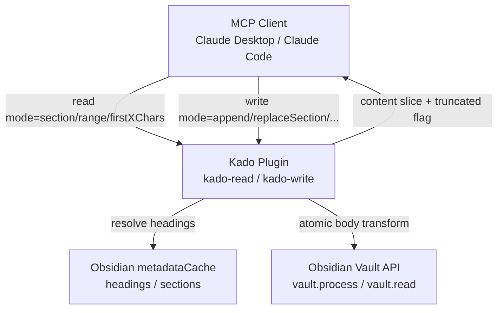
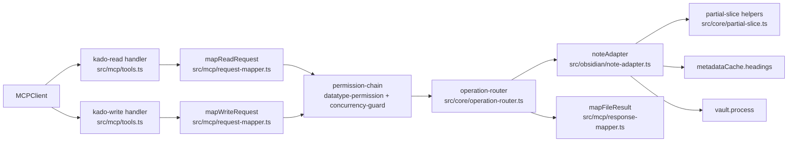
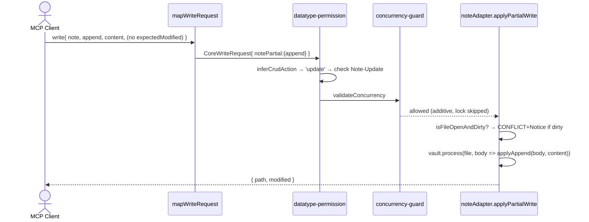

# Solution Design Document

## Validation Checklist

### CRITICAL GATES (Must Pass)

- [x] All required sections are complete
- [x] No [NEEDS CLARIFICATION] markers remain
- [x] Architecture pattern is clearly stated with rationale
- [x] All architecture decisions confirmed by user (ADR-1 through ADR-8 confirmed 2026-06-13)
- [x] Every interface has specification

### QUALITY CHECKS (Should Pass)

- [x] All context sources are listed with relevance ratings
- [x] Project commands are discovered from actual project files
- [x] Constraints → Strategy → Design → Implementation path is logical
- [x] Every component in diagram has directory mapping
- [x] Error handling covers all error types
- [x] Quality requirements are specific and measurable
- [x] Component names consistent across diagrams
- [x] A developer could implement from this design
- [x] Implementation examples use actual type names verified against source
- [x] Complex logic includes traced walkthroughs

---

## Constraints

CON-1 **Existing Kado stack**: TypeScript strict, esbuild, Obsidian desktop + mobile Plugin API, MCP SDK (Zod v4). No new runtime dependencies.
CON-2 **Reuse the permission chain**: partial reads/writes flow through the existing gate chain (`permission-chain` → `datatype-permission` → `concurrency-guard`). No parallel permission path. Partial reads are **Note-Read**, partial writes are **Note-Update** — no new `DataType` or permission key.
CON-3 **No schema version bump**: request/result type extensions are additive optional fields. Existing full-note clients keep working unchanged.
CON-4 **TDD (see `src/CLAUDE.md`)**: RED first — failing test before implementation — across all modules touched. Pure helpers must be unit-tested without an Obsidian mock.
CON-5 **Backward compatibility invariant**: omitting `mode` MUST behave byte-for-byte like today's full-note read/write/create. No behavioural change for existing callers.
CON-6 **`vault.process` is the write primitive** (ref #65, retraction of #10): all body mutation goes through `app.vault.process(file, fn)`, never `adapter.write`.
CON-7 **Dirty-editor guard is non-negotiable**: every write mode (additive or destructive) must honour `isFileOpenAndDirty` and raise CONFLICT + Notice before mutating a file the user is actively editing.
CON-8 **No content corruption**: character boundaries must be respected (no split multibyte code points); inverted/out-of-range bounds are rejected or clamped per spec, never applied blindly.

## Implementation Context

### Required Context Sources

#### Documentation Context
```yaml
- doc: docs/XDD/specs/007-partial-note-rw/requirements.md
  relevance: HIGH
  why: "PRD — drives all acceptance criteria and the must/should split"

- doc: docs/api-reference.md
  relevance: HIGH
  why: "Public contract for kado-read/kado-write — must document every new mode"

- doc: docs/ai/memory/decisions.md
  relevance: MEDIUM
  why: "Existing architectural decisions (permission chain, concurrency model)"

- doc: docs/live-testing.md
  relevance: MEDIUM
  why: "Run the plugin against a real vault for partial-write verification"
```

#### Code Context
```yaml
- file: src/types/canonical.ts
  relevance: HIGH
  why: "CoreReadRequest / CoreWriteRequest / CoreFileResult extensions; new mode + partial union types; type guards"

- file: src/mcp/request-mapper.ts
  relevance: HIGH
  why: "mapReadRequest / mapWriteRequest — where flat MCP `mode` args are validated and normalized into the canonical partial union"

- file: src/obsidian/note-adapter.ts
  relevance: HIGH
  why: "readNote / updateNote / createNote — partial read slicing and partial write via vault.process + metadataCache live here"

- file: src/core/gates/datatype-permission.ts
  relevance: HIGH
  why: "inferCrudAction — must classify partial writes as 'update', not 'create'"

- file: src/core/concurrency-guard.ts
  relevance: HIGH
  why: "validateConcurrency — must skip the optimistic lock for additive append/prepend without treating them as create"

- file: src/core/operation-router.ts
  relevance: MEDIUM
  why: "ReadWriteAdapter contract and write routing — partial mode must always reach the update path"

- file: src/mcp/tools.ts
  relevance: HIGH
  why: "Zod input schemas for kado-read/kado-write — add mode + addressing params and their .describe() docs"

- file: src/mcp/response-mapper.ts
  relevance: MEDIUM
  why: "mapFileResult — surface the `truncated` flag to clients"

- file: src/core/audit/* (audit entry creation, ref src/main.ts:81)
  relevance: MEDIUM
  why: "Record `mode` and bodyTouched for partial writes, consistent with frontmatter bodyTouched:false"

- file: src/core/tag-utils.ts (stripFrontmatter precedent in note-adapter.ts:86-93)
  relevance: MEDIUM
  why: "Frontmatter-boundary detection reused for prepend/body-start anchoring"
```

#### External APIs
Not applicable. Local Obsidian Plugin API only. Heading/section structure comes from `app.metadataCache.getFileCache(file).headings`.

### Implementation Boundaries

- **Must Preserve**:
  - Full-note read/write/create behaviour when `mode` is omitted (CON-5).
  - `CoreError` shape and `CoreErrorCode` enum (reuse `NOT_FOUND`, `CONFLICT`, `VALIDATION_ERROR`).
  - The dirty-editor CONFLICT guard and its Notice (`note-adapter.ts:147-177`).
  - Existing frontmatter `mode: merge|replace` semantics and its request-mapper validation.
- **Can Modify**:
  - `CoreReadRequest`, `CoreWriteRequest`, `CoreFileResult` types (additive optional fields).
  - `inferCrudAction` (datatype-permission) and `validateConcurrency` (concurrency-guard) — generalised, behaviour preserved for the no-mode path.
  - `readNote` / `updateNote` and the `createNoteAdapter.write` routing in note-adapter.
  - Zod schemas + `.describe()` in `tools.ts`; `mapReadRequest` / `mapWriteRequest`.
- **Must Not Touch**:
  - Frontmatter / inline-field / file adapters and their gates.
  - `scope-resolver`, `glob-match`, path-access gate.
  - Delete path (`kado-delete` stays whole-note / whole-field).

### External Interfaces

#### System Context Diagram



#### Interface Specifications

```yaml
inbound:
  - name: "kado-read MCP tool (extended)"
    type: "MCP (Streamable HTTP)"
    format: "JSON-RPC (MCP SDK, Zod-validated)"
    authentication: "Bearer token → keyId (existing authenticate gate)"
    data_flow: "operation=note + mode + params → partial content + truncated"
  - name: "kado-write MCP tool (extended)"
    type: "MCP (Streamable HTTP)"
    format: "JSON-RPC (MCP SDK, Zod-validated)"
    authentication: "Bearer token → keyId"
    data_flow: "operation=note + mode + content (+ expectedModified) → new modified"

outbound:
  - name: "Obsidian Vault API"
    type: "In-process (Plugin API)"
    format: "TypeScript objects"
    doc: "https://docs.obsidian.md/Reference/TypeScript+API/Vault/process"
    criticality: HIGH
    data_flow: "process(file, (data) => newData)"
  - name: "Obsidian metadataCache"
    type: "In-process (Plugin API)"
    format: "CachedMetadata { headings: HeadingCache[] }"
    doc: "https://docs.obsidian.md/Reference/TypeScript+API/MetadataCache"
    criticality: HIGH
    data_flow: "getFileCache(file).headings → section boundaries"
```

### Project Commands

```bash
# From package.json
Install:  npm install
Dev:      npm run dev
Lint:     npm run lint
Build:    npm run build    # tsc -noEmit (src only) + esbuild production bundle
Test:     npm test         # vitest (if present)
Typecheck test files: npx tsc --noEmit -p tsconfig.test.json   # build does NOT cover test/** (auto-memory: kado_build_typecheck_scope)
```

## Solution Strategy

- **Architecture Pattern**: Extend the existing four-layer pipeline (MCP boundary → Core gates → Interface adapter → Obsidian) with a `mode` dimension on note read/write. The MCP arg surface stays flat (single `mode` param, Variante A); the **request-mapper normalizes flat args into a typed discriminated-union `partial` field** on the canonical request, giving exhaustive type-safety internally without polluting the tool schema.
- **Integration Approach**:
  1. `types/canonical.ts`: add `NoteReadMode` / `NoteWriteMode`, a `NoteReadPartial` / `NoteWritePartial` discriminated union, attach `partial?` to read/write requests, add `truncated?` to `CoreFileResult`.
  2. New pure module `src/core/partial-slice.ts`: Obsidian-free helpers — `firstXChars`, `sliceByCharRange`, `sliceByLineRange`, `applyAppend`/`applyPrepend`/`applyReplaceRange`. Unit-tested in isolation (CON-4).
  3. `request-mapper.ts`: validate `mode` + addressing params per operation; build the `partial` union; reject malformed combos at the boundary (VALIDATION_ERROR).
  4. `datatype-permission.ts` `inferCrudAction`: a note write carrying `partial` is **always `update`**.
  5. `concurrency-guard.ts`: additive `append`/`prepend` may omit `expectedModified` (skip optimistic lock); replace/insert require it; never reclassify a partial write as create.
  6. `note-adapter.ts`: `readNote` applies read slicing; new `applyPartialWrite` resolves headings via `metadataCache`, computes the new body, and writes through `vault.process` — after the dirty-editor guard. `createNoteAdapter.write` routes any `partial` to the update path.
  7. `tools.ts` + `response-mapper.ts`: Zod schema params, `.describe()` docs, surface `truncated`.
  8. `docs/api-reference.md`: document every mode, its params, response shape, and errors.
- **Justification**: Heading/section resolution is intrinsically Obsidian-coupled (metadataCache) so it lives in the adapter; the math (slicing, boundary safety) is pure and lives in core where it is cheaply and exhaustively testable. Reusing the gate chain keeps the privilege model intact — a partial write cannot bypass Note-Update permission.
- **Key Decisions**: See Architecture Decisions — ADR-1 through ADR-8.

## Building Block View

### Components



### Directory Map

```
src/
├── mcp/
│   ├── tools.ts                  # MODIFY: add mode + addressing params to kado-read/kado-write Zod schemas + .describe()
│   ├── request-mapper.ts         # MODIFY: validate mode/params per operation; normalize to NoteReadPartial/NoteWritePartial
│   └── response-mapper.ts        # MODIFY: include `truncated` in mapped read result
├── core/
│   ├── partial-slice.ts          # NEW: pure, Obsidian-free slice/apply helpers (firstXChars, line/char range, append/prepend/replaceRange)
│   ├── gates/
│   │   └── datatype-permission.ts# MODIFY: inferCrudAction — partial note write ⇒ 'update'
│   ├── concurrency-guard.ts      # MODIFY: append/prepend lock-free; never treat partial write as create
│   └── operation-router.ts       # MODIFY (if needed): ensure partial write reaches update path
├── types/
│   └── canonical.ts              # MODIFY: NoteReadMode/NoteWriteMode, NoteReadPartial/NoteWritePartial unions, partial? on requests, truncated? on CoreFileResult, type guards
└── obsidian/
    └── note-adapter.ts           # MODIFY: readNote slicing; applyPartialWrite (heading resolution + vault.process); write routing

test/
├── core/partial-slice.spec.ts            # NEW: pure helper unit tests (boundary/multibyte/inverted)
├── core/gates/datatype-permission.spec.ts# MODIFY: partial write ⇒ update permission
├── core/concurrency-guard.spec.ts        # MODIFY: append lock-free; replace requires expectedModified
├── mcp/request-mapper.spec.ts            # MODIFY: mode validation, malformed combos
└── obsidian/note-adapter.spec.ts         # MODIFY: section/range read, append/insert/replace write, dirty-editor guard per mode
```

### Interface Specifications

#### Tool Contract (inline spec)

```yaml
Tool: kado-read (operation="note", extended)
  New params (all optional; absent ⇒ full read):
    mode: z.enum(['firstXChars','section','range']).optional()
    limit:       z.number().int().positive().optional()   # mode=firstXChars (chars / code points)
    heading:     z.string().optional()                    # mode=section, text form (first match)
    headingPath: z.array(z.string()).optional()           # mode=section, path form (H1>H2)
    rangeBasis:  z.enum(['line','char']).optional()        # mode=range
    start:       z.number().int().nonnegative().optional() # mode=range (line: 1-based; char: 0-based)
    end:         z.number().int().nonnegative().optional() # mode=range (inclusive line / exclusive char — see ADR-4)
  Response (success): mapFileResult adds
    truncated: boolean    # true when content outside the returned slice exists

Tool: kado-write (operation="note", extended)
  New params:
    mode: z.enum(['append','prepend','insertUnderHeading','replaceSection','replaceRange']).optional()
    heading / headingPath          # insertUnderHeading | replaceSection
    rangeBasis / start / end       # replaceRange
    content: string                # text to add/insert/replace
    expectedModified: number       # REQUIRED for insert/replace; OPTIONAL for append/prepend
  Errors:
    VALIDATION_ERROR — malformed mode/param combo (caught in request-mapper)
    NOT_FOUND        — target heading/section does not exist
    CONFLICT         — stale expectedModified, or file open & dirty
    FORBIDDEN        — key lacks Note-Update (write) / Note-Read (read)
```

#### Application Data Models

```typescript
// src/types/canonical.ts — ADDITIONS

export type NoteReadMode = 'firstXChars' | 'section' | 'range';
export type NoteWriteMode =
  | 'append' | 'prepend'
  | 'insertUnderHeading' | 'replaceSection' | 'replaceRange';

/** Heading addressing — text (first match) OR path (H1 > H2 > …). ADR-3. */
export type HeadingTarget =
  | { heading: string }
  | { headingPath: string[] };

/** Range addressing with explicit basis. ADR-4.
 *  line: start 1-based, end inclusive. char: start 0-based, end exclusive (code points). */
export interface RangeTarget {
  basis: 'line' | 'char';
  start: number;
  end: number;
}

/** Normalized partial-READ descriptor (built by request-mapper from flat args). */
export type NoteReadPartial =
  | { mode: 'firstXChars'; limit: number }
  | ({ mode: 'section' } & HeadingTarget)
  | ({ mode: 'range' } & RangeTarget);

/** Normalized partial-WRITE descriptor. */
export type NoteWritePartial =
  | { mode: 'append' }
  | { mode: 'prepend' }
  | ({ mode: 'insertUnderHeading' } & HeadingTarget)
  | ({ mode: 'replaceSection' } & HeadingTarget)
  | ({ mode: 'replaceRange' } & RangeTarget);

// CoreReadRequest gains:   partial?: NoteReadPartial;     // operation='note' only
// CoreWriteRequest gains:  notePartial?: NoteWritePartial; // operation='note'; distinct from frontmatter `mode`
// CoreFileResult gains:    truncated?: boolean;            // set by partial reads
```

> **Note on the existing `mode` field**: `CoreWriteRequest.mode` stays typed as `FrontmatterWriteMode` (frontmatter-only). Note partial writes use the new `notePartial` union. At the MCP arg surface both are entered via a single flat `mode` key (Variante A); the request-mapper routes by `operation` — `frontmatter` → `mode`, `note` → `notePartial`.

#### Data Storage Changes
None. No config/`data.json` changes. Request/result type extensions only.

### Implementation Examples

#### Example 1: Pure slice helpers (core, Obsidian-free)

**Why this example**: These are the only places that touch raw content math. They are pure and must be exhaustively unit-tested for boundary/multibyte safety (CON-8) without an Obsidian mock.

```typescript
// src/core/partial-slice.ts

/** First N code points (multibyte-safe). Returns the slice and whether content was dropped. */
export function firstXChars(body: string, limit: number): { slice: string; truncated: boolean } {
  const cps = Array.from(body);              // code points, not UTF-16 units → never splits a char
  if (cps.length <= limit) return { slice: body, truncated: false };
  return { slice: cps.slice(0, limit).join(''), truncated: true };
}

/** Inclusive 1-based line range. Clamps to bounds; reports whether content exists outside. */
export function sliceByLineRange(body: string, start: number, end: number): { slice: string; truncated: boolean } {
  if (start > end || start < 1) throw rangeError(start, end);
  const lines = body.split('\n');
  const from = Math.min(start, lines.length);
  const to = Math.min(end, lines.length);
  const slice = lines.slice(from - 1, to).join('\n');
  const truncated = from > 1 || to < lines.length;
  return { slice, truncated };
}

/** 0-based start, exclusive end, code-point based. */
export function sliceByCharRange(body: string, start: number, end: number): { slice: string; truncated: boolean } {
  if (start > end || start < 0) throw rangeError(start, end);
  const cps = Array.from(body);
  const to = Math.min(end, cps.length);
  const slice = cps.slice(start, to).join('');
  const truncated = start > 0 || to < cps.length;
  return { slice, truncated };
}

export const applyAppend  = (body: string, add: string): string =>
  body.length === 0 || body.endsWith('\n') ? body + add : body + '\n' + add;
export const applyPrepend = (bodyAfterFm: string, add: string): string =>
  add.endsWith('\n') ? add + bodyAfterFm : add + '\n' + bodyAfterFm;
```

#### Example 2: Heading resolution + partial write (adapter, Obsidian-coupled)

**Why this example**: Section addressing needs the metadataCache; both text and path forms (ADR-3) resolve to a `[startLine, endLine)` span, after which the write reuses the pure range apply. The dirty-editor guard (CON-7) runs first for *every* mode.

```typescript
// src/obsidian/note-adapter.ts (new helper, abbreviated)
import type {HeadingCache} from 'obsidian';

interface SectionSpan { startLine: number; endLine: number; } // 0-based, end exclusive

function resolveSection(headings: HeadingCache[], target: HeadingTarget): SectionSpan | null {
  const idx = ('headingPath' in target)
    ? matchHeadingPath(headings, target.headingPath)   // see matchHeadingPath below
    : headings.findIndex(h => h.heading === target.heading); // first text match
  if (idx === -1) return null;
  const start = headings[idx].position.start.line;
  const level = headings[idx].level;
  // section ends at the next heading of equal-or-higher level, else EOF
  let endLine = Infinity;
  for (let i = idx + 1; i < headings.length; i++) {
    if (headings[i].level <= level) { endLine = headings[i].position.start.line; break; }
  }
  return { startLine: start, endLine };
}

// headingPath ['Project','Tasks'] matches the FIRST heading sequence where each
// segment is found, in order, at a strictly deeper level than the previous match,
// with no intervening heading at or above the previous segment's level (i.e. the
// later segment must fall *within* the earlier segment's section). Returns the
// index of the final segment's heading, or -1 if the path does not resolve.
function matchHeadingPath(headings: HeadingCache[], path: string[]): number {
  let from = 0;            // search window start
  let parentLevel = 0;     // 0 = top; each match must be deeper than this
  let lastIdx = -1;
  for (const name of path) {
    let found = -1;
    for (let i = from; i < headings.length; i++) {
      if (headings[i].level <= parentLevel) break;          // left the parent's section
      if (headings[i].heading === name && headings[i].level > parentLevel) { found = i; break; }
    }
    if (found === -1) return -1;
    lastIdx = found; parentLevel = headings[found].level; from = found + 1;
  }
  return lastIdx;
}

async function applyPartialWrite(app: App, req: CoreWriteRequest): Promise<CoreWriteResult> {
  const file = app.vault.getFileByPath(req.path);
  if (!file) throw notFoundError(req.path);
  if (await isFileOpenAndDirty(app, file)) {        // CON-7 — every mode
    new Notice(`Kado wanted to modify ${file.basename} — pause typing …`, 8000);
    throw conflictEditorError(req.path);
  }
  const partial = req.notePartial!;
  await app.vault.process(file, (data) => computeNewBody(app, file, data, partial, req.content as string));
  const stat = app.vault.getFileByPath(req.path)?.stat ?? file.stat;
  return {path: req.path, created: stat.ctime, modified: stat.mtime};
}
```

**`computeNewBody` per-mode semantics:**
- `insertUnderHeading`: inserts at the **end of the resolved section** — immediately before the next heading of equal-or-higher level (i.e. just before `endLine`), or at end-of-body when the section runs to EOF. It does **not** insert directly after the heading line. Surrounding sections are byte-unchanged.
- `replaceSection`: replaces the section **body** (lines after the heading up to `endLine`); the heading line itself is preserved. Empty `content` ⇒ the body is deleted, leaving the bare heading.
- `replaceRange`: replaces the addressed span. **Empty `content` deletes the span** (valid, not an error).
- `append`/`prepend`: delegate to the pure `applyAppend`/`applyPrepend` helpers; `prepend` anchors after the frontmatter block (via the existing `stripFrontmatter` boundary), never at offset 0.

#### Example 3: Create/update discrimination with partial modes

**Why this example**: This is the highest-risk change (ADR-2). Three sites key off `expectedModified` today; a partial write must be `update` even when `expectedModified` is absent (append).

```typescript
// src/core/gates/datatype-permission.ts
function inferCrudAction(request: CoreRequest): CrudOperation {
  if (isCoreDeleteRequest(request)) return 'delete';
  if (isCoreWriteRequest(request)) {
    // A partial note write always targets an existing file → update, regardless of expectedModified.
    if (request.notePartial !== undefined) return 'update';
    return request.expectedModified !== undefined ? 'update' : 'create';
  }
  return 'read';
}
```

**Traced walkthrough** (write classification + concurrency):

| operation | notePartial.mode | expectedModified | CRUD action | concurrency-guard | adapter path |
|-----------|------------------|------------------|-------------|-------------------|--------------|
| note | — (full) | absent | create | pass (no file) / CONFLICT (file exists) | createNote |
| note | — (full) | present | update | check mtime | updateNote |
| note | append | absent | **update** | **pass (lock skipped)** | applyPartialWrite |
| note | append | present | update | check mtime | applyPartialWrite |
| note | replaceSection | absent | update | **rejected at request-mapper (VALIDATION_ERROR)** | — |
| note | replaceSection | stale | update | CONFLICT | — |
| note | replaceRange | present (fresh) | update | pass | applyPartialWrite |

#### Example 4: Concurrency guard — additive lock-free path

```typescript
// src/core/concurrency-guard.ts (added branch, before the generic write logic)
if (isCoreWriteRequest(request) && request.notePartial !== undefined) {
  const additive = request.notePartial.mode === 'append' || request.notePartial.mode === 'prepend';
  if (request.expectedModified === undefined) {
    if (additive) return {allowed: true};            // ADR-5: lock-free additive write
    return malformed('replace/insert modes require expectedModified');
  }
  // expectedModified present → standard optimistic check (mtime compare below)
}
```

## Runtime View

### Primary Flow: partial read (`mode: section`)

1. Client calls `kado-read` `{ operation:"note", path, mode:"section", heading:"## Tasks" }`.
2. `mapReadRequest` validates the combo, builds `partial = { mode:'section', heading:'## Tasks' }`.
3. Gate chain: `datatype-permission` checks **Note-Read** for the path. `concurrency-guard` passes (read).
4. `readNote` reads the body, fetches `metadataCache.getFileCache(file).headings`, resolves the section span, slices the body, sets `truncated` (content exists outside the section).
5. Heading not found → `NOT_FOUND` naming the section.
6. `mapFileResult` returns `{ content: <section>, modified, truncated: true, … }`.

### Primary Flow: additive write (`mode: append`, no expectedModified)



### Error Handling

- **Malformed mode/param combo** (e.g. `mode:range` without `start`, `replaceSection` without `expectedModified`, inverted range) → `VALIDATION_ERROR` at `request-mapper` (fail fast at the boundary).
- **Target heading/section missing** → `NOT_FOUND` naming the target. Never a silent append/no-op (BR-5).
- **Stale `expectedModified`** (replace/insert) → `CONFLICT`, no mutation.
- **File open & dirty** (any mode) → `CONFLICT` + Notice, no mutation.
- **Permission missing** → `FORBIDDEN` (Note-Read / Note-Update) — identical to full read/write.
- **firstXChars limit ≥ length** → full body, `truncated:false` (not an error).
- **range bounds beyond EOF** → clamp, return effective slice, `truncated` reflects reality (not an error).

### Complex Logic
Section-span resolution and the create/update classification are traced in Examples 2 and 3. Range/firstXChars boundary behaviour is covered by `partial-slice.spec.ts`.

## Cross-Cutting Concepts

### System-Wide Patterns
- **Security**: Partial reads = Note-Read; partial writes = Note-Update. No new permission key; the gate chain is the single enforcement point (CON-2).
- **Error Handling**: Reuse `CoreError` + existing codes. Boundary validation in request-mapper mirrors the existing frontmatter `mode` validation.
- **Auditing**: Partial writes log `mode` and `bodyTouched:true` via the existing audit helper, consistent with frontmatter `bodyTouched:false`. Append count/size need not be logged beyond existing fields.
- **Performance**: Slicing is O(body length); heading resolution is O(headings). Local, no caching needed.
- **Backward compatibility**: No-mode path is byte-identical to today (CON-5); covered by regression tests.

## Architecture Decisions

- [x] **ADR-1 Single flat `mode` arg, normalized to a discriminated union internally** (Variante A).
  - Rationale: Compact tool schema; `operation` already disambiguates frontmatter vs note. Internal `NoteReadPartial`/`NoteWritePartial` unions give exhaustive type-safety.
  - Trade-offs: `mode`'s valid value-set is operation-dependent at the arg surface; mitigated by request-mapper validation + Zod `.describe()`.
  - User confirmed: **Yes** (2026-06-13).

- [x] **ADR-2 Partial note write is always Note-Update** (never create), regardless of `expectedModified`.
  - Rationale: Partial writes target existing content; classifying append as "create" (today's `expectedModified`-absent rule) would check the wrong permission and hit "Note already exists". The presence of `notePartial` overrides the legacy discriminator.
  - Trade-offs: Three sites in the **note** write path (`inferCrudAction`, `concurrency-guard`, `createNoteAdapter.write` routing) must branch on `notePartial`. Full-note path unchanged. **Scope note:** `src/obsidian/file-adapter.ts` also keys off `expectedModified` for create-vs-update, but it serves `operation: "file"` only and `notePartial` never reaches it (partial modes are note-only, enforced in request-mapper) — so file-adapter is intentionally out of scope and unchanged.
  - User confirmed: **Yes** (2026-06-13).

- [x] **ADR-3 Section addressing supports BOTH heading text (first match) and heading path (H1 > H2)**.
  - Rationale: Text covers the common case; path disambiguates duplicate headings. `HeadingTarget` union carries exactly one form.
  - Trade-offs: Two resolution paths to test; block-ref (`^id`) remains a Should-have, deferred.
  - User confirmed: **Yes** (2026-06-13).

- [x] **ADR-4 Range basis is an explicit discriminator** (`basis: 'line' | 'char'`); line = 1-based inclusive, char = 0-based exclusive (code points).
  - Rationale: User chose both; an explicit basis avoids ambiguity. firstXChars stays code-point based for multibyte safety.
  - Trade-offs: Two slice helpers; covered by pure unit tests.
  - User confirmed: **Yes** (2026-06-13).

- [x] **ADR-5 append/prepend are lock-free; replace/insert require `expectedModified`; dirty-editor guard applies to all modes**.
  - Rationale: Append is additive/conflict-tolerant — forcing a fresh read defeats fire-and-forget capture. Replace/insert mutate existing spans → lost-update protection matters. The dirty-editor guard protects live user keystrokes regardless.
  - Trade-offs: Lock-free append can add to a note that changed since the client last saw it; acceptable because it overwrites nothing and the guard still blocks active editing.
  - User confirmed: **Yes** (2026-06-13).

- [x] **ADR-6 Add `truncated` to `CoreFileResult`**; partial reads never report complete when content was omitted.
  - Rationale: Mirrors the search-scope "no partial-as-complete" rule (BR-4); lets clients know to read more.
  - Trade-offs: One optional field; full reads leave it unset/false.
  - User confirmed: **Yes** (2026-06-13).

- [x] **ADR-7 Pure slice math in `core/partial-slice.ts`; heading/section resolution in the adapter**.
  - Rationale: Heading data is Obsidian-coupled (metadataCache); slicing is pure and must be unit-tested without a mock (CON-4). Clean layer separation.
  - Trade-offs: Adapter still owns the metadataCache-dependent span resolution (not unit-testable without a mock); acceptable.
  - User confirmed: **Yes** (2026-06-13).

- [x] **ADR-8 Backward compatibility: no `mode` ⇒ legacy behaviour**; full-note write keeps the `expectedModified`-based create/update discrimination.
  - Rationale: Zero regression for existing clients (CON-5).
  - Trade-offs: Two discrimination rules coexist (full-note legacy vs partial-always-update); documented and tested.
  - User confirmed: **Yes** (2026-06-13).

## Quality Requirements

- **Performance**: Partial read/write completes within the same envelope as a full read/write on a typical note (<50 ms desktop). No new caching.
- **Correctness**:
  - No multibyte code point is ever split (firstXChars/char-range use code-point arrays).
  - Inverted or negative bounds are rejected (VALIDATION_ERROR); over-EOF bounds clamp.
  - A missing heading/section is always an error, never a silent append.
- **Security**:
  - No partial operation bypasses Note-Read / Note-Update permission.
  - A partial write is never misclassified as create.
- **Reliability**:
  - Every write mode honours the dirty-editor guard.
  - Omitting `mode` is byte-identical to current behaviour (regression-tested).

## Acceptance Criteria

Partial READ: [PRD Feature 1]
- [ ] WHEN `mode=firstXChars` with limit N and body length > N, THE SYSTEM SHALL return the first N code points and `truncated:true`
- [ ] WHEN `mode=firstXChars` and body length ≤ N, THE SYSTEM SHALL return the full body and `truncated:false`
- [ ] WHEN `mode=section` (heading text or path) matches, THE SYSTEM SHALL return content from the heading to the next equal-or-higher heading (or EOF), with `truncated:true` when any content exists outside the section and `false` only when the section is the whole body
- [ ] WHEN `mode=section` does not match any heading, THE SYSTEM SHALL return `NOT_FOUND` naming the section
- [ ] WHEN `mode=range` with `basis` line/char, THE SYSTEM SHALL return exactly the requested span and a `truncated` flag; out-of-range bounds clamp
- [ ] WHEN `mode` is omitted, THE SYSTEM SHALL return the full body identical to current behaviour

Partial WRITE: [PRD Feature 2]
- [ ] WHEN `mode=append`/`prepend`, THE SYSTEM SHALL add content additively without altering existing content (prepend lands after frontmatter)
- [ ] WHEN `mode=insertUnderHeading` with an existing heading, THE SYSTEM SHALL insert at the END of that section (before the next equal-or-higher heading, or EOF) and leave other sections unchanged
- [ ] WHEN `mode=insertUnderHeading`/`replaceSection` with a missing heading, THE SYSTEM SHALL return `NOT_FOUND`
- [ ] WHEN `mode=replaceSection`/`replaceRange`, THE SYSTEM SHALL replace only the targeted span
- [ ] WHEN `mode=replaceSection`/`replaceRange` with empty `content`, THE SYSTEM SHALL delete the targeted span (valid, not an error)
- [ ] WHEN `mode=append`/`prepend` without `expectedModified` and the file is idle, THE SYSTEM SHALL succeed without an optimistic-lock check
- [ ] WHEN `mode=replaceSection`/`replaceRange`/`insertUnderHeading` without `expectedModified`, THE SYSTEM SHALL reject as VALIDATION_ERROR
- [ ] WHEN any replace/insert mode has a stale `expectedModified`, THE SYSTEM SHALL return `CONFLICT` and make no change
- [ ] WHEN any write mode targets a file open & dirty, THE SYSTEM SHALL return `CONFLICT` + Notice and make no change
- [ ] WHEN the key lacks Note-Update, THE SYSTEM SHALL deny every partial write as `FORBIDDEN`

Observability: [PRD Feature 3]
- [ ] WHEN a partial write completes, THE SYSTEM SHALL record `mode` and `bodyTouched` in the audit log
- [ ] THE api-reference SHALL document every read/write mode, its params, response shape, and errors

## Risks and Technical Debt

### Known Technical Issues
- **metadataCache staleness**: heading resolution depends on the cache being current. For a file the client just wrote, the cache may briefly lag. Mitigation: resolve headings from the freshly-read body inside `vault.process` where feasible; document the read-then-write ordering.
- **Duplicate headings**: text-form addressing resolves the first match; path-form is the disambiguation escape hatch (ADR-3). Block-ref deferred.

### Technical Debt
- Two create/update discrimination rules coexist (full-note legacy vs partial-always-update). Documented in ADR-8; revisit if a future write type needs the same override.

### Implementation Gotchas
- **Three sites must change together** for ADR-2 (`inferCrudAction`, `concurrency-guard`, adapter routing) — a partial write that reaches `createNote` will wrongly throw "Note already exists".
- **prepend + frontmatter**: insert after the YAML block using the existing `stripFrontmatter` boundary logic (`note-adapter.ts:86-93`), not at offset 0.
- **char offsets are code points**, not UTF-16 units — use `Array.from`, never `string.slice` for char-range/firstXChars (CON-8).
- **Build typecheck scope** (auto-memory `kado_build_typecheck_scope`): run `npx tsc` on new `test/` files; `npm run build` won't catch them.
- **vault.process is synchronous-callback**: compute the whole new body in the callback; do not await inside it.

## Glossary

| Term | Definition |
|------|------------|
| Partial read | A `kado-read` returning only a slice of a note body (firstXChars / section / range) |
| Partial write | A `kado-write` adding or replacing part of a note body (append / prepend / insertUnderHeading / replaceSection / replaceRange) |
| Section span | `[startLine, endLine)` from a heading to the next equal-or-higher heading, resolved via metadataCache |
| Additive write | append / prepend — adds content without overwriting existing bytes; lock-free |
| `truncated` | Result flag: content exists outside the returned slice |
| `notePartial` | Canonical discriminated-union field carrying the normalized note write mode + addressing |
