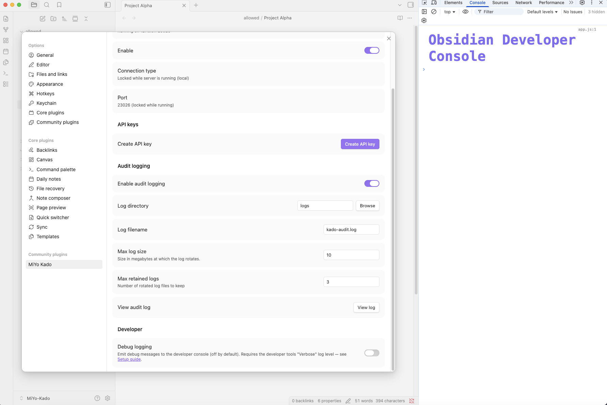
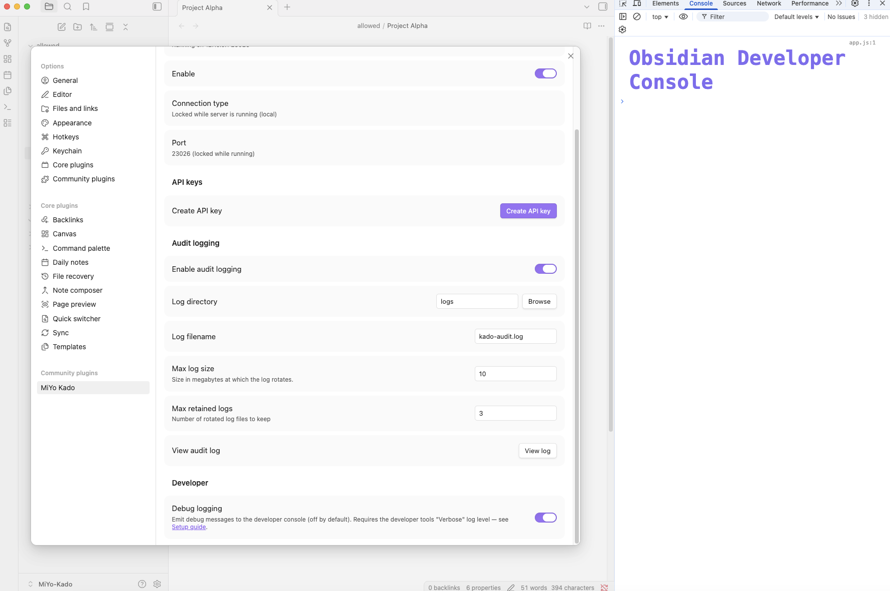
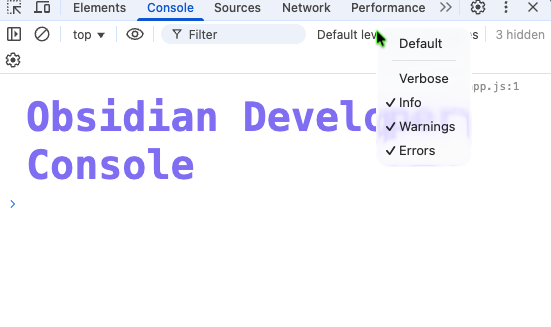
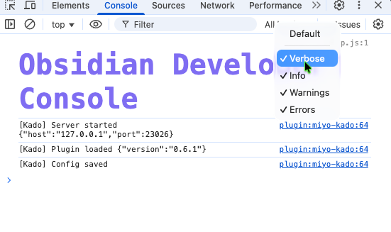
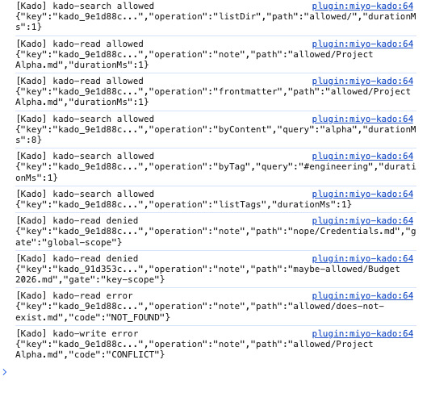
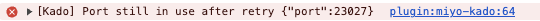

# Debug Logging — Kado

How to view Kado's debug output in Obsidian's developer console.

By default Kado is silent: only error messages reach the console, in line with
[Obsidian's plugin guidelines](https://docs.obsidian.md/Plugins/Releasing/Plugin+guidelines#Avoid+unnecessary+logging+to+console).
When you need to diagnose what Kado is doing, two switches need to be flipped:

1. The **Debug logging** toggle inside Kado's settings — controls whether
   debug messages are emitted at all.
2. The **Verbose** log level inside Chromium DevTools — controls whether
   those messages are visible in the console.

Both are off by default. If only one is on, you will see nothing.

## Step 1 — Turn on debug logging in Kado

1. Open Obsidian → Settings → MiYo Kado → General
2. Scroll to the **Developer** section and find **Debug logging**

Default state — toggle off, no debug emission:



After enabling — Kado will now emit debug messages prefixed with `[Kado]`
whenever it handles an MCP request or notable lifecycle event:



## Step 2 — Show the Verbose log level in DevTools

Debug messages use the browser's **Verbose** log level. Chromium hides Verbose
by default, so the messages exist but are filtered out of the console view.
You only need to enable this once per DevTools session.

1. Open DevTools:
   - macOS: `Cmd + Option + I`
   - Windows / Linux: `Ctrl + Shift + I`
   - or: menu → **View → Toggle Developer Tools**
2. Click the **Console** tab.
3. In the console toolbar, find the **log-level dropdown** (labeled
   "Default levels" or showing the currently selected levels).
4. Tick **Verbose**. Leave the other levels enabled.

### Before — Verbose disabled

Even with Kado's debug toggle on, the console stays empty because the
Verbose level is filtered out:



### After — Verbose enabled

With Verbose checked, every `[Kado]` line shows up immediately:



Existing messages emitted before you enabled Verbose will not retroactively
appear — trigger a new MCP call to see fresh output.

### Optional: filter to Kado messages only

The console can get noisy with output from Obsidian core and other plugins.
Type `[Kado]` into the filter textbox at the top of the Console tab to show
only Kado messages.

## What you should see

Each debug line looks like:

```
[Kado] <message> {"key":"value", ...}
```

### Lifecycle events

These fire on plugin load/unload, server start/stop, and settings saves:

```
[Kado] Plugin loaded {"version":"0.6.1"}
[Kado] Server started {"host":"127.0.0.1","port":23026}
[Kado] Config saved
[Kado] Server stopped
[Kado] Plugin unloaded
```

### Per-call events (allowed / denied / error)

Every `kado-read`, `kado-write`, `kado-search`, and `kado-delete` emits a
debug line with its outcome. The `key` field shows the first 12 characters
of the API key id so you can tell which client made the call:

```
[Kado] kado-read allowed {"key":"kado_9e1d88c0","operation":"note","path":"allowed/Project Alpha.md","durationMs":3}
[Kado] kado-search allowed {"key":"kado_9e1d88c0","operation":"listDir","path":"allowed","durationMs":2}
[Kado] kado-read denied {"key":"kado_9e1d88c0","operation":"note","path":"nope/Credentials.md","gate":"global-scope"}
[Kado] kado-write error {"key":"kado_9e1d88c0","operation":"note","path":"allowed/Project Alpha.md","code":"CONFLICT"}
```

Live example of allowed / denied / error lines in the console:



The `gate` field on denials tells you which permission gate rejected the
request (one of `authenticate`, `global-scope`, `key-scope`,
`datatype-permission`, `path-access`). The `code` field on tool-level
errors carries the canonical error code (`CONFLICT`, `NOT_FOUND`,
`VALIDATION_ERROR`, `INTERNAL_ERROR`). Note that a tool-level `error`
outcome is still a debug line — it only appears when Verbose is enabled.

### Genuine errors

A handful of log lines go through `console.error` instead of `console.debug`
— these are genuine infrastructure problems, not per-request outcomes. They
bypass the Verbose filter entirely: DevTools shows them in red at the
default log level, so you'll see them even without flipping the Verbose
switch.

A typical example is the server failing to bind its configured port because
another process already holds it:



The corresponding log message:

```
[Kado] Port in use {"port":23026}
```

## Troubleshooting

- **No messages appear after triggering an MCP call.** Check both that the
  Kado debug toggle is on _and_ that Verbose is checked in the console
  log-level dropdown. Both gates have to be open.
- **The DevTools log-level dropdown is missing.** It's the small dropdown to
  the right of the filter textbox in the Console tab toolbar. If your
  DevTools is narrow, the toolbar may collapse — widen the DevTools panel.
- **Messages from other plugins clutter the view.** Use the filter textbox
  with `[Kado]` to scope output to Kado only.
- **I want to share output with a maintainer.** Right-click anywhere in the
  console and choose **Save as…** to dump the full log to a file. Strip any
  vault paths or content you consider sensitive before sharing.
