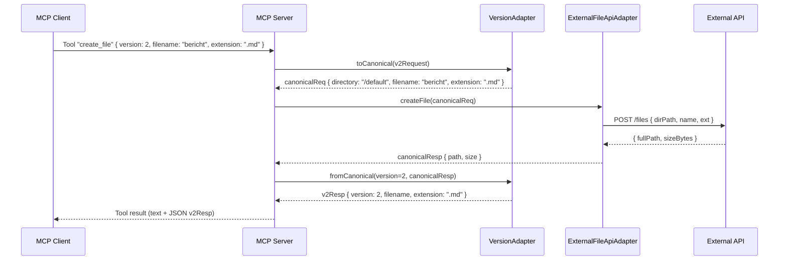

Hier ist ein vollständiges ADR-Dokument, das du direkt in dein Repo legen oder an Claude geben kannst (z.B. `adr-00x-mcp-payload-versioning-acl.md`).

***

# ADR-00X: MCP-Server mit Payload-basierter Versionierung und Anti-Corruption Layer

*Status:* Accepted  
*Datum:* 2026-03-09  

## Kontext und Problemstellung

Wir bauen einen **Model Context Protocol (MCP) Server**, der:  
- nach außen über MCP eine **stabile API** für AI‑Clients (z.B. Claude) anbietet,  
- intern eine **Fremd‑API** konsumiert, deren Schema sich ändern kann,  
- und gleichzeitig mehrere **Client-Payload-Versionen** (v1, v2, v3, …) unterstützen soll, ohne bestehende Clients zu brechen.[1][2][3]

Randbedingungen und Anforderungen:  
- Der Client soll seine **Version im JSON-Payload** übergeben (Feld `version`), statt über URL‑Pfad, Header oder Query‑Parameter.[4][5]
- Der öffentlich dokumentierte MCP‑Contract (Tool‑Schemas) soll möglichst lange **stabil** bleiben.  
- Änderungen an der Fremd‑API sollen **nicht** erfordern, dass MCP‑Clients angepasst werden.  
- Wir wollen ein Muster, das **Explosionsgefahr** (für jede Version eigene Endpoints/Tools) vermeidet und klar kapselt, wo Mapping-Logik liegt.[6][7]

Beispiel-Use-Case:  
- MCP‑Tool „create_file“ mit Versionen:  
  - v1: nur `filename` (implizit `.txt`, Verzeichnis `/default`)  
  - v2: `filename` + `extension` (Verzeichnis `/default`)  
  - v3: `directory` + `filename` + `extension`  

***

## Entscheidungsstatement

Wir führen für den MCP‑Server eine Kombination aus:

1. **Payload-basierter API-/Message-Versionierung** (Version im JSON‑Body, Feld `version`) und  
2. einem **Anti-Corruption Layer (ACL)** mit  
   - kanonischem Innenmodell,  
   - Version‑Adaptern für Request & Response (pro Client‑Version) und  
   - einem Fremd‑API‑Adapter (External Adapter)  

ein, um Stabilität der MCP‑API und Entkopplung von der Fremd‑API zu erreichen.[2][3][8][1]

***

## Detaillierte Entscheidung

### 1. Versionierung im JSON-Payload (Message Versioning)

- Jede Anfrage an das MCP‑Tool enthält ein Feld `version` im JSON‑Body (z.B. `1 | 2 | 3`).  
- Das Schema der übrigen Felder hängt von dieser `version` ab (z.B. v1 nur `filename`, v3 zusätzlich `directory`).  
- Responses enthalten ebenfalls `version`, und die Antwortstruktur entspricht der **eingehenden** Version.[5][4]

Beispiel:

```json
// v2 Request
{
  "version": 2,
  "filename": "bericht",
  "extension": ".md"
}
```

### 2. Kanonisches Innenmodell

- Intern wird ein **kanonisches Modell** verwendet, das dem aktuellsten fachlichen Modell entspricht (hier: v3 mit `directory`, `filename`, `extension`).  
- Alle Requests werden zuerst in dieses Modell übersetzt, alle Responses aus diesem Modell heraus.[1][2]

Kanonisches Modell:

```ts
export interface CanonicalCreateFileRequest {
  directory: string;
  filename: string;
  extension: string;
}

export interface CanonicalCreateFileResponse {
  path: string;
  size: number;
}
```

### 3. Version-Adapter (Request & Response)

Wir implementieren eine zentrale `VersionAdapter`-Klasse:

- **Request-Pfad:** `v1/v2/v3 → Canonical`  
  - v1: setzt `directory = "/default"`, `extension = ".txt"`.  
  - v2: setzt `directory = "/default"`, übernimmt `extension`.  
  - v3: übernimmt alle Felder direkt.  

- **Response-Pfad:** `Canonical → v1/v2/v3`  
  - Die Zielversion wird aus der eingehenden Request‑Version übernommen.  
  - v1: gibt nur `filename` zurück.  
  - v2: gibt `filename` + `extension` zurück.  
  - v3: gibt `directory` + `filename` + `extension` + `size` zurück.  

Pseudocode-Skizze:

```ts
canonicalReq = versionAdapter.toCanonical(versionedReq);
canonicalResp = externalApiAdapter.createFile(canonicalReq);
versionedResp = versionAdapter.fromCanonical(req.version, canonicalResp);
```

### 4. Anti-Corruption Layer zur Fremd-API

- Der MCP‑Server kapselt alle Zugriffe zur Fremd‑API in einen **External Adapter** (ACL).  
- Schnittstellen:  
  - `CanonicalCreateFileRequest → Fremd-API-Payload`  
  - `Fremd-API-Response → CanonicalCreateFileResponse`  

Diese Schicht übernimmt:  
- Datentransformation (z.B. `directory` → `dirPath`, `extension` → `ext`),  
- eventuelle Validierungen,  
- ggf. Retry/Fehlerbehandlung,  
- und kann bei Änderungen der Fremd‑API **isoliert** angepasst werden.[8][2][1]

***

## Architektur und Sequenz

### Komponenten

- **MCP Client**: Claude oder anderer MCP‑Client.  
- **MCP Server**: unser Prozess; exponiert Tools (z.B. `create_file`).  
- **VersionAdapter**: wandelt v1/v2/v3 ↔ kanonisch.  
- **ExternalFileApiAdapter (ACL)**: wandelt kanonisch ↔ Fremd‑API‑Schema.  
- **Fremd‑API**: externe REST/HTTP‑API.

### Sequenzdiagramm



***

## Betrachtete Optionen

1. **Keine Versionierung / immer Breaking Changes**  
   - Jede Änderung am Schema bricht Clients; nur für interne Systeme mit enger Kopplung vertretbar.  

2. **URL-/Routen-basierte Versionierung der MCP-Tools**  
   - Z.B. `create_file_v1`, `create_file_v2`, … oder getrennte Toolnamen pro Version.  
   - Führt mittelfristig zu Tool‑Flut und schwer wartbarer Doku.[7]

3. **Header-basierte Versionierung**  
   - Version in HTTP‑Header oder MCP‑Metadaten.  
   - Für reine JSON‑Payload‑Steuerung aus LLM‑Prompts weniger ergonomisch als ein `version`‑Feld im Body.[9][7]

4. **Payload-basierte Versionierung mit ACL und kanonischem Modell (gewählt)**  
   - Version im JSON‑Payload, stabiler MCP‑Contract, internes kanonisches Modell, ACL zur Fremd‑API.[2][8][1]

***

## Entscheidungsergebnis

Gewählte Option:  
**Payload-basierte Versionierung im JSON-Body („version“), kombiniert mit einem Anti-Corruption Layer und Version-Adaptern auf einem kanonischen Innenmodell.**[8][1][2]

Begründung:  
- **Stabilität**: Die externe MCP‑Schnittstelle ändert sich nicht bei jeder Fremd‑API‑Änderung.  
- **Klarer Verantwortungszuschnitt**:  
  - Versionierungslogik im `VersionAdapter`,  
  - Fremd‑API‑Anpassungen im `ExternalFileApiAdapter`.  
- **LLM‑Ergonomie**: LLMs (z.B. Claude) können `version` im JSON‑Body leicht kontrollieren, ohne HTTP‑Header oder Pfad anpassen zu müssen.  
- **Erweiterbarkeit**: v4, v5 usw. können mit zusätzlichen Mapping‑Regeln implementiert werden, ohne bestehende Clients zu brechen.

***

## Konsequenzen

### Positive Konsequenzen

- **Entkopplung**: Änderungen der Fremd‑API bleiben auf den ACL‑Adapter beschränkt.[1][2]
- **Backward Compatibility**: Ältere Clients (z.B. v1) funktionieren weiter, solange Mappings gepflegt werden.  
- **Klare Architektur**:  
  - Ein MCP‑Tool pro Fachoperation (z.B. `create_file`),  
  - ein zentraler Version‑Adapter,  
  - ein klarer Anti‑Corruption Layer.  
- **Nachvollziehbarkeit**: Die `version` ist im Payload sichtbar und kann geloggt/auditiert werden.

### Negative Konsequenzen / Risiken

- **Komplexität im Mapping**:  
  - Bei vielen Versionen steigen Aufwand und Komplexität in `VersionAdapter`.  
  - Es besteht Risiko von Inkonsistenzen, wenn Mappings nicht sauber getestet werden.[10]
- **Doppelpflege von Schemas**:  
  - Kanonisches Modell + Fremd‑API‑Modell + einzelne Versionsmodelle.  
- **Leichter Overhead**:  
  - Jede Anfrage durchläuft mindestens zwei Mapping‑Schritte (Version ↔ Kanonisch ↔ Fremd).  
- **Testaufwand**:  
  - Für jede Version muss der Roundtrip (Request vX → kanonisch → Fremd‑API → kanonisch → Response vX) getestet werden.

***

## Implementierungsnotizen

- **MCP-Server-Framework**:  
  - Wir verwenden das offizielle TypeScript‑MCP‑SDK mit `McpServer` und `StdioServerTransport`.[11][12][13]
- **Tool-Definition**:  
  - MCP‑Tool `create_file` mit Zod‑Schema, das `version` als `number` 1..3 erzwingt und optionale Felder je nach Version erlaubt.  
- **Erweiterung um neue Versionen**:  
  - Neue Version `v4` bedeutet:  
    - neue Request/Response‑Typen,  
    - Ergänzung im `VersionAdapter`,  
    - ggf. Anpassung des kanonischen Modells (oder neues internes Kanon).  

***

## Status und Follow-ups

- **Status:** Accepted (wird in der ersten Implementierung des MCP‑Servers umgesetzt).  
- **Follow-ups:**  
  1. Eigene ADR für **Fehlerbehandlung & Logging** im ACL‑Layer (z.B. Retry‑Politik, Circuit Breaker).  
  2. Eigene ADR für **Version Lifecycle** (Deprecation-Policy, wie lange wird v1/v2 unterstützt).  
  3. Ergänzung einer **Teststrategie** (Contract-Tests pro Version, Integrationstests gegen Fremd‑API).[14][10]

***

## Referenzen

- Anti-Corruption Layer Pattern: Azure / AWS Dokumentation.[2][8][1]
- ADR-Templates und Best Practices.[15][16][6][10]
- API-Versionierung-Strategien & ADR-Beispiele.[17][7][9]
- MCP-Server-Implementierungen in TypeScript.[12][13][18][19][11]

Wenn du möchtest, kann ich dir als nächstes einen fertigen Dateinamen, Header und „How to reference this ADR in Code/Docs“ vorschlagen, damit das konsistent in dein Projekt passt.

Sources
[1] Anti-corruption Layer pattern - Azure Architecture Center - Microsoft https://learn.microsoft.com/en-us/azure/architecture/patterns/anti-corruption-layer
[2] Anti-corruption layer pattern - AWS Prescriptive Guidance https://docs.aws.amazon.com/prescriptive-guidance/latest/cloud-design-patterns/acl.html
[3] How to Build the Anti-Corruption Layer Pattern - OneUptime https://oneuptime.com/blog/post/2026-01-30-anti-corruption-layer-pattern/view
[4] How to implement version control of JSON data interface? https://www.tencentcloud.com/techpedia/127962
[5] How to design the interface version number for JSON data ... https://www.tencentcloud.com/techpedia/128090
[6] Architecture decision record (ADR) examples for software planning ... https://github.com/joelparkerhenderson/architecture-decision-record
[7] 0078 API Versioning | MilMove Developer Portal https://transcom.github.io/mymove-docs/docs/adrs/api-versioning/
[8] Anti-Corruption Layer | Dremiowww.dremio.com › wiki › anti-corruption-layer https://www.dremio.com/wiki/anti-corruption-layer/
[9] 4 API Versioning Strategies Every Developer Should Know https://designgurus.substack.com/p/4-api-versioning-strategies-for-beginners
[10] Best Practices for Effective Software Architecture Documentation https://bool.dev/blog/detail/architecture-documentation-best-practice
[11] GitHub - mcp-auth/mcp-typescript-sdk: The official Typescript SDK for Model Context Protocol servers and clients https://github.com/mcp-auth/mcp-typescript-sdk
[12] The official TypeScript SDK for Model Context Protocol ... - GitHub https://github.com/modelcontextprotocol/typescript-sdk
[13] Build Your First (or Next) MCP Server with the TypeScript MCP ... https://dev.to/nickytonline/build-your-first-or-next-mcp-server-with-the-typescript-mcp-template-3k3f
[14] Maintain an architecture decision record (ADR) - Microsoft https://learn.microsoft.com/en-us/azure/well-architected/architect-role/architecture-decision-record
[15] ADR Templates - Architectural Decision Records https://adr.github.io/adr-templates/
[16] Architectural Decision Records https://adr.github.io
[17] What is an ADR? (And Why They're Critical for AI-Powered ... https://www.outcomeops.ai/blogs/what-is-an-adr-and-why-theyre-critical-for-ai-powered-development
[18] Azure Data Explorer MCP Server - playbooks https://playbooks.com/mcp/pab1it0/adx-mcp-server
[19] ADR Analysis MCP server for AI agents - Playbooks https://playbooks.com/mcp/tosin2013-adr-analysis
[20] Architecture Decision Record (ADR) Template - Miro https://miro.com/templates/architecture-decision-record-adr/
[21] ADR process - AWS Prescriptive Guidance https://docs.aws.amazon.com/prescriptive-guidance/latest/architectural-decision-records/adr-process.html
[22] IASA - Architecture Decision Record Template | Miroverse https://miro.com/templates/architecture-decision-record-template/
